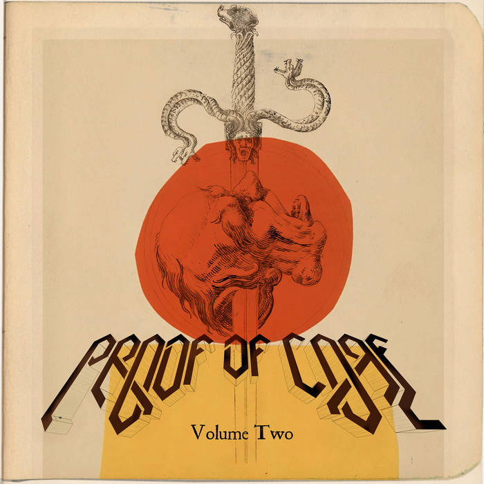
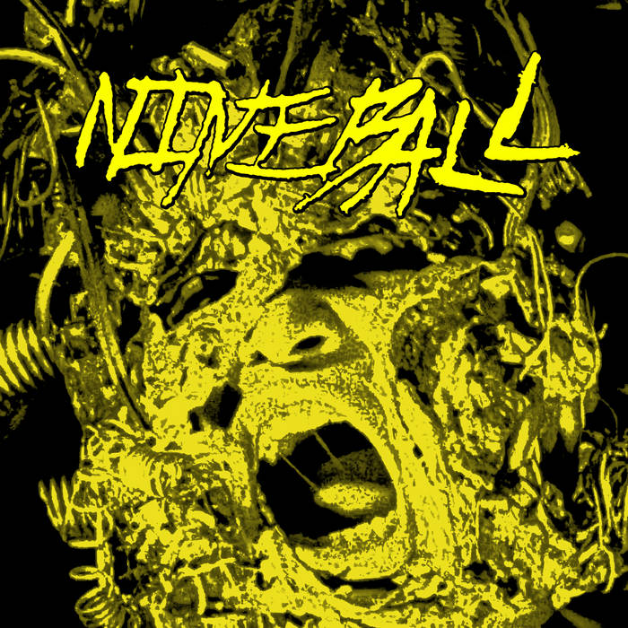
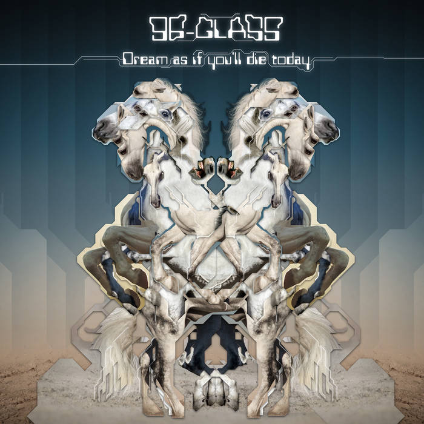
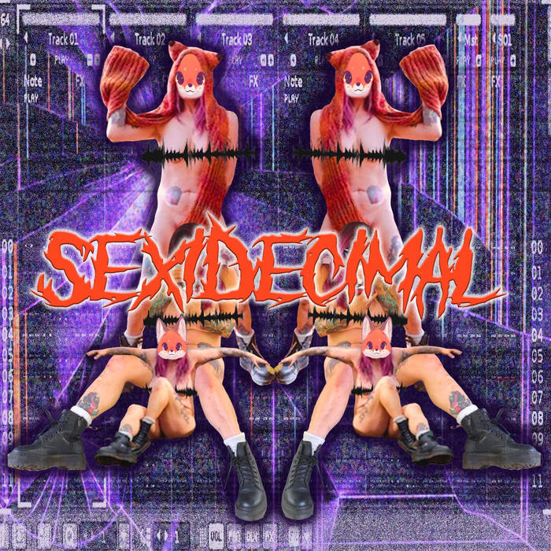
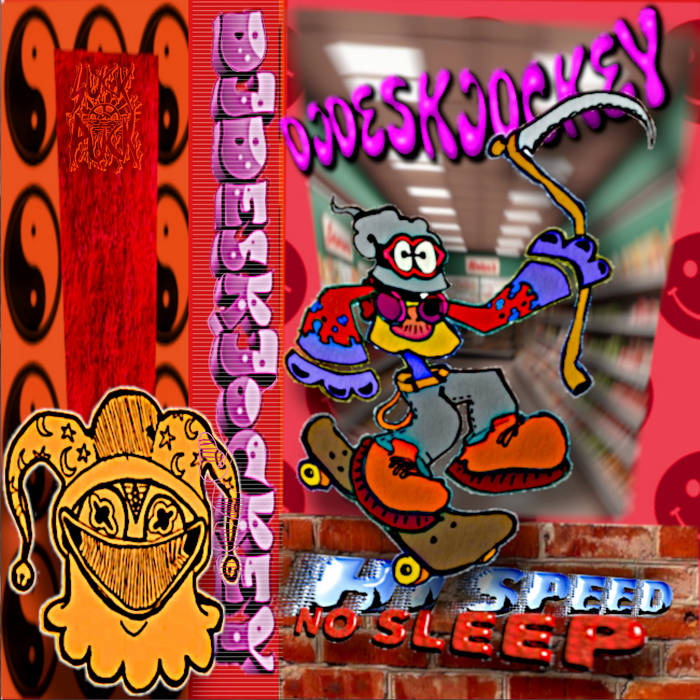
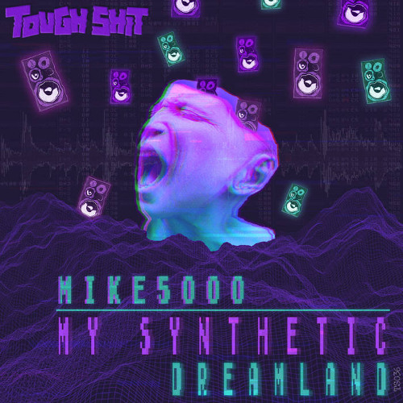
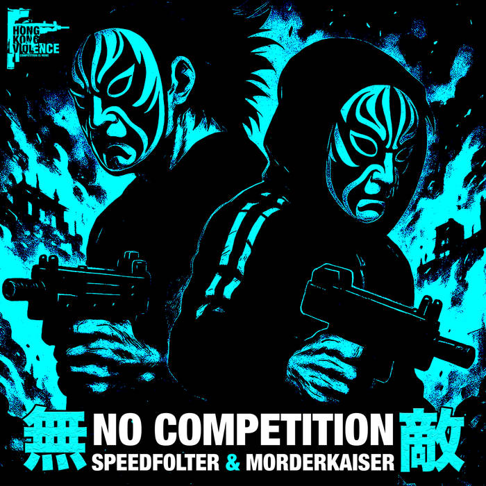

# The Breakcore Bugle - September 2025 Edition

## Releases of the month

At first, we said we'd do 5 releases a month to spotlight. We lied - too much amazing music has come out recently!!! It's been a good month for \*core.

We've learned our lesson. We're not going to limit the number of entries in any section, within reason (except mix of the month). If something comes out, and we wanna put it on blast, we'll put it on blast 📢📢📢 !!!

Let's get into it.

### Proof of Core Vol.2 - Murder Channel

Following up from Proof of Core Vol.1 from Jan 2024, here we have Murder Channel's latest compilation E.P. Five tracks of carnage with some heavy names included; x.nte and Audiotist are both favourites here at The Bugle. Murder Channel's roster and discography is absolutely mental, and so consistent.

Amazing label, definitely worth keeping tabs on, and will no doubt feature regularly in The Bugle.

Buy it on [Bandcamp](https://murderchannel.bandcamp.com/album/proof-of-core-vol-2-2)!

### Nineball - Nineball

Yo, okay, this one, and I can hear the protests already, may not be strictly breakcore.

But over here at The Bugle, we don't even care!!! That's right!!!! Don't even care!!! It's breakcore adjacent, and breakcore is a massively ill-defined genre. What the hell even is breakcore? I know if you come to us with a definition too strict, we could give u some examples to go against that definition... So... Breakcore is an ethos ... A state of mind ...

Anything close enough to breakcore or breakcore adjacent will feature in The Bugle.

Anyway, onto Nineball. What the hell man. Noise and breaks reminiscent of 90s DHR - real classic breakcore. The roots baby. The Bugle came across Realicide via the producer Bomb20 - 90s DHR roster alumni noise and breakcore wizzkid. We knew if Bomb20 was choosing to release with Realicide regularly, then anything else coming out MUST be good. So we kept tabs on the label ... and lo and behold ... gold!!!

Nineball are incredible. Give the whole album a listen and just get lost in the groove.

Buy it on [Bandcamp](https://realiciderex.bandcamp.com/album/nineball)!

### Dream as if you'll die today - 96-glass

I warned you... Here's another Murder Channel release. When they stop bringing the heat I'll stop shouting about it...

96-glass bringing fast paced, choppy action. Insane breaks spliced in with super dancy, catchy samples, some sections sampling super aggressively, bordering on mashcore, but never delving fully into the genre. On first listen, the MCR sample hit me like a Vietnam war flashback, terrifying me with the knowledge of my age.

Buy it on [Bandcamp](https://murderchannel.bandcamp.com/album/dream-as-if-you-ll-die-today)!

### Sexidecimal - Demetzy

*from the artist:*

> Growing up listening to breakcore everything felt pretty masculine- I wanted to make something rooted in my experiences. Sexidecimal is that, influenced by a range of music that meant so much to me growing up like folk, alt rock and blues- a bit girly, a bit queer and a lot weird.

Touching on something important there - breakcore is too often, too straight, too masc... 

Fast, crazy, wacky and wild sex-themed debut E.P. from 1/2 of London based breakcore night promoters Corefusion! These guys put on awesome events, and you should keep track of them if you're in or near London.

Touches on an important issue... breakcore is too often too straight, too cis, too masc... What better way to combat this than by buying this E.P. on [Bandcamp](https://corefusion.bandcamp.com/album/demetzy-sexidecimal)!

### HI SPEED NO SLEEP - DJDESKJOCKEY

DJDESKJOCKEY has the aesthetic down. You look at this album art and know what you're in for.

Suck Puck Records' discography of releases is only getting phatttttttttttttter and even more impeccable with HI SPEED NO SLEEP. DJDESKJOCKEY blends several core-adjacent genres together effortlessly and cohesively, all whilst not taking itself too seriously. Something we're a fan of at the Bugle! :)

Like Murder Channel, Suck Puck releases will likely feature a bunch on the Bugle in the future.

*from the artist:*

> The debut album from American artist DJDESKJOCKEY on SuckPuck — and it fully lives up to its name. HI SPEED NO SLEEP is a furious marathon of 12 tracks where oldschool rave, gabber. hardcore, breakcore, jungle and footwork collide, mutate, and turn into a strange new creature. Across just over an hour, DJDESKJOCKEY delivers nonstop momentum: playful, aggressive, and unpredictable. Acid lines, cartoonish samples, sudden switches and hyperactive energy make the record feel both chaotic and meticulously arranged.

Buy it on [Bandcamp](https://suckpuckrecordz.bandcamp.com/album/hi-speed-no-sleep)!

### Phase Space - XXHARDBIT3S

Man, here at the Bugle, we're big fans of XXHARDBIT3S - first discovered through BOMBGRL - an E.P from a little while ago that rocked our world. Absolutely insane. We wait on new XXHARDBIT3S with bated breath over here.

So what is Phase Space?

Breakcore? No. Hardcore? Also no. Jungle? Absolutely not.

Phase Space is none of these things, but also, all of them. Phase Space belongs to XXHARDBIT3S own genre...

OPPCORE

Phase Space is the 4th album in the OPPCORE series.

What is OPPCORE? XXHARDBIT3S describes it extensively in the Bandcamp link below. I can't read that many words consecutively, so I'm choosing to learn what the genre is by listening instead.

*from the artist:*

> THE FOURTH ALBUM IN THE "OPPCORE" SERIES, XXHARDBIT3S TAKES A NEW AND UNIQUE APPROACH TO XYR'S PRODUCTION WITH "PHASE SPACE" 

Buy it on [Bandcamp](https://formforum.bandcamp.com/album/phase-space)!

### Denephrion - Confabulations - maybe

PLACEHOLDER!!! This isn't out yet. Add shit here later. Out 25th Sept on South England Hate Club

## Singles of the month

We also said at first we'd do 5 singles a month to spotlight. We lied - we've been finding it difficult to keep up with singles released on SoundCloud and stuff. Here's a few though, that we hope you like - we did!

### Zombie Nation Insta Kill Microwave Edit - The Bang Bros

Hard.

Freaking.

Gabber!!!!!!

Listen on [SoundCloud](https://on.soundcloud.com/FYGv0XOoPNhrm7r3Hd)!

### Jungalist Temptations - M5K

Not exactly a new single, released a few years ago, but recently re-uploaded to SoundCloud - so we're going to count it as new to us! Don't tell anyone we're cheating. The song is also probably new to you as well :P

M5K is well liked here at the Bugle. We discovered them through a Corefusion event last year and have been following them since!

Listen on [SoundCloud](https://on.soundcloud.com/gtnnpkanVjfk38xSxC)!

### No Competition - Speedfolter vs Mordekaiser

A single recently released on Hong Kong Violence - a label we're sure you're aware of already, and if ya ain't - GET TO KNOW!!!

We won't describe this track to you...

*We'll let HKV do that instead...*

> Few producers dare to touch this sound — but Speedfolter x Mordekaiser succeed in all glory. A dedication to the NYC DOA speedcore style: analoog TR-909 kickdrums, blasting percussion, saturated distortion, and raw nineties rap attitude. It’s rare, it’s ruthless — and when it hits, this release destroys everything.

Over here at the Bugle we looooooooove this aggressive, abrasive speedcore sound... It's addicting...

Listen on [SoundCloud](https://on.soundcloud.com/DmAbqYnV0GSwXHWFZn)!

## Mix Of The Month

### 90’s Real Japanese Hardcore Mix (You’ll Never Get It) - Yuta Umegatani

Put out by Murder Channel, this mix blew our mind. It's so god damn hard we're at a loss for words to describe it.

*Like above, we'll let the label describe it...*

> This mix is a promotional mix for Manga Corps, published by Never Sleep. It was created for several media outlets, but none of them responded. That’s probably because this mix is pure, authentic Hardcore. It was just too real and too hard.

Brace yourself for 48 minutes of carnage.

Listen on [SoundCloud](https://on.soundcloud.com/9mKLaW0JGnV8IaJJg5)!

## Upcoming events

### Blackpool - Blobapalooza 2 - October 4th

Have you heard of Cliff Glitchard? If not, reconsider everything about yourself, and head to Blackpool on Oct 4th. Lineup featuring artists like Scottish Gabber Punk, Kalisae, Shoebill, and many more heaters.

More details on [instagram](https://www.instagram.com/p/DOgIyZbCM-W/?igsh=NHVja3htdmRnanN3).

### Cincinnati - Corroded Battery Noise - October 13th

More noise than breakcore, but we love noise here at the Bugle. Put on in collaboration with Realicide. Get tf down!!

More details on [instagram](https://www.instagram.com/p/DOg6GlPj3Tq/?igsh=Z3kxdzNrNHN0cDVo).

### London - Mums Against Donk Presents... Gabber Ghouls - October 24th

Spooky gabber night at MOT!

More details on [instagram](https://www.instagram.com/p/DODcl6DDNah/?igsh=MTBncWhpeXM5dGYyYg%3D%3D).

### London - Corefusion Live Breakcore Special - October 11th

Live breakcore special!!! Hours and hours of only live breakcore!!! Ohhhhhhhh yeahhhhhhhh...

More details on [instagram](https://www.instagram.com/p/DMXN_UGNSov/).

### London - Rave Against The Machine - October 4th

If you're not close to Blackpool on the 4th, maybe you're closer to London. Good news! You're not out of luck for some \*core. Ruby My Dear headline, day after the new album releases. Will be sickkkk.

More details on [instagram](https://www.instagram.com/p/DN-S3O4jir-/?igsh=MWdkMjQyOGVwa2tkeg%3D%3D).

### Rotterdam - PRSPCT XL 34 - November 29th

Not gunna say nufffffffin on this one. Just go check the lineup.

More details on [instagram](https://www.instagram.com/p/DN3KUOrXt1J/?igsh=MXQzNGJhaHJlcmk4OA%3D%3D).

### Antwerp - Breakcore Gives Me Wood - November 22nd

No introduction needed for BGMW. Lineup here is astounding.

More details on [instagram](https://www.instagram.com/p/DO3KpD3CGz5/?igsh=OWlvcnV3YndncjVn).

## Thanks!

Thanks for reading! See you next month. It's been a lot of fun putting this edition together, and we're sure they'll get more fun as time goes on :)

