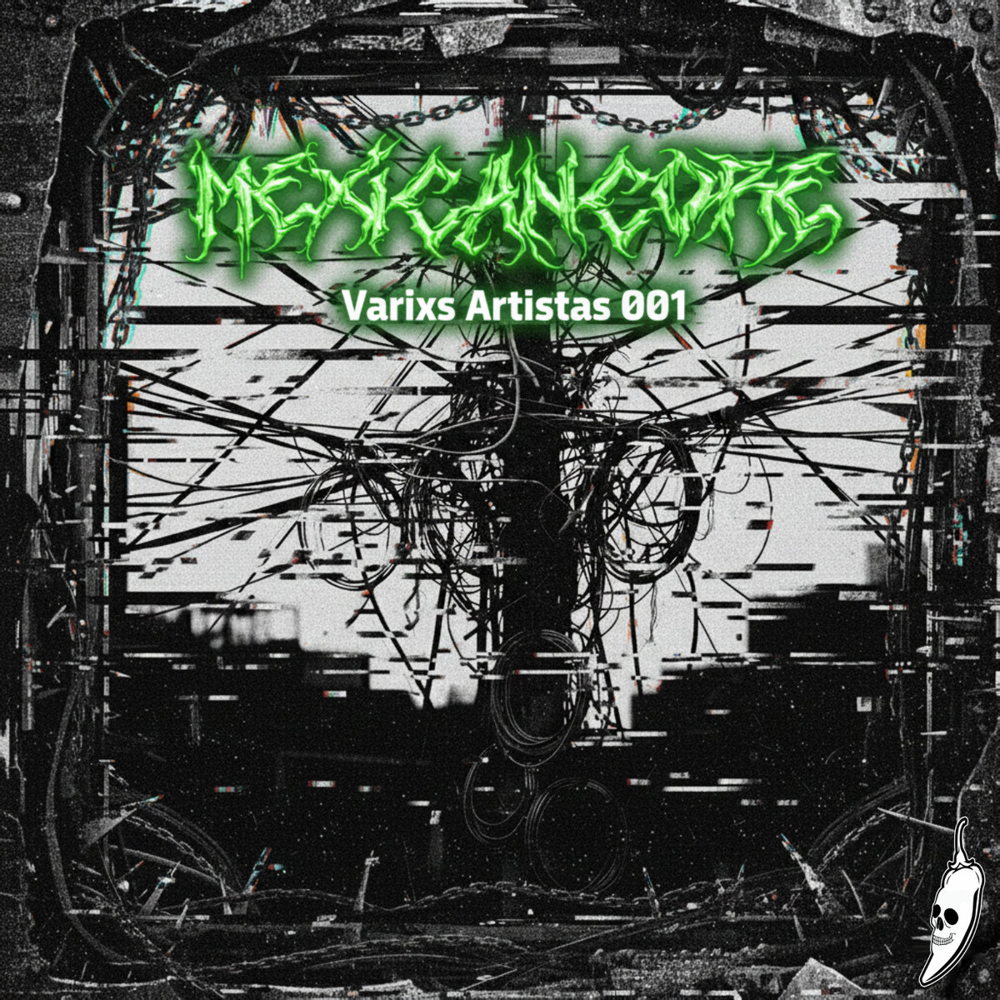
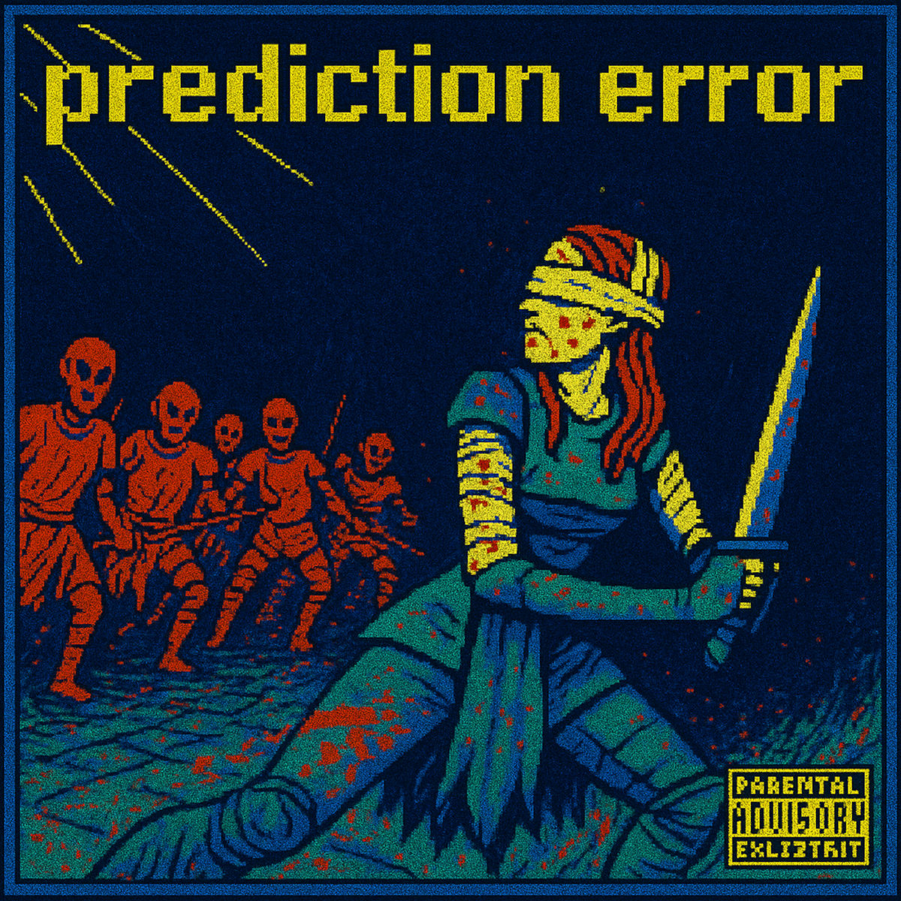
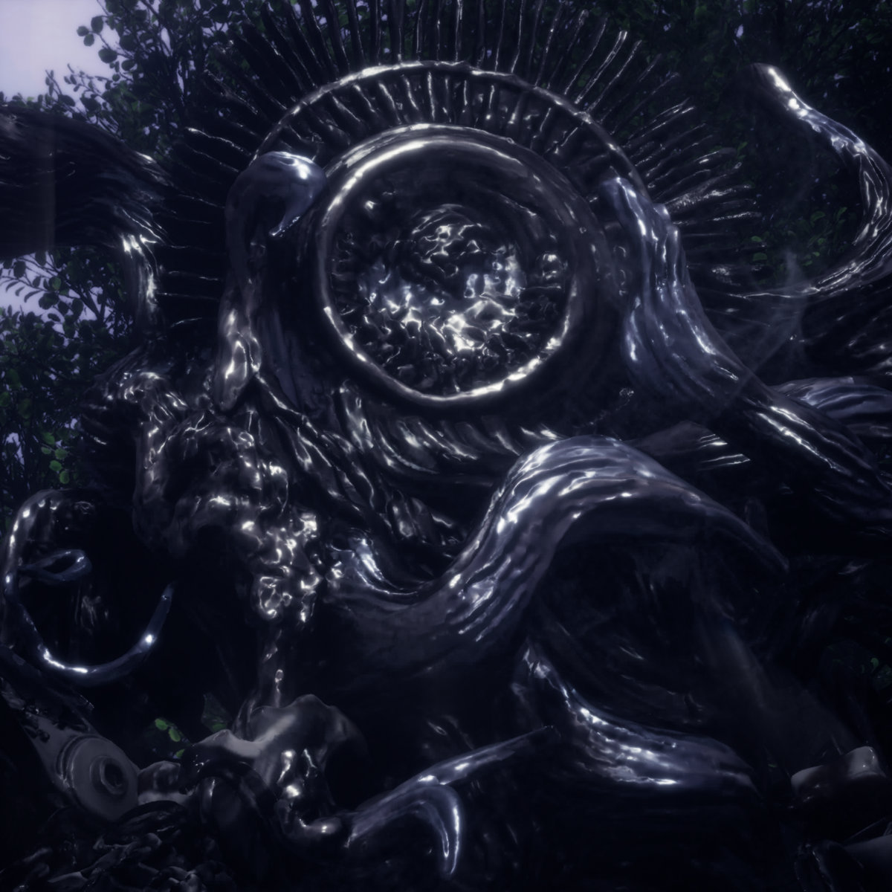
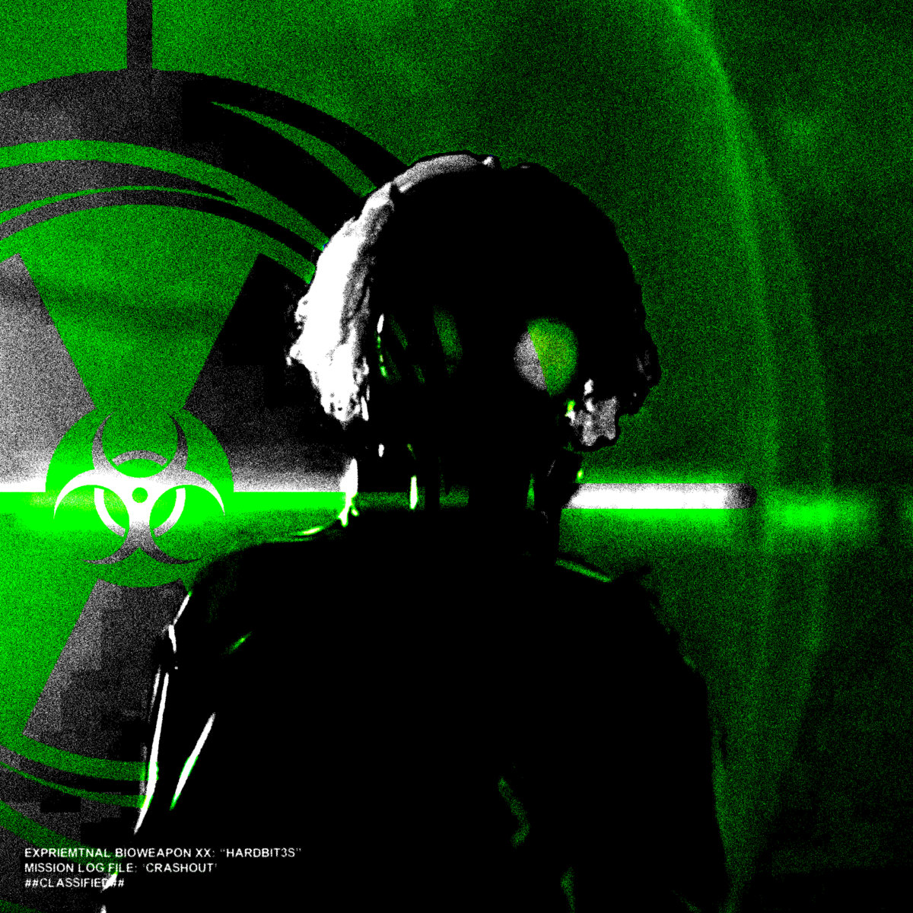
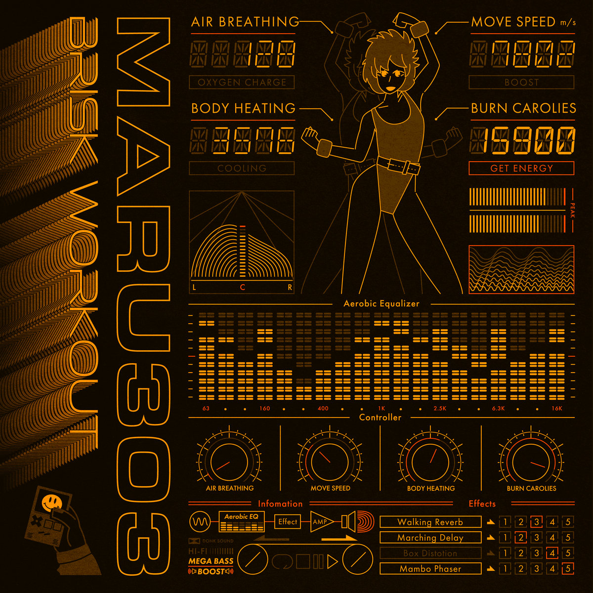
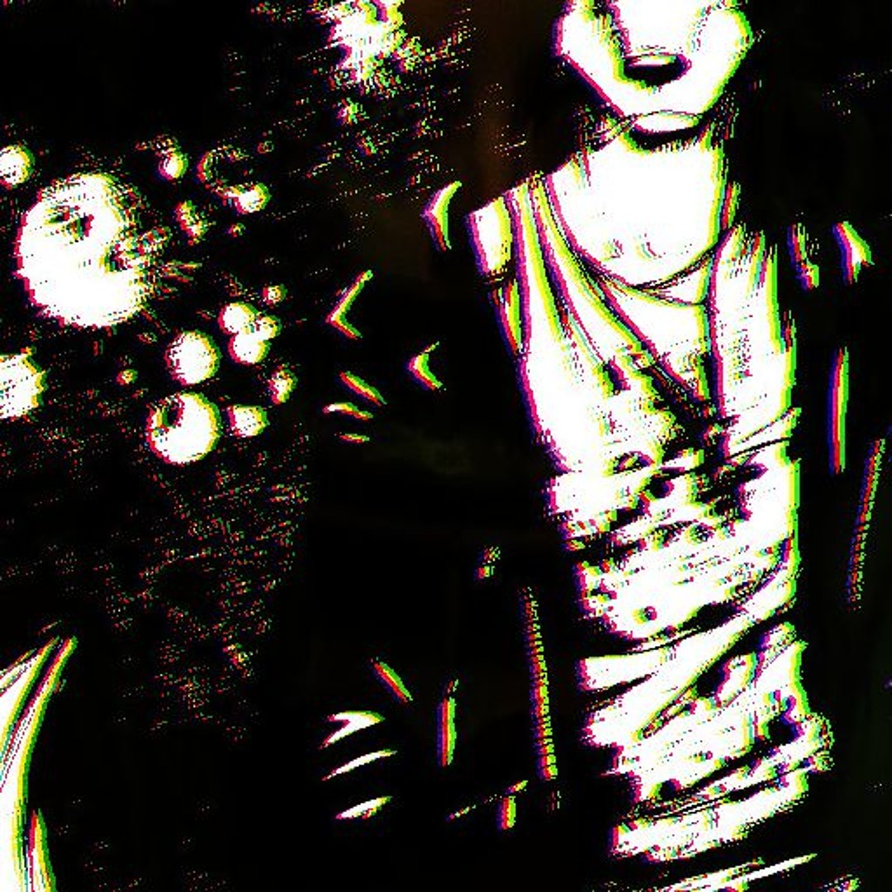
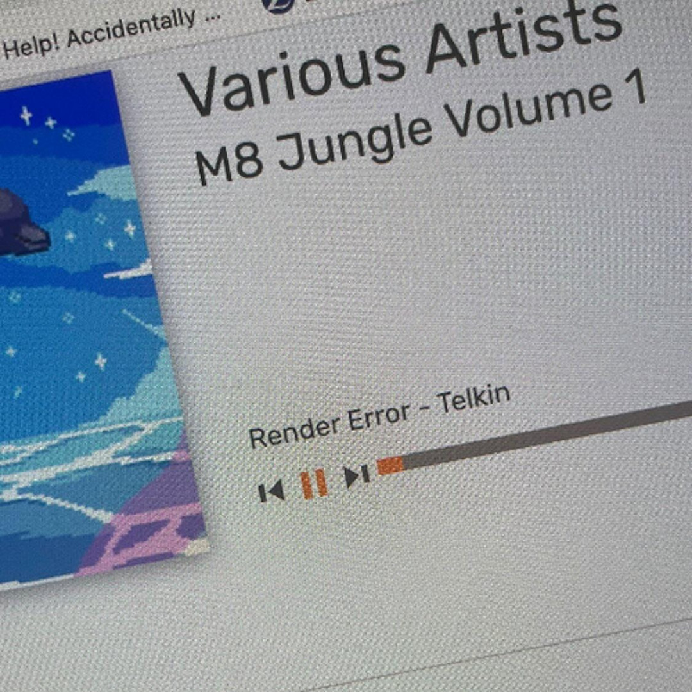
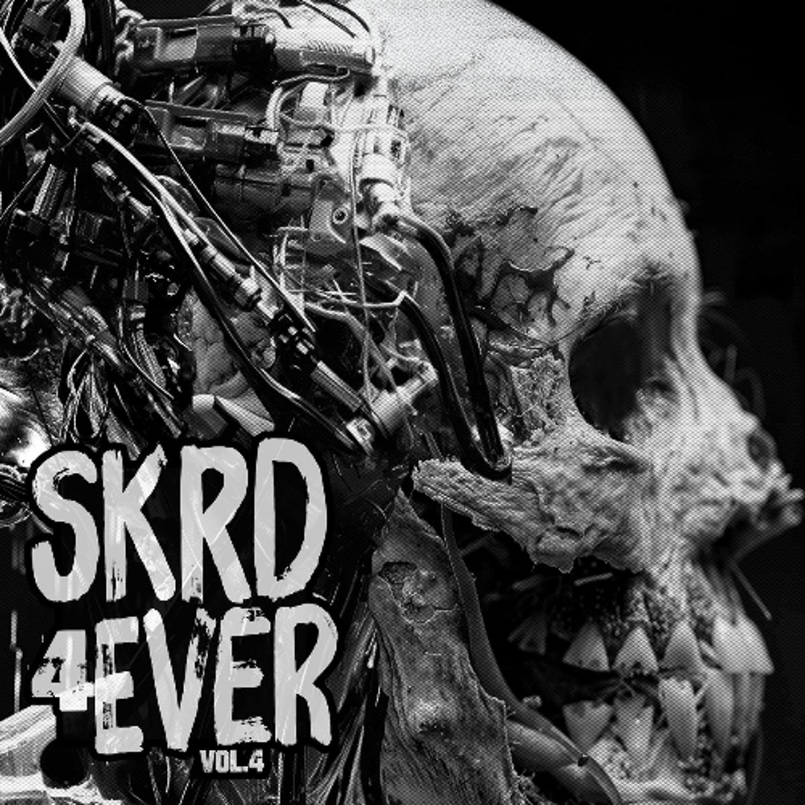

# The Breakcore Bugle - November 2025 Edition

What's up my breakcore baddies!

Hope everyone had a great time at Bangface! We were supposed to be there this year, but Mr Bugle double booked himself with a Lorde concert, accidentally. Mr Bugle booked the wrong night of the Lorde London shows, and he is also a Lorde superfan, so go figure. We're already looking forward to next years Bangface though - see you there!!!

We hope you all also had a spooky October/November... Who's cold? Me too ... I'm freezing ...  Every day ... Come ye, weary traveller... Warm thyself, by my hearth made of pure CCCCCCCCCCCoreeeeeee.........

## Releases of the month

November has been fruitful... Got some treats... For u... Some repeat offenders ... some new suspects ... let's investigate ...

### Mexicancore - Varixs Artistas vol.1

Starting off with a real special one here! Mexicancore is, if you're unfamiliar, a netlabel focusing on bigging up all latinx producers of Xcore... This is an absolutely stellar first installment, with bangers from some names you may know of, redHat, glitchgirl, Hitori Tori, etc.

Buy it on [Bandcamp](https://mexicancore.bandcamp.com/album/varixs-artistas-vol-1)!

### Prediction Error - Predatory Microtransactions

We missed this one last month! We only found it on Reddit after releasing the October article - Predatory Microtransactions came out Oct 20th. We don't care. We're featuring it!!!

Oh man... This album... Where to even start - a mash of glitchcore, prog rock, smooth jazz? Big band jazz? A wild ride for sure.

This album is basically, what if Chon, Drumcorps, and Trigun: The First Donuts had a child together. A wild ride of crazy breaks and guitar solos. LFG.

Prediction Error has since had a couple more releases, but we'd really like to highlight this one. It's stellar.

Buy it on [Bandcamp](https://predatorymicrotransactions.bandcamp.com/album/prediction-error)!

### F8TLE33 - The Day After

Glossy, glassy, ethereal, and most importantly, LOUD madness. Not really a breakcore ep, tbh, it's "post-club", a term we've not heard before at The Bugle... Either way, this EP is really frickin cool, don't care if it's not BxC :P

Buy it on [Bandcamp](https://formforum.bandcamp.com/album/the-day-after)!

### XXHARDBIT3S - CRASHOUT!!

3 tracks of dark, techstep goodness. Long dancy sections with some beautifully chopped and produced breaks. When we listen to xxh4rdbit3s, we get a lot of producer envy. We wish we knew how to make breaks sound that damn crirrrrrrrspy... It's like a "drop the skincare routine" moment... Envy...

Buy it on [Bandcamp](https://xxhardbit3s.bandcamp.com/album/crashout)!

### Maru303 - Brisk Workout

Classic jungle out now on Murder Channel... Seriously addictive high energy jungle vibes that we're gagging to hear people play out O.o

Anyway... This EP does exactly what it says on the tin! Listening feels like the briskest of workouts... LET'S GET THOSE KNEES HIGH PEOPLE! OH YES!

Buy it on [Bandcamp](https://murderchannel.bandcamp.com/album/brisk-workout)!

### Noise 4 Tots - Noise 4 Tots

This is a special and cute little entry! Noise 4 Tots is the collaborative project between Wolf Merrick of [Deformat Records](https://www.deformatrecords.com/) and, you (maybe) guessed it... His tots! Wolf and his tots bring u 4 tracks of breakcore, gabber, and more!

Buy it on [Bandcamp](https://deformat.bandcamp.com/album/noise-4-tots)!

## Singles of the month

We spent a lot more time on SoundCloud in the last month (Mr Bugle is not a fan of the platform at all, maybe an incoming rant article one day? No one wants to read that - but anyway - been on SC more this month, so we have a waaaaayyyyyy more extensive list of singles than usual for your eardrums to get acquainted with!

### EXORCISMATDARAVE (The Black Dog Cries) - shimoda

Mental mashcore/drill n bass to destroy ya ears to!

Listen on [SoundCloud](https://soundcloud.com/shimodacore/exorcismatdarave-the-black-dog-cries)!

### FEARDOTCOM - PISSCHRIST SUPERSTAR

This track is hard as fuuuuuuuuuck........ We love the sampling and the raw old school gabber kick... Reminding us of Nasenbluten...

Listen on [SoundCloud](https://soundcloud.com/feardotc0m/pisschrist-superstar)!

### Telkin - Render Error

Super ethereal, soft padded atmospheric goodness. Classic jungle vibes!

Listen on [SoundCloud](https://soundcloud.com/iamtelkin/telkin-render-error)!

### M5K X Noise Excrement - WHO FUCKS THEIR UNCLE

We really don't know how to describe this one :D

Super crazy silly South Park sampling with some crisp breaks, complete with dancey hardcore kick and glossy synth lines. A very fun track.

Listen on [SoundCloud](https://on.soundcloud.com/CWlYVmIMdpS6TkCnNq)!

### Simi | Donkinator - brkcr1

Super old school instrumental, dancey breakcore with some super clean breaks.

Listen on [SoundCloud](https://soundcloud.com/siminczak/simi-brkcr1?si=9a049ebd1d84477097d0217a5b5e8ac1&utm_source=clipboard&utm_medium=text&utm_campaign=social_sharing)!

### 32 Bit Extinction (Ft. Feral Cvnt) - Infedex

Infedex featuring again bring some dark, twisted, downright eery synths... Feels like the soundtrack in an asylum or something... Evillllllll.... And for those of you who are also evil and enthusiastic about evil music, Infedex has an album on the way!

Listen on [SoundCloud](https://soundcloud.com/infedex/32-bit-extinction)!

## Mix Of The Month

This one is a HEATERRRRRRRR and we're so mad we missed it in person... But we digress...

### Breakforce One @ Bangface Weekender 2025

Breakforce One has been making a return as of late... We caught him a few months ago at Core Unit, and his set was massive, but not as massive as this one...

Listen on [SoundCloud](https://on.soundcloud.com/DRi3uLkJfdVgPaFycv)!

## Thanks!

Thanks for reading! See you next month. We have a couple of interviews and accompanying mixes in the works right now - hope to have the first with you all in mid-December.
