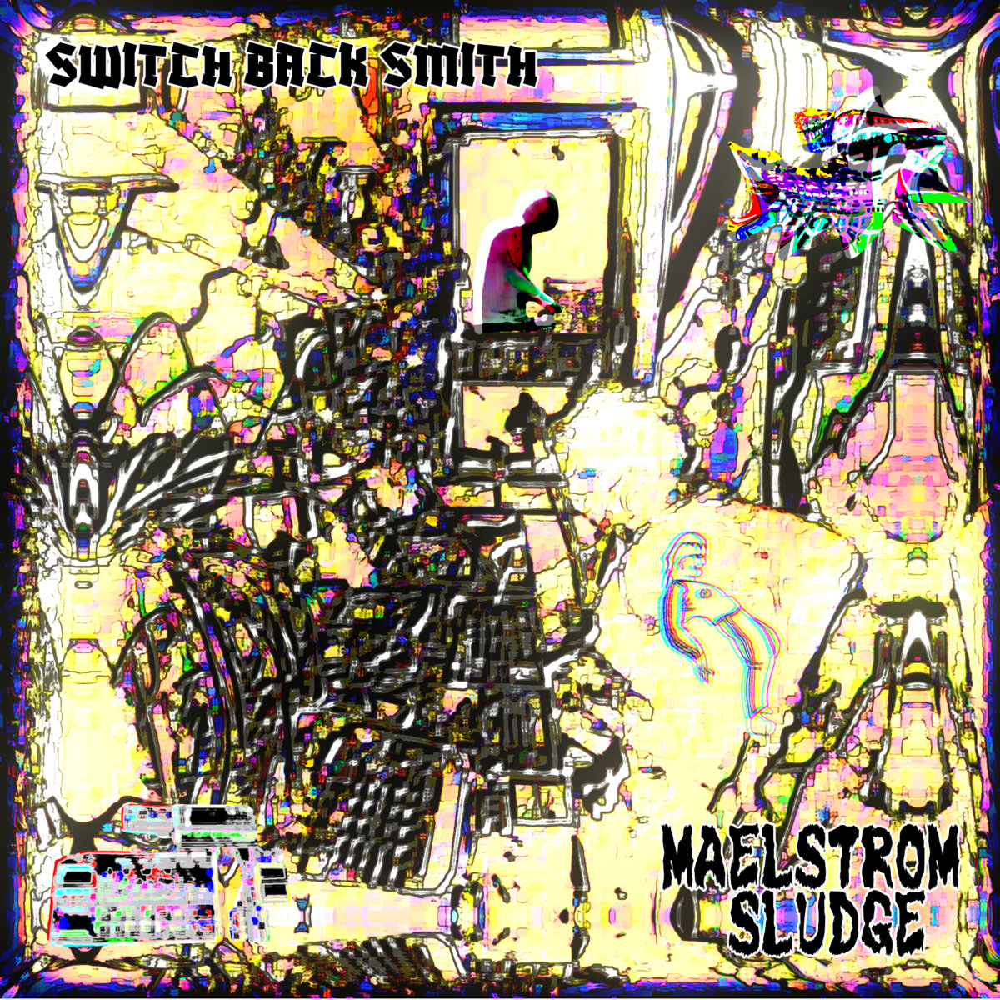
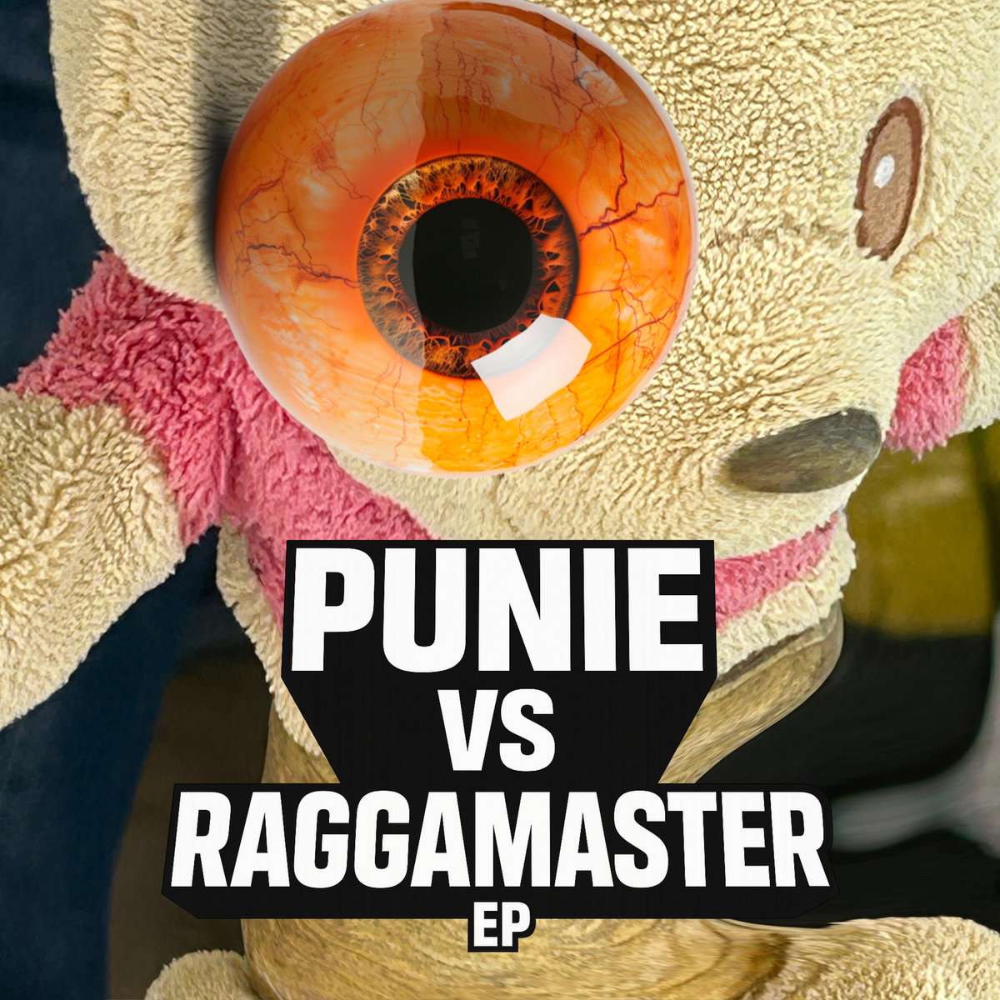
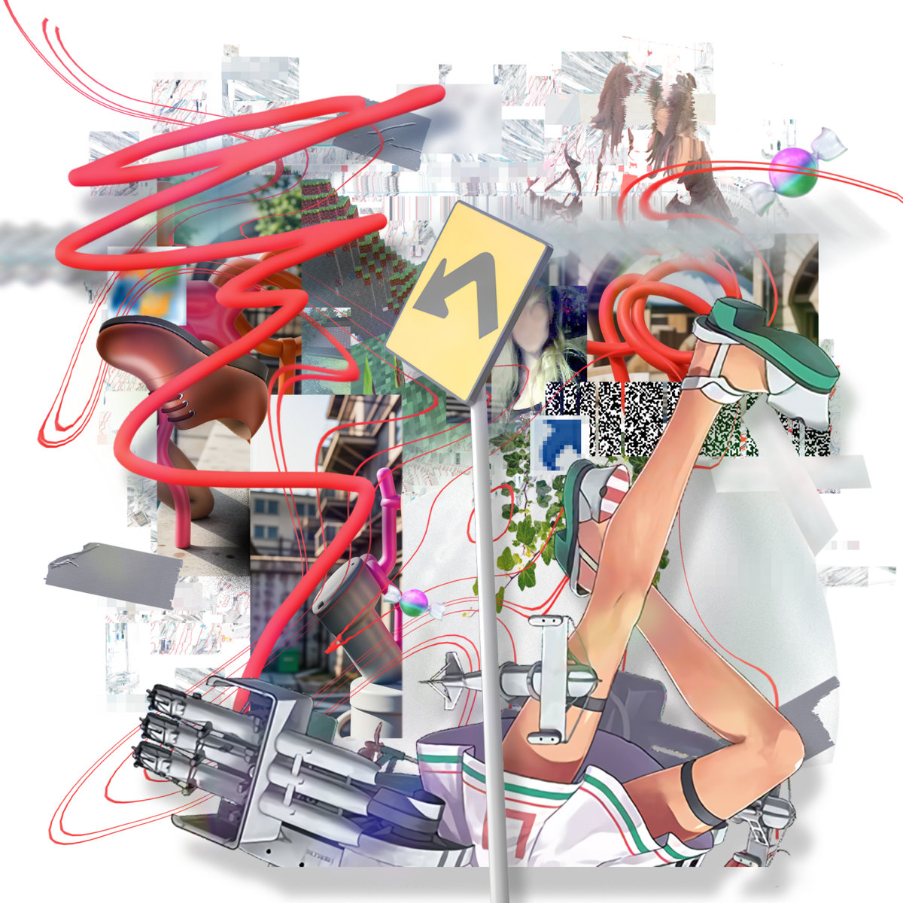
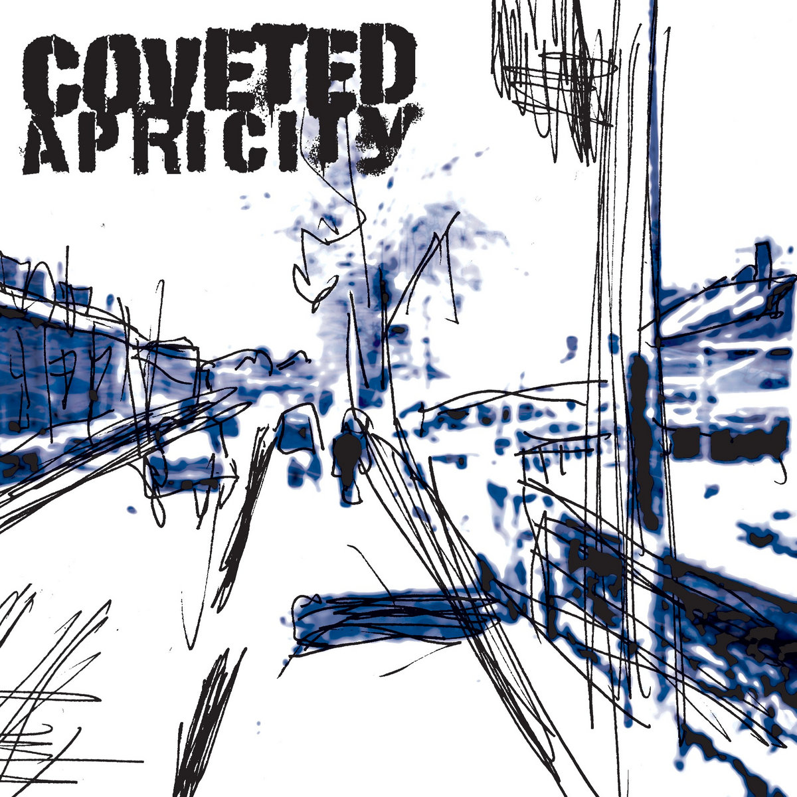
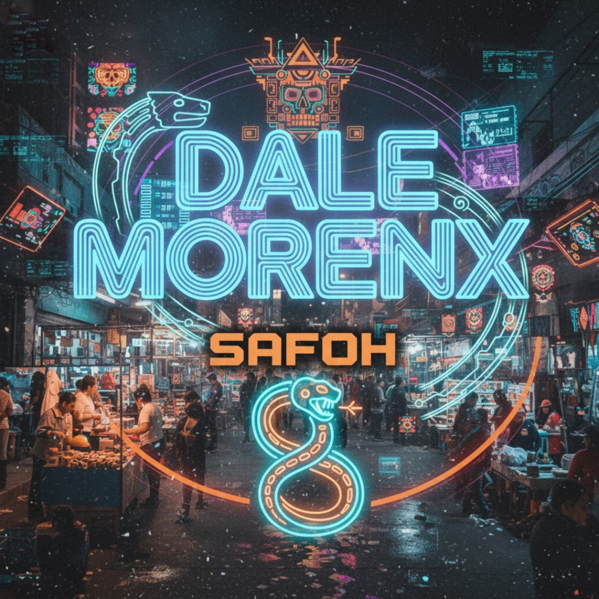
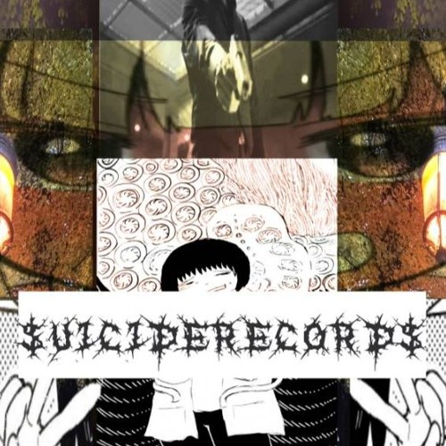

# The Breakcore Bugle - December 2025 Edition

Ho ho ho! Merry Christmas and Happy Holidays everyone! Hope you've all had a wonderful time with your loved ones...

God DAMN so much good music has come out this month... It makes sense! It's a cold time of year... So you all had to bring the heat... And you DELIVERED!!!

## Special Mentions

A new category! We've been toying with having this category for a while... We will have it every now and then, for releases that don't necessarily meet the criteria to be in the newsletter, but releases we want to shout about nonetheless.

Without further ado...

### The 20th Anniversary of Producer Snafu's 2004 'Cutecore'

We discovered this through a [reddit post](https://www.reddit.com/r/breakcore/comments/1pf32pw/20th_anniversary_of_my_debut_album_cutecore/) from Producer Snafu himself... It is indeed the 20th anniversary of cutecore!

It can't be overstated how much Snafu has contributed to the world of breakcore over his multi-decade career... A hero of the scene, from his music to his sample packs to his moderation of r/breakcore - thank you Snafu! <3

Go show him the love and appreciation he deserves... Buy it on [Bandcamp](https://producersnafu.bandcamp.com/album/cutecore-2004)!!!

### Doormouse - 101 VIPs

No introduction needed... A heavyweight in the scene... This is a collection of 57 VIP edits from tracks between 1995 and 2025. Doormouse has been releasing a few VIP edits recently, and this collection is the magnum opus.

Buy it on [Bandcamp](https://doormouse.bandcamp.com/album/101-vips)!

## Releases of the month

Okay! Without further ado, let's cover all the amazing music from this very month.

### Shimoda - Cybernetic Sample Assault

Last month, we covered EXCORSISMATDARAVE, which Shimoda released as a single, in the run up to this release. If you loved that track, you'll love this album.

In their own words, this album is...

> blown-out hyper mashcore

We love basically everything that comes out on Mobcore records, and this album is no exception.

Buy it on [Bandcamp](https://mobcorechicagorecords.bandcamp.com/album/shimoda-cybernetic-sample-assault-mcr-090)!

### XXHARDBIT3S - NEW OPP // CALI-MAN

Feels like XXHARDBIT3S is featuring monthly... Idk how this mfer puts out so much great music so frequently. Bewildering!!!

Anyway, this 2 track is a mixture of Jersey club and hardcore... Not exactly breakcore, but we're pretty loose with the genre specification at the Bugle - it really doesn't matter. It's hard as fuck and will get yer Nan hyped this Xmas.

Buy it on [Bandcamp](https://xxhardbit3s.bandcamp.com/album/new-opp-cali-man-certified-nuke-classics-vol-1)!

### Hawitima - Breaking Of The Senses

So, this month, we've been a lot more active in scouring the world of Bandcamp search (now we understand why people get so pissed about people tagging music breakcore when it isn't breakcore lol) and we discovered this absolutely beautiful album.

We were so pleasantly surprised when we stumbled across this... Hawitima blends ambient IDM & breakcore in what feels like a peaceful break from the world... I first listened to this on a long train ride home from the pub, little bit buzzed, romanticising life...

Buy it on [Bandcamp](https://hawitima.bandcamp.com/album/breaking-of-the-senses)!

### Murder Channel - Proof of Core Vol.3

We're clearly massive fans of Murder Channel here at the Bugle. Proof of Core Vol.2 was featured in our first ever article <3

With tracks from:
- yumeo
- The Teknoist
- Lil Kevo 303
- Mathlovsky
- MEOWMEOW

This compilation has a mix of IDM, hardcore, breakcore, and more.

Buy it on [Bandcamp](https://murderchannel.bandcamp.com/album/proof-of-core-vol-3)!

### DJ Tosa - Some Other Shit

Out via Shiftwreck Records - another label we're clearly a fan of! You can read out interview with Nevis Taiga (the dude who runs Shiftwreck) [here](https://thebreakcorebugle.com/posts/spotlight-01-shiftwreck-records/)!

Anyway, this EP is super fun, the first track is pretty chill, and the latter, pretty crazy. Very old school samples, and very old school break sound. Love it.

Buy it on [Bandcamp](https://shiftwreck.bandcamp.com/album/some-other-shit)!

### Switch Back Smith - Maelstrom Sludge

We <3 Corefusion here at the Bugle... Switch Back Smith and Demetzy are doing so much for the scene, I mean, they basically ARE the London breakcore scene...

This is a home recording of Switch Back Smith's set at Corefusion 003, accompanied with a video of him recording it.

In their words...

> Blown out, gritty, distorted, lo-fi sludge

Anyway, I heard you orded the heat? Well, Switch Back Smith Enterprises has got you, same day guarantee.

Buy it on [Bandcamp](https://corefusion.bandcamp.com/album/switch-back-smith-maelstrom-sludge)!

### BIJŪ - Punie vs Raggamaster

Also something we found scouring the Bandcamp search... SO pleasantly surprised with this EP!!!

Idk how to describe this?!?!?! Punky, noisy, breaky, catchy?!?!

I guess you could say, FFO like, Tokky Horror, Atari Teenage Riot perhaps?! Just listen...

Buy it on [Bandcamp](https://bijujapan.bandcamp.com/album/punie-vs-raggamaster-ep)!

### vvga - boots and legs

Another something we found scouring the Bandcamp search... There's some Portal samples in there that really grabbed our attention (greatest game series of all time btw).

FFO of jcore and super glitchy breaks!

Buy it on [Bandcamp](https://agwamnc.bandcamp.com/album/boots-and-legs)!

### South England Hate Club - Coveted Apricity

Not much needs to be said... SEHC's compilations are some of the hardest out there being made... This comp is full of crazy, noisy, aggressive, glitchy breaks... So damn good...

Buy it on [Bandcamp](https://southenglandhateclub.bandcamp.com/album/coveted-apricity)!

### Deformat Records - Apathy For The USA, VOL A

We love Deformat here at the Bugle!!! This comp has three super talented artists, two of which have already featured on the Bugle, go listen!!!

Buy it on [Bandcamp](https://deformat.bandcamp.com/album/apathy-for-the-usa-vol-a)!

## Singles of the month

### SAFOH - Dale Morenx (Latincore VIP)

Super fkin hard hardcore mixed with latin rhythms!!!

Buy it on [Bandcamp](https://safohmx.bandcamp.com/track/dale-morenx-latincore-vip)!

### Ozigiri - Rationalization Grind Attack

Grindcore, hardcore, drill n bass breakcore goodness from the [\$UICIDE\$ELECT vol.7 compilation](https://zisatsu.bandcamp.com/album/uicide-elect-vol-7)!

Listen on [SoundCloud](https://soundcloud.com/ozigiri/rationalizationgrindattack)!

### Ely Muff - Conan The Transfarian

Originally released on Bruchstellen Records Vol. 3 in 2006. 5 minutes of the hardest hitting old school kickdrums!

Buy it on [Bandcamp](https://elymuff.bandcamp.com/track/conan-the-transafarian)!

## Mix Of The Month

### DJ SP - Don't Fake The Funk meets COREFUSION

Not exactly a mix, but Corefusion were invited onto Aaja to talk everything breakcore, and play some of their favourite tracks. Listen to their breakbeat wisdom and take notes!!!

Listen on [Mixcloud](https://www.mixcloud.com/Aajamusic/dj-sp-dont-fake-the-funk-meets-corefusion-aaja-channel-1-11-12-25/)!

## Thanks!

Thanks for reading! See you next month.

We still have a few interviews and accompanying mixes in the works right now. Couple with a couple labels... Another one is going to be a really cool rig rundown with one of the coolest live artists we've seen recently... Stay tuned!!!
