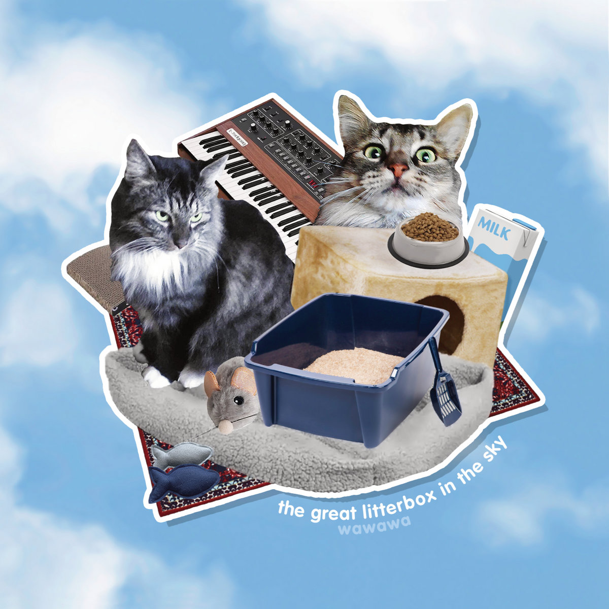
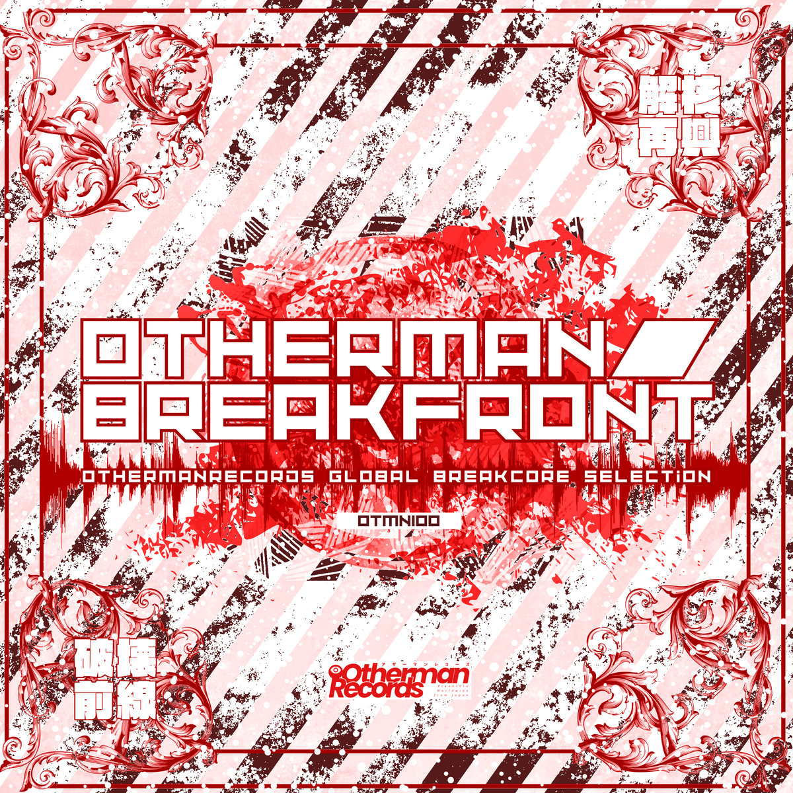
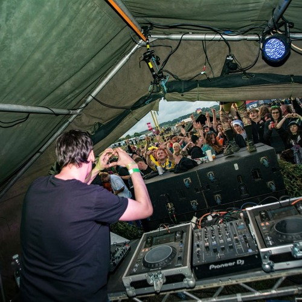

# The Breakcore Bugle - January 2026 Edition

HAPPY NEW YEAR BREAKBABIES! BUGLEHEADS! BAES! Thanks for continuing to read the Bugle. Means the world to us, and feels so fun and amazing and cool to be starting the year with this site on the go. We think '26 is going to be a great year for the Bugle.

Jan has been a _liiiiiiiiiittle_ bit quiet in the breakcore world... But actually... When you look closer... HAS IT?!?!?!?!?!?! Would you like to find out? Let's...

## Releases of the month

Alright then! Let's see what our fav breakcore artists have been cooking over this festive season and into this new, cursed year.

### Elif Yalvac - Hypnopomp

We managed to catch Elif Yalvac at a Corefusion back in December, and she was absolutely mind blowing, as is this EP. We're a bit late, we missed it in the December edition, but we don't care !!!!!!!!!!!!!!!!!!!!!!

This EP is somewhat of a departure from the more traditional breakcore we put on blast here at the Bugle. Elif comes across as very experimental (which for breakcore, is a statement and a half) - she pushes the boundaries of what we know as breakcore, speedcore, and pure experimental, modular synth based (we think) electronic music.

Buy it on [Bandcamp](https://hazalelif.bandcamp.com/album/elif-yalvac-hypnopomp-ep)!

### wawawa - the great litterbox in the sky

wawawa... More like wow wow wow! We love wawawa here at the Bugle, doing great work representing the "big jazz band falling down 7 flights of stairs" side of breakcore. This album follows wawawa's latest album, der kater der einst war (the cat that once was), from nearly a year ago. That former album was really a masterpiece of orchestral breakcore - akin to rossz csillag alatt született - this new album is much more akin to the Chocolate Wheelchair album.

Out now via South England Hate Club - god when will those guys stop putting out such good music!!!

Buy it on [Bandcamp](https://southenglandhateclub.bandcamp.com/album/the-great-litterbox-in-the-sky)!

### Entropy Nine X - Haile Selassie Lion inna Soundkillaz Session Dub

We discovered this artist through a reddit post, with a short video teasing some raggacore they had been working on. We tried to find their bandcamp, socials, etc to no avail... We were losing hope... So we hassled them directly on reddit and got that juicy link for all u Buglers...

Noisy, aggressive, raggacore. Right in the pocket. ENJOY!

Buy it on [Bandcamp](https://ee9x.bandcamp.com/album/haile-selassie-lion-inna-soundkillaz-session-dub)!

### Otherman Breakfront - OTMN100

We always try and put a compilation of some form in every Bugle edition - the most efficient way to discover new music is to follow labels, mostly, so we wanna put labels on blast every month! This month, it's Otherman Records from Japan.

Pleasantly surprised to have come across this compilation and see a lot of names we're already massive fans of, like:
- Arcade Trauma
- Bloodclot
- bypass
- unstable tone
- and many more...

If you've been following the Bugle at least a little bit of time, you're probably enjoyers of the artists we've put on blast, so you'll definitely enjoy OTMN100!

Buy it on [Bandcamp](https://othermanrecords.bandcamp.com/album/otmn100-otherman-breakfront)!

### Nevis Taiga - The Degrader

Don't think we really need to say all that much about this one... We've put Shiftwreck on blast a bunch, and The Degrader really feels like the epitome of what Shiftwreck is all about... You asked for it hot, and Nevis Taiga brought it sizzling... In their own words:

>  The Degrader is an album about erosion, destruction and overrall sonic hardcore-oriented turntable terrorism. 

Buy it on [Bandcamp](https://shiftwreck.bandcamp.com/album/the-degrader)!

### DJ Tosa - Don't Fit In

THIRTY FKIN ONE tracks of madness - we can't even fathom how someone can even make this much music...

DJ Tosa brings us a range of genres blended with breakcore in this one, in an album he says he learned to make breakcore through - he learned pretty fast...

Buy it on [Bandcamp](https://dsquad.bandcamp.com/album/dont-fit-in)!

### Cex - The Barbarjan

Another SEHC release - this time with a release from Cex, an OG producer we were previously unfamiliar with at the Bugle. Let's let SEHC describe The Barbarjan:

> 25 years on from his big explosive debut 'role model' on tigerbeat6, rjyan kidwell is back as the legendary cex, to stun again with a hefty full-length that feels somewhat like a full circle moment, if he had adopted an eyepatch and a peg leg about 180 degrees in - there is no easy way to categorise 'the barbarjan'.

Buy it on [Bandcamp](https://southenglandhateclub.bandcamp.com/album/the-barbarjan)!

### Final Sketch - Everything Goes Breakcore EP

Out via Lost Frog, Russia's Final Sketch brings us a blend of breakcore, drill'n'bass & j-core. Enjoy!

Buy it on [Bandcamp](https://lostfrog.bandcamp.com/album/everything-goes-breakcore-ep)!

## Singles of the month

### Breakforce One - It's Alright

Dancey banger from one of the goats - with an EP on the way... Oh yes...

Buy it on [Bandcamp](https://soundcloud.com/gade-system/its-alright)!

### Predatory Microtransaction -  gloria lewis and the murder of timing in a c standard environment

Not exactly breakcore, but if;
- crazy big acoustic drums
- wild guitar solos
- smooooooooooooth organ interlude

Sound good to you, check it out!

Buy it on [Bandcamp](https://predatorymicrotransactions.bandcamp.com/track/gloria-lewis-and-the-murder-of-timing-in-a-c-standard-environment)!

### Shoebill - o'er the otley runners

You're most likely already familiar with shoebill - if not - expect utter mashcore madness. True pinnacle mashcore...

Listen on [SoundCloud](https://soundcloud.com/user-905888909/oer-the-otley-runners)!

### xxxlolxxx - HAYAMITEK

HARDTEK! HARDTEK! HARDTEK!

Listen on [SoundCloud](https://soundcloud.com/glowingmaggot/hayamitek)!

### spoonXYZ -  俺のFRIDGECOREにゲイFURRY7001匹いる

> i-have-7001-gay-furries-in-my-fridgecore

Mental mashcore. Nuff said

Listen on [SoundCloud](https://soundcloud.com/spnxyz/i-have-7001-gay-furries-in-my-fridgecore)!

## Mix Of The Month

### Samson the Barbarian - BARBARIC MULTI-GENRE LIVE SET

What it says on the tin - with tracks from:
- Alec Empire
- Doormouse
- MIMIDEATH
- goreshit

and more, this mix is a riiiiiide!

Listen on [SoundCloud](https://soundcloud.com/samsonthebarbarian/barbaric-multi-genre-live-set)!

## Thanks!

Thanks for reading, everybody! It's a pleasure and a privilege to write this lil article every month.

Next article is coming out in the middle of February! o.O It's gna be a banger, written by our first external contributor!

If you enjoy reading the Bugle, and you ever feel like you want to write an article, please get in touch! The more the merrier.
