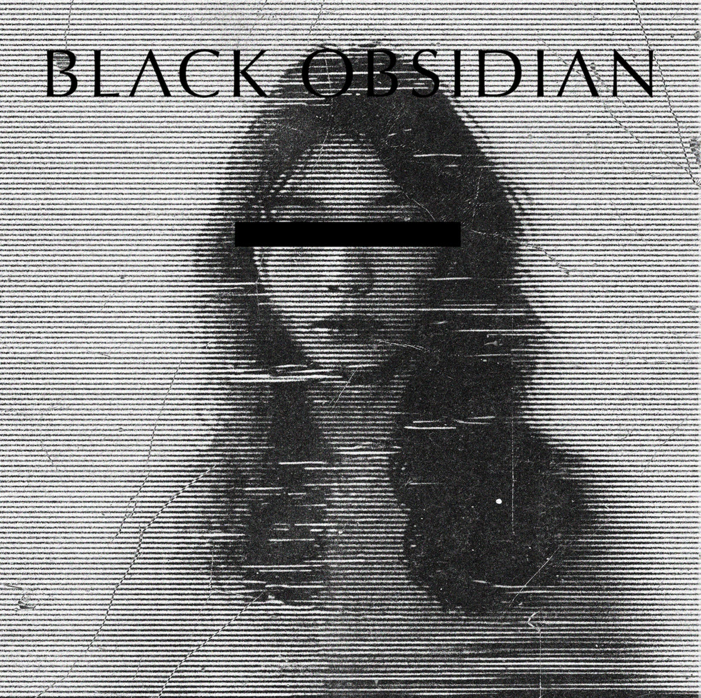
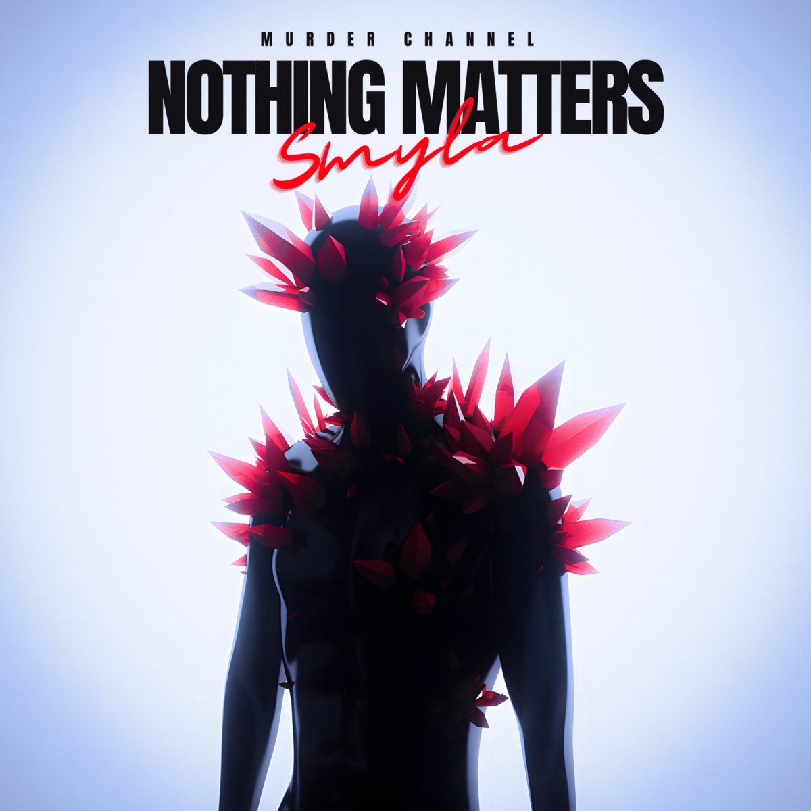
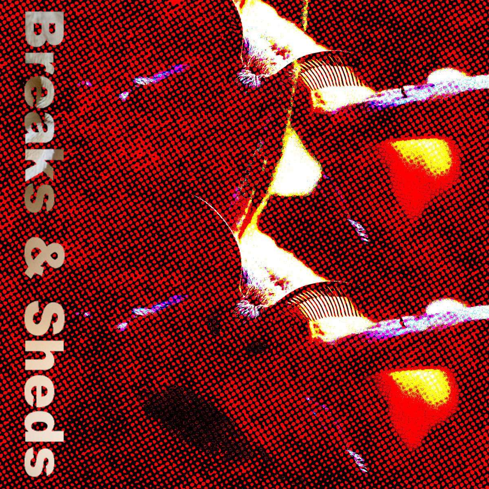
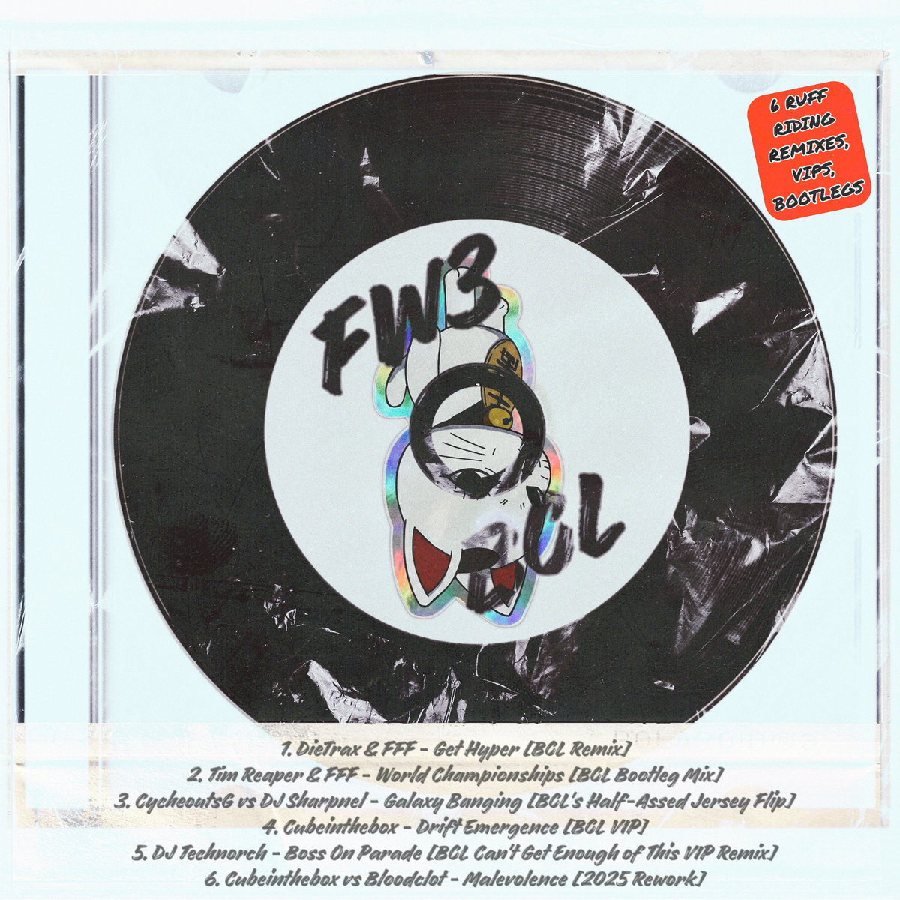
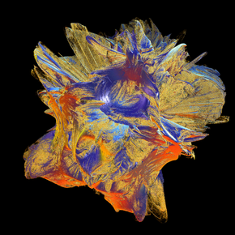

# The Breakcore Bugle - February 2026 Edition

HELLO MY BUGLERS! Sorry this one is a little late... It got initially delayed cos I found a rat in a kitchen cupboard and getting rid of it took up that whole day... and then I had a banging hangover and couldn't even dream of typing or thinking or doing anything ... Lightweights unite? Ugh...

Anyway!!!!! I've been excited to release this month's edition. The list of releases we have is, in my opinion, even MORE killer than usual... Is this possible? Read and find out...

## Releases of the month

Less singles this month - been much more on paying attention to bigger releases. So, enjoy the wide range of EPs and albums we have for u ...

### MTS AIRMASS - Prayer and Forgiveness in Modern Dance

I recently got put on to Magma Sphere records and this album was the first I listened to... And wow... Is it special...

Sonically, it is truly unlike a lot of breakcore you may have listened to. It is beautiful, calm frantic, textured... I wanted to try and describe it myself, but let me just quote from the artist:

> After five years since the last proper MTS AIRMASS album, the new Prayer and Forgiveness in Modern Dance is an unforgettable front-to-back experience that subverts the listener's expectations at every possible turn. A breakcore album inspired completely by non-breakcore outfits; see nods to Jandek, The Mountain Goats, Sachiko M, id m theft able, Kevin Drumm, Ethel Cain, and Stars of the Lid.

You can absolutely hear the influences here, making for a really unique album that pushes the envelope of breakcore. I'd say the closest thing I listen to regularly is something like The Flashbulb?

However, MTS AIRMASS makes more than enough space for themself, and needs no comparison. Enjoy!

Buy it on [Bandcamp](https://magmasphere.bandcamp.com/album/prayer-and-forgiveness-in-modern-dance)!

### Yurikan Force - Mind Stifles Me

Discovered this one through some deep bandcamp digging (side note, the search function on bandcamp is completely broken dogshit, I wish they would fix it, feels vibe coded lol)...

Normally, trawling through a bandcamp search is tiresome, it eats away at your soul a little bit seeing all the completely unrelated releases, stuff that doesn't match your search criteria at all... However, Mind Stifles Me, was at the top of the page on a particular search. I think I was meant to stumble across this album, instantly clicked with it and knew it had to feature.

I know nothing of the artist, and seemingly it is their first release? For a first release, this album is mental. Insanely aggressive, noisy, over the top... 10 tracks of pure violence. I LOVE it.

Buy it on [Bandcamp](https://yurikanforce.bandcamp.com/album/mindstiflesme)!

### BLACK OBSIDIAN - DTRASH247

D-Trash have been putting out absolute heaters for the longest time... And by no means do they let up in their 247th release:

> When ATR said to bang your fucking head some 30 years ago, Black Obsidian listened; they embodied it - owned it - and haven't stopped banging since.

D-Trash ain't lying to you with this statement... This album doesn't let up for a fucking minute, so energetic from start to finish, feels like it'll explode out of my computer... Some of the rawest breaks and vocal combos ya ever heard...

Buy it on [Bandcamp](https://d-trashrecords.bandcamp.com/album/dtrash247-black-obsidian)!

### Smyla - Nothing Matters

Out via Murder Channel... A favourite of the Bugle, of course... 25 minutes of seriously hard hitting drum and bass... Breaks are absolutely crissssssspppppppp...

Buy it on [Bandcamp](https://murderchannel.bandcamp.com/album/nothing-matters)!

### DJ Tosa - Amenmentalist

DJ Tosa making a Bugle appearance yet again... We'll let up when he lets up with the bangers...

What's this EP? Well, it does what it says on the tin. Raw, pure, amen mentalism, with a lil bit of raggacore on the side!!!!!! Energetic as fuck, we love it...

Buy it on [Bandcamp](https://dsquad.bandcamp.com/album/amenmentalist)!

### noisetripper - Girls Love Raggacore

20 tracks of insane Ragga-mash-core - a very special album which deserves some more attention, very creative sampling (which is something always loved by the Bugle) even coming complete with a remix from DJ Tosa!!! And also extra clout points for the homage to the similarly named Mochipet album :P Technically came out in January, missed it, don't care!

Buy it on [Bandcamp](https://noisetripper.bandcamp.com/album/girls-love-raggacore)!

### Midnight Shawarma - Breaks & Sheds

Here at the Bugle, we try and represent all aspects of breakcore, all the influencing and related genres - people get into breakcore in many avenues, from many other genres, so it's only right we represent all those avenues. So, the preamble is because some people will not perceive this release as breakcore. But... Who cares? Midnight Shawarma gives u a masterclass in break chopping on this record, meandering between ambient jungle, pure IDM, and some pure breakbeat mentalism...

Buy it on [Bandcamp](https://midnightshawerma.bandcamp.com/album/breaks-sheds)!

### Bloodclot - FROM WITHIN VOL 3

Bloodclot brings you 6 hard as fuck remixes of some of his fav tracks from various compilations over the years... Spanning a few genres over the 6 tracks, this EP will get you moving, no matter which track you're spinning...

Buy it on [Bandcamp](https://blo0dcl0t.bandcamp.com/album/from-within-vol-3)!

## Singles of the month

Yeah... Sorry... Like I mentioned earlier, I've been paying way less attention to individual tracks this month, so this section is more sparse than usual!

I think I follow too many people on SoundCloud. I've added a note to my todo list to unfollow a bunch of people to make it easier to keep up with the feed... Hopefully next month I'll be back to having many singles 4 u...

### HAMMER BROS - Gang Ni Naritakkatta

Absolutely FUCKING LUDICROUS hardcore from the HAMMER BROS... I'm actually also in the process of sampling the english version of Taxi Driver, and was so surprised and confused when I heard the sample until I realised what it was... Here is a man... Who STOOD UP! Well... The HAMMER BROS stand the fuck up and give u what u need...

Buy it on [Bandcamp](https://murderchannel.bandcamp.com/album/gang-ni-naritakkatta)!

### Hawitima - From The Heart

Hawitima back at it again with some clean breaks and wonderful soundscapes... Listen n relaxxxxx...

Buy it on [Bandcamp](https://hawitima.bandcamp.com/track/from-the-heart)!

## Mix Of The Month

### AndreiM_2606 - BREAKCORE Nostalgia

Stumbled upon this one on Mixcloud - no idea who the guy is, but the mix BANGSSSSSSSSSS!!!! And it's absolutely nostalgia baiting me, but it worked, and I thoroughly enjoyed the listen... Lots of all time fav breakcore artists in this one for me, so it's ideal...

Listen on [Mixcloud](https://www.mixcloud.com/AndreiM_2606/breakcore-nostalgia/)!

## Thanks!

Thanks for reading! As always, it's a pleasure and a privilege to write this lil article every month.

We have a super fun article coming out in the next few weeks - an interview with a certain _Mexican_ breakcore label... Hmmmmm... Who could we be talking about? I wonder... Perhaps clues are in previous articles? Are you a sleuth? Will you figure it out? No prizes apart from a sense of accomplishment!

See you then x
