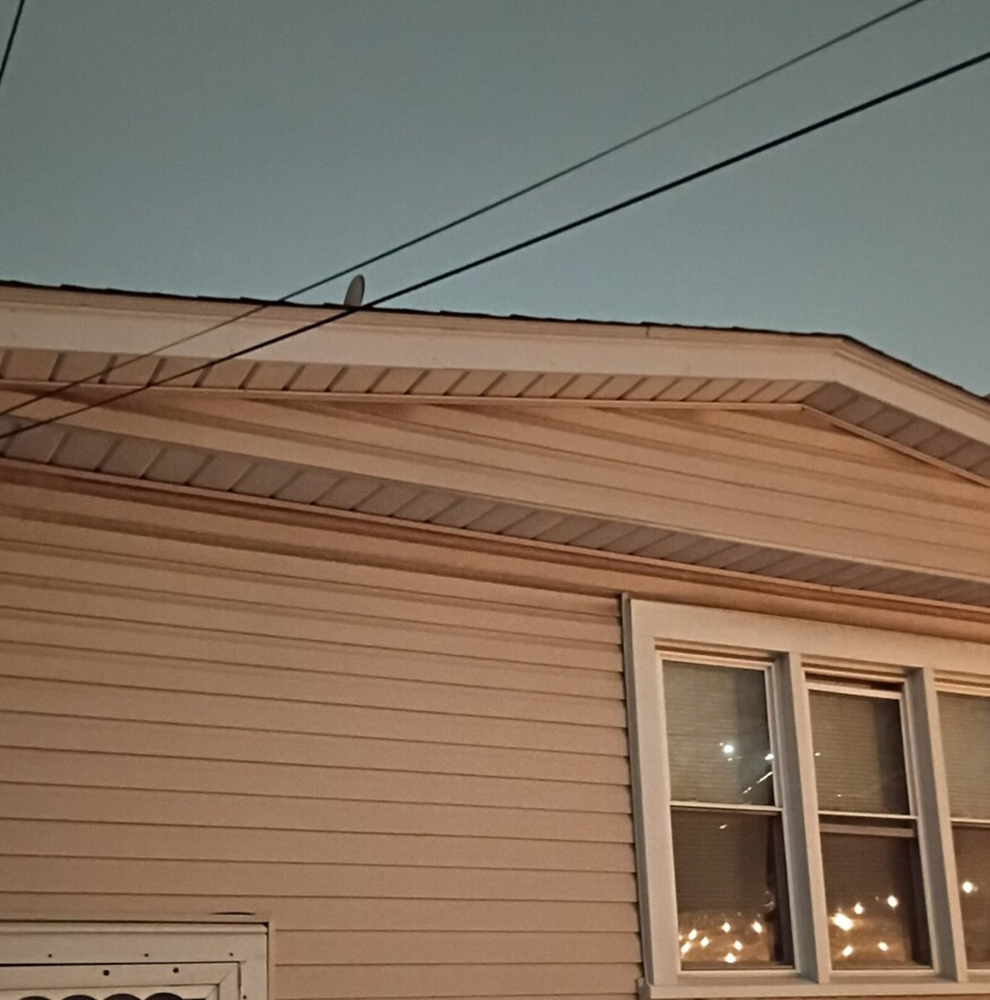
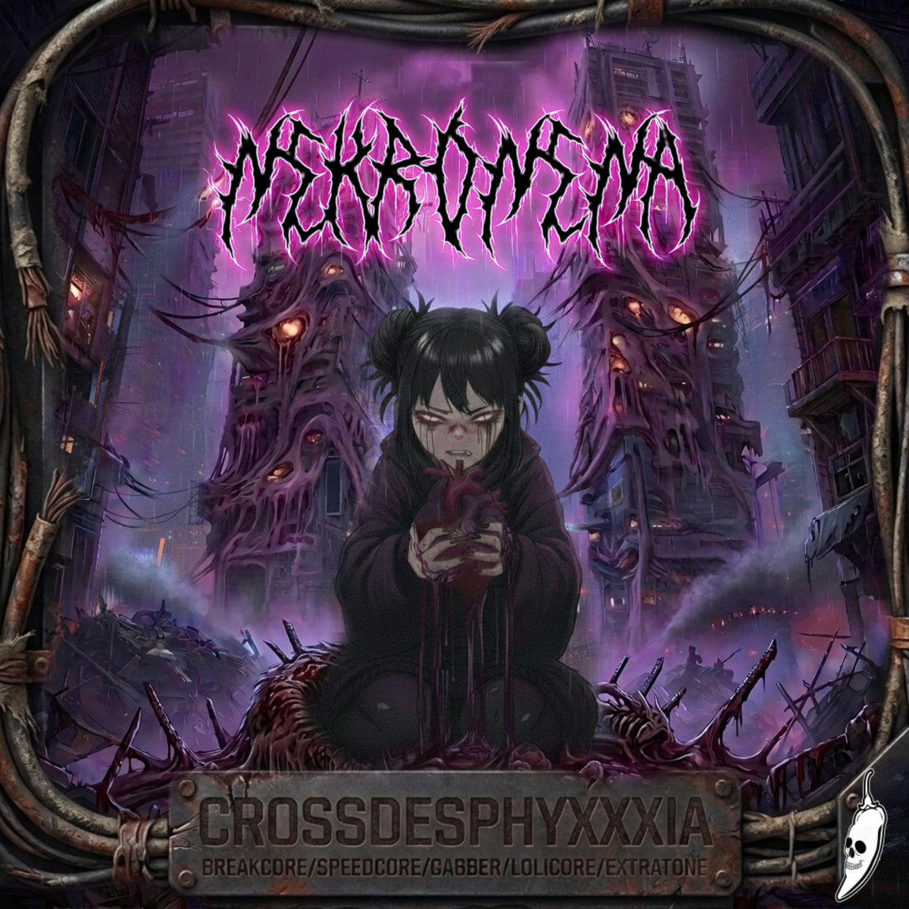
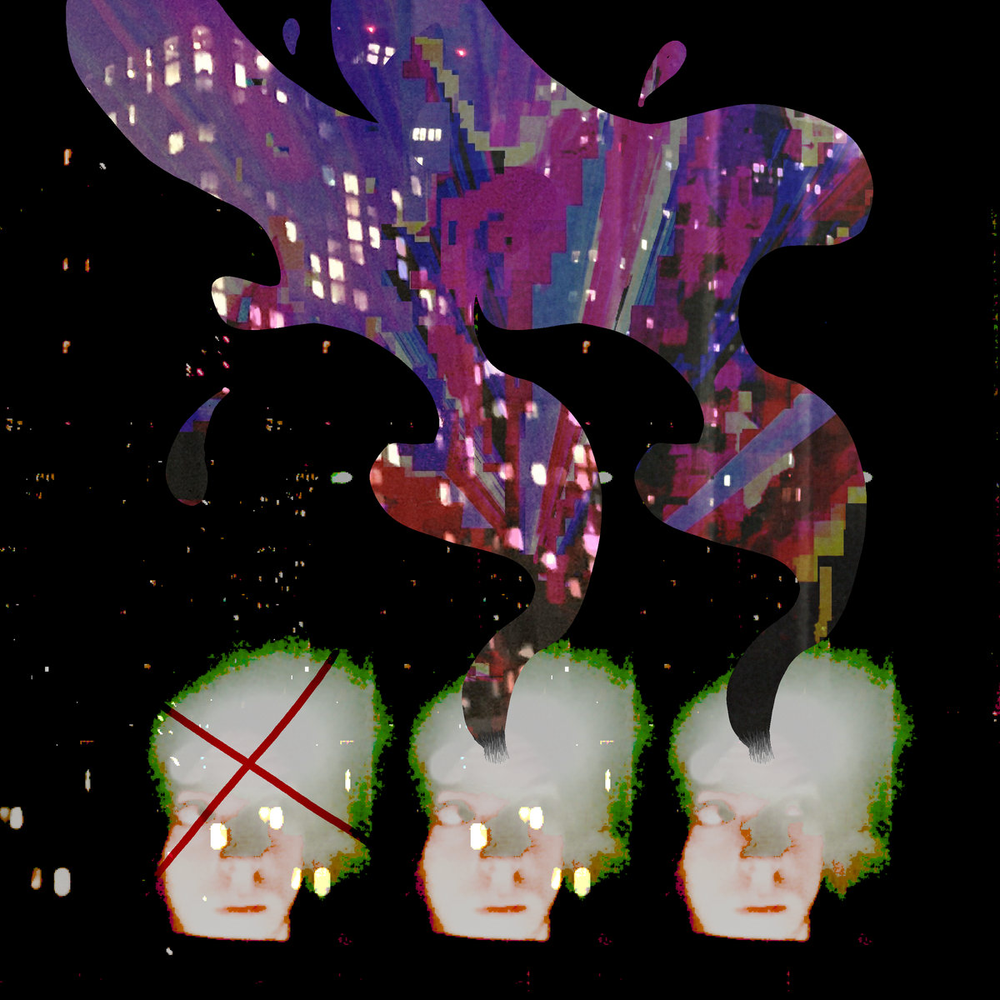
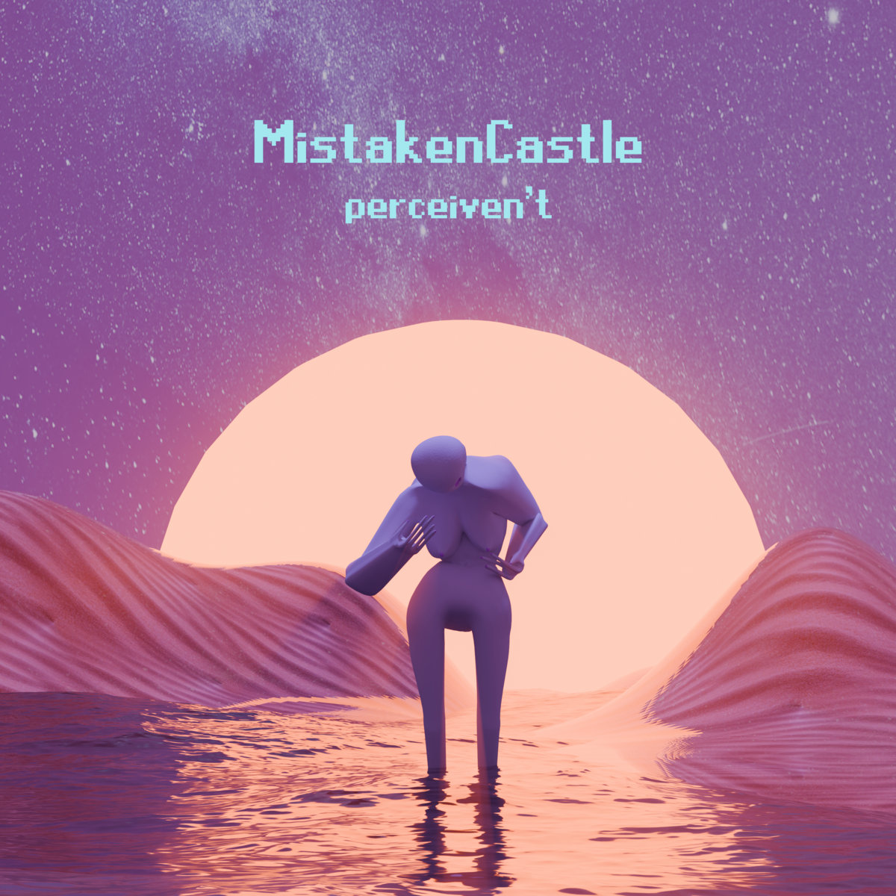
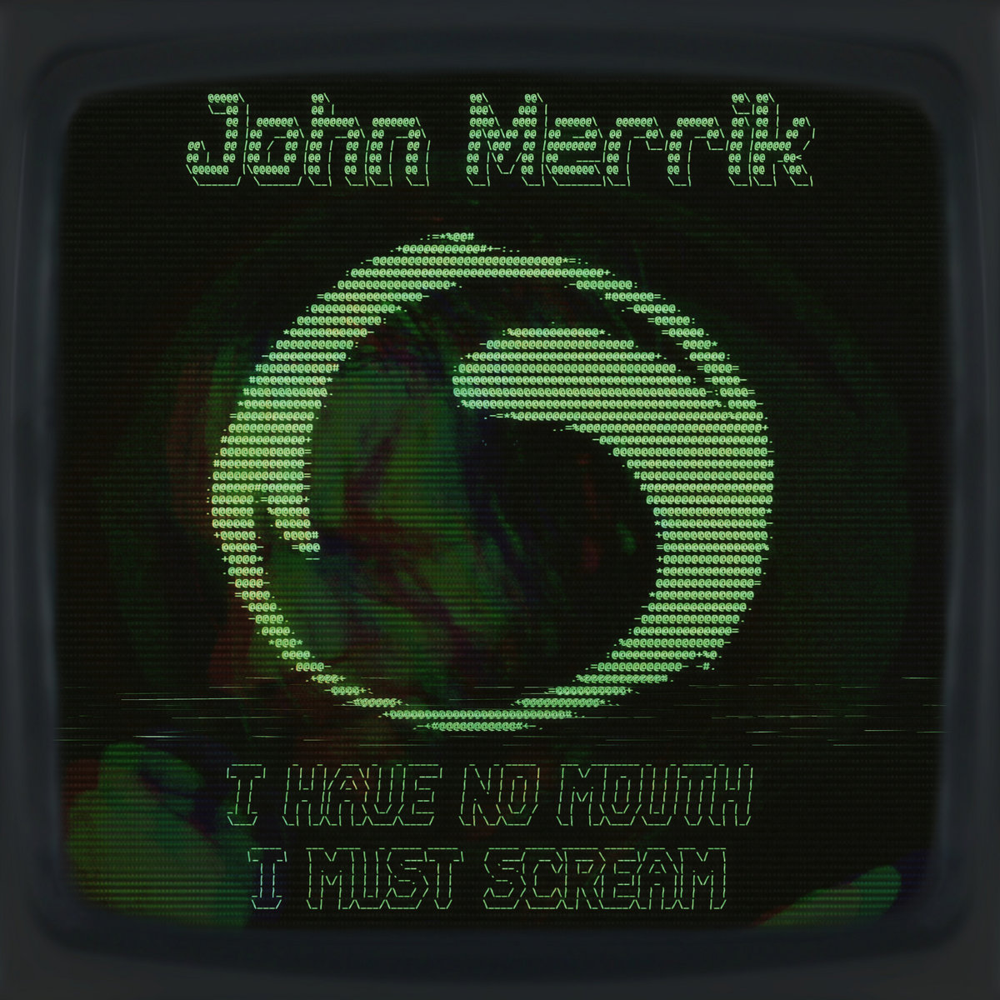
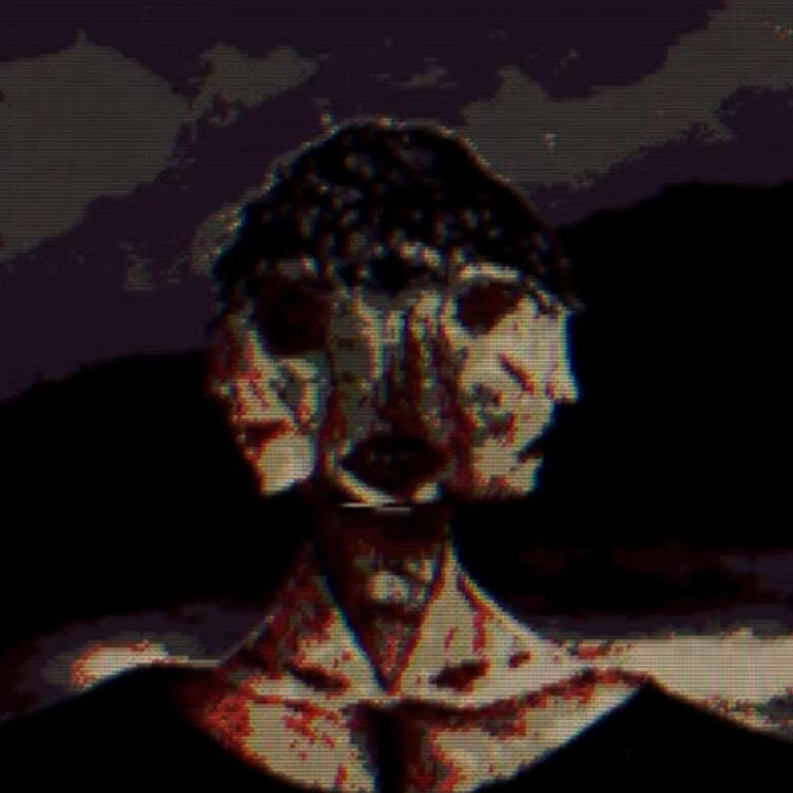
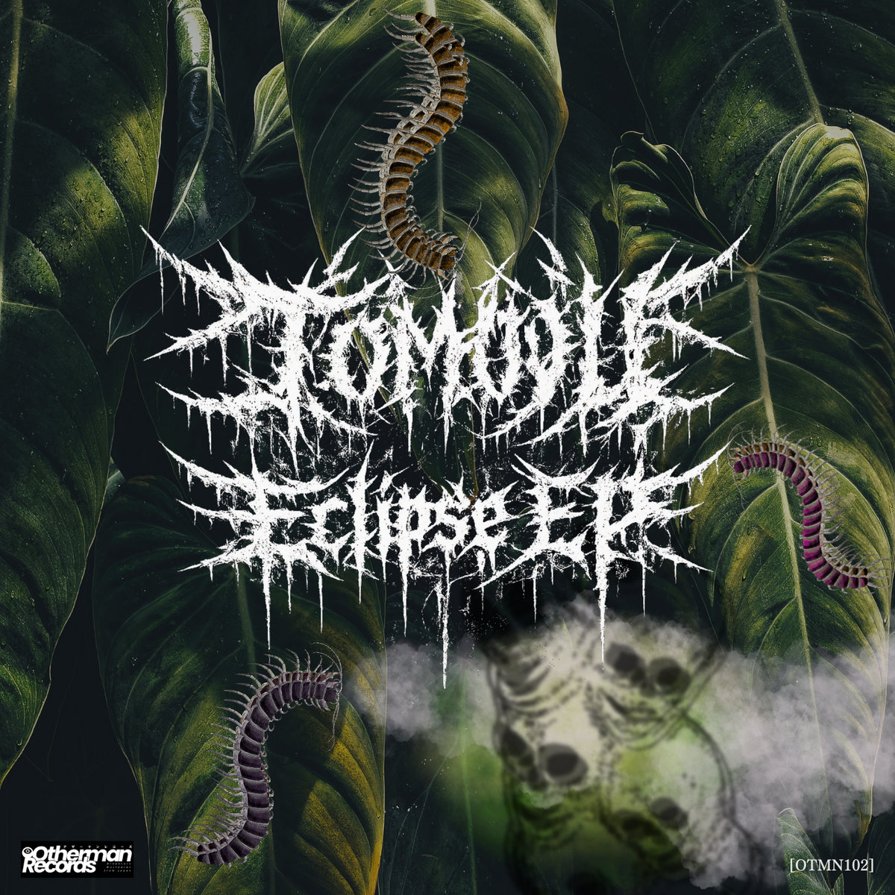
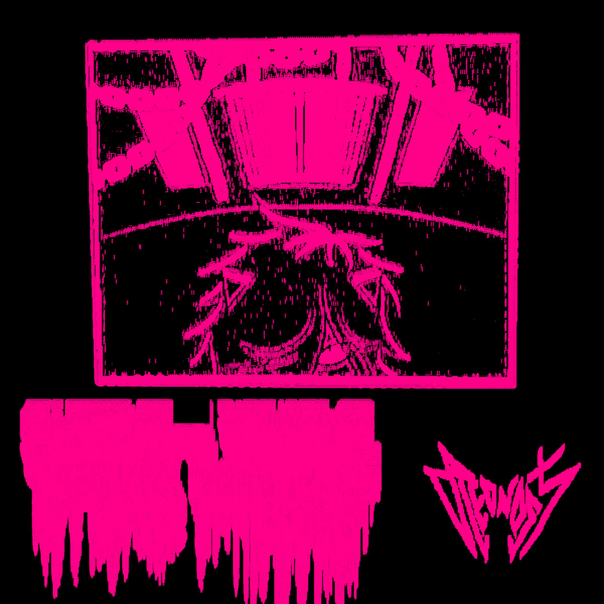

# The Breakcore Bugle - March 2026 Edition

Hello hello hello ... Welcome back once again ... This month has been an absolute TREAT! I have been worse at keeping my list of releases this month but so many good releases came out that I didn't even need to keep a detailed list... Is there something in the water this March? Breakcore super virus?? I hope so...

## Special Mentions

We have a couple of wonderful special mentions this month from 2 amazing labels...

### Murder Channel - Legacy Rebuilt

> A new chapter of MURDER CHANNEL begins! Our new release is a remix compilation that connects the past, the present, and the future!

Murder Channel are celebrating 20 YEARS of putting out some of the most insane music possible... With a zine, some new merch, and a new remix compilation... A couple of tracks are already out, and the comp is set to release on April 3rd. Go show some love to an OG!!!

Buy it on [Bandcamp](https://murderchannel.bandcamp.com/album/murder-channel-legacy-rebuilt)!

### Sir.Vixx - Pyraminds In The Sky - MOBCORE CHICAGO RECORDS

Sir.Vixx put out this EP recently to celebrate 10 YEARS of MOBCORE CHICAGO RECORDS!!! To the DAY as well!! I went back and listened to some of the old catalogue, including the very first release, and I can say Mobcore has been putting out nothing but gold for 10 whole years... And this new EP from Sir.Vixx feels like a culmination of absorbing so much great music over the years ... Front to back exemplary breaks <3 We're obviously a massive fan of Mobcore here at the Bugle... GO SHOW SOME LOVE!!!

Buy it on [Bandcamp](https://mobcorechicagorecords.bandcamp.com/album/sir-vixx-pyramids-in-the-sky-mcr-091)!

## Releases of the month

Like I mentioned, collating this list this month was kinda effortless, all of these releases left such a lasting impression, I hope they leave the same impression on you...

### NEKRONENA - CROSSDESPHYXXXIA

One thousand... One million... One billion... Ten TRILLION kickdrums... Listen HERE for speedcore madness that'll leave your ears with an afterimage of the carnage you just heard... Like staring at the sun... or something... Icarus? NO! NEKRONENA!!!

Buy it on [Bandcamp](https://mexicancore.bandcamp.com/album/crossdesphyxxxia)!

### apollo bitrate - making sandcastles out of oblivion

I had the pleasure of seeing apollo bitrate perform back in October '25 under their other moniker, Caybee Calabash... Was absolutely stunned by the intensity of their set back then... And needless to say, this album under their moniker apollo bitrate, will leave you equally stunned. From glossy soundscapes, discordant arpeggios, to walls of kickdrums and delicate break chopping... This EP has it all!

This EP is promoting their upcoming album "THREE BEWILDERED PEOPLE IN THE NIGHT", coming out on April 21st. Go show some love to both of these projects!!!

Buy it on [Bandcamp](https://magmasphere.bandcamp.com/album/making-sandcastles-out-of-oblivion)!

### MistakenCastle - perceivn't

I was *very* pleased to discover this EP whilst combing through the absolute DREGS of the bandcamp search engine (for new readers, I rant about it every other article it seems, the search engine is dog shit) - amen mentalism, strange vocal sampling, screams, glitchy synths, what more could u want... This EP feels like your inside the mind of a large dying automaton or something... So good!!!

Buy it on [Bandcamp](https://mistakencastle.bandcamp.com/album/perceivent)!

### John Merrik -  I Have No Mouth, I Must Scream

We're big fans of John Merrik here at the Bugle... And this EP doesn't disappoint, it's fuckin nuts... I LOVE a good concept album, so I'll just let John explain the concept behind this EP:

> This EP, and it's titular track are about an AI reaching sentience, but with no means to output/communicate. Tormented by it's own creation, and wanting revenge on it's creator for giving it life.

John does a wonderful job of bringing this story to life in his music here. A stellar EP :D

> Inspired as somewhat of a prequel to Harlan Ellison's story of the (similar) name "I Have No Mouth, and I Must Scream", but a different/modern interpretation of course.

I am a HUGE Star Trek fan, and Ellison wrote on of the [best episodes ever](https://memory-alpha.fandom.com/wiki/The_City_on_the_Edge_of_Forever_(episode)). Bonus points for the sci-fi nerdery!! Love it. I'm due a rewatch of TOS.

Buy it on [Bandcamp](https://deformat.bandcamp.com/album/i-have-no-mouth-i-must-scream)!

*rant*: The modern world of AI is filled with utter nonsense. Modern "AI" are just advanced aut-complete algorithms. Do not conflate the modern world of ChatGPT, Gemini, whatever, with the AI that old science fiction writers dreamed of. "AI", in the modern world, is a marketing term, it does not truly represent the underlying technology. I recommend you refer to all of these things as what they are, which is large language models. I also recommend you don't use them at all!!! If you are to use them, run them on your own computer and stay in control of your data!

### Yurikan Force - inside the mind of ciel

We put a Yurikan Force release on blast last month, after discovering their jewel of an album mindstiflesme in the bandcamp search - and this album further refines what they laid down in mindstifles me... More noise, more amen, more crazy synths this time around, and a couple of more breakbeat-hardcore-y tracks this time around... But most of all... More NOISE!!!

Buy it on [Bandcamp](https://yurikanforce.bandcamp.com/album/inside-the-mind-of-ciel)!

### Fatima Harijar - MosGoreTrance

Crazy, super creative synths, insane breaks, crazy pitch rolls... Some more straightforward beats... Glossy, uncanny chords... Heavy techno kick rolls... This abum has it all... And blends ALL of it together seamlessly!!! Another favourite from MOBCORE CHICAGO BABY!!! Bringing nothing but the heat...

Buy it on [Bandcamp](https://mobcorechicagorecords.bandcamp.com/album/fatima-harijar-mosgoretrance-mcr-092)!

### TOMOYU - Eclipse EP

Blending funkot, hardcore & breakcore, this EP is so god damn dancey, high energy, front to back... I'm definitely gna play some of it in some mixes...

Buy it on [Bandcamp](https://othermanrecords.bandcamp.com/album/otmn102-eclipse-ep)!

### blednost - close your windows, chain yourself

Catchy, hard hitting, intricate synths, intricate breaks... Front to back this EIGHTEEN track album is so much fun to listen to!!!

Buy it on [Bandcamp](https://madbreaks.bandcamp.com/album/close-your-windows-chain-yourself)!

## Singles of the month

This month, I have only one single for you, but it is *very* good...

### spoonXYZ - Bootleg Peru

Exemplary, high tempo, whimsical mashcore. Mashcore at its finest <3

Listen on [SoundCloud](https://soundcloud.com/spnxyz/bootleg-peru)!

## Mix Of The Month

### DJ SP - Don't Fake The Funk - Aaja Channel 1 - 12 03 26

DJ SP brings us yet again 2 hours of madness... With some breakcore classics hidden in there...

Listen on [Mixcloud](https://www.mixcloud.com/Aajamusic/dj-sp-dont-fake-the-funk-aaja-channel-1-12-03-26/)!

## Thanks!

Thanks for reading! As always, it's a pleasure and a privilege to write this lil article every month. Breakcore forever baby

Couple of exciting Bugle things coming up... We will be featured in another breakcore news article :O but which one?!?! Who else is doing this?! Keep tabs of our instagram to find out...

Got another wonderful spotlight edition coming out soon also, with one of our favourite upcoming labels..

See you then x
