# The Breakcore Bugle - April 2026 Edition

Welcome back once again my people. I was worried coming to write this article, I felt like I had let this month slip a little bit... But then I surprised myself! I forgot just HOW MANY amazing releases I've made note of over this last month. This month is going to be a FAT edition, stacked front to back with nothin but gold...

## Special Mentions

Quick couple of special mentions and then let's dive into the releases...

### John Merrik - Rubber EP

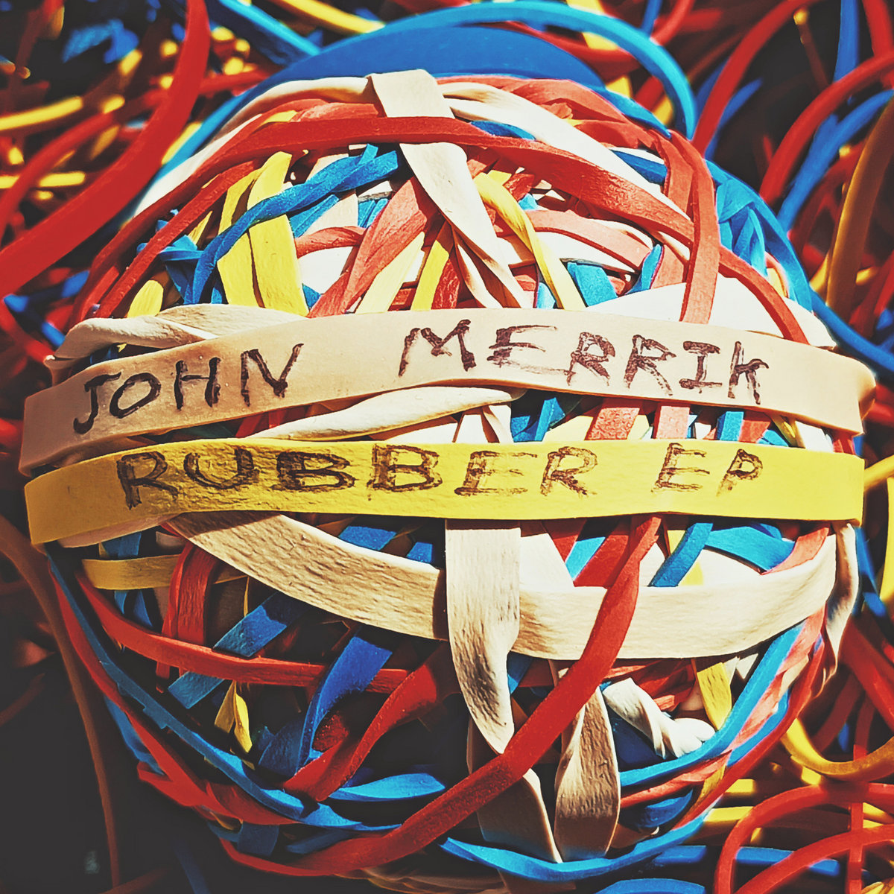

This EP is a re-master and re-release of some of John Merrik's earliest work from the mid-2000s. You can really hear the era of breakcore in this release and it's nostalgic and inviting. Blending old school hardcore, breaks2thamax, and some deep D&B grooves... The songs on this EP are all new to me but feel like classics! Great stuff.

Buy it on [Bandcamp](https://deformat.bandcamp.com/album/rubber-ep)!

### STR1PE - CLOSER222GOD

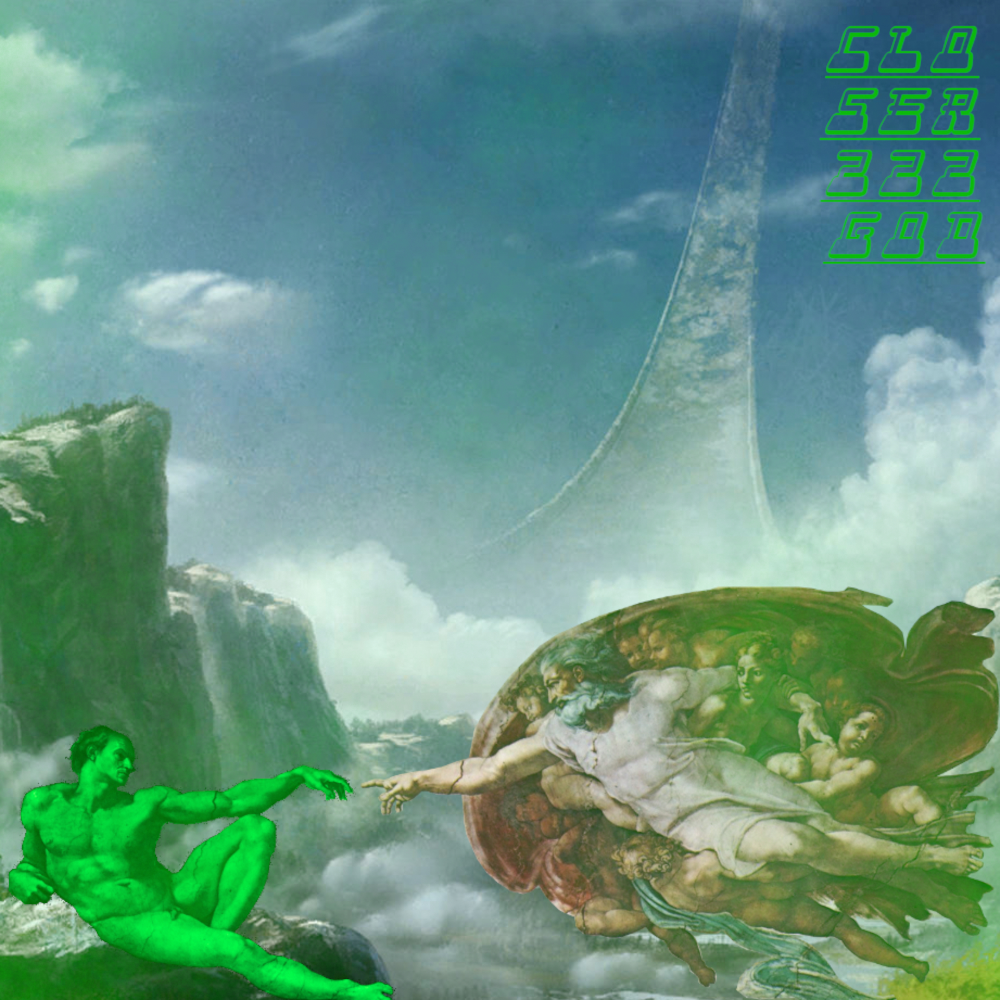

A cheeky little self plug... Don't hate me... Here is my latest EP, CLOSER222GOD :) Whacky sampling and groove awaits you...

Buy it on [Bandcamp](https://mobcorechicagorecords.bandcamp.com/album/str1pe-closer222god-mcr-093)!

## Releases of the month

Ooft... Carrying around this edition of the Bugle... So heavy... So many great releases inside... My arms hurt... But I carry this anthology for you... Reader...

### nitroii - Recession Beating Anthems, Volume Two

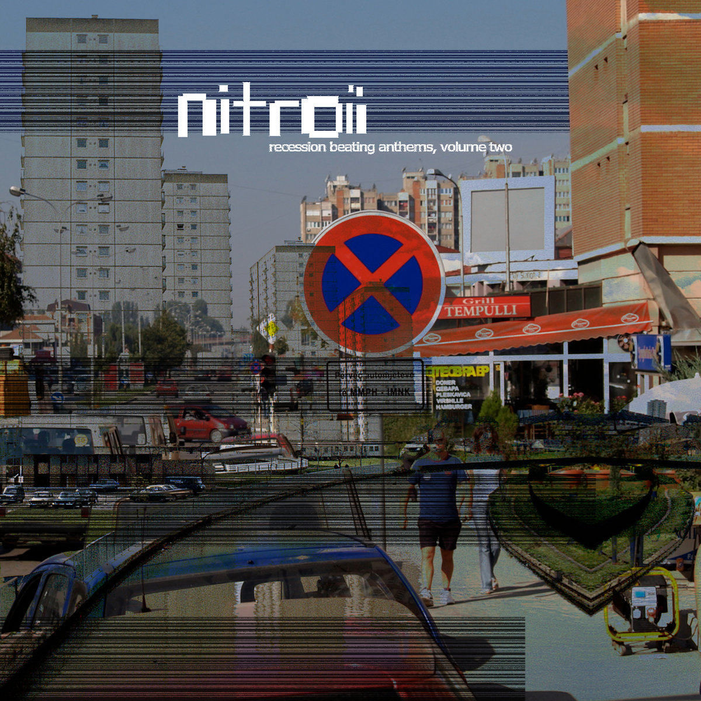

For those who don't know, nitroii is 1 half of South England Hate Club - and for those who do know - u know that means anything this guy makes is highly likely to be absolutely fuckin awesome. I've listened and can confirm it is, and that nitroii in no way disappoints.

> a hard and long two years on from the first installation, nitroii returns to confuse and dazzle once again in his classic tongue-in-cheek mashup breakcore manner. continuing where volume one left off, volume two is a jam-packed affair of breaks and bass, skipping from mashcore and breakcore at questionable tempos to industrial grime/dubstep and crunk - what's not to love, folks?!

I finish listening to this album and I just... Want... More...

Buy it on [Bandcamp](https://southenglandhateclub.bandcamp.com/album/recession-beating-anthems-volume-two)!

### Swr.ratGRL - the sales from this album will help us afford housing

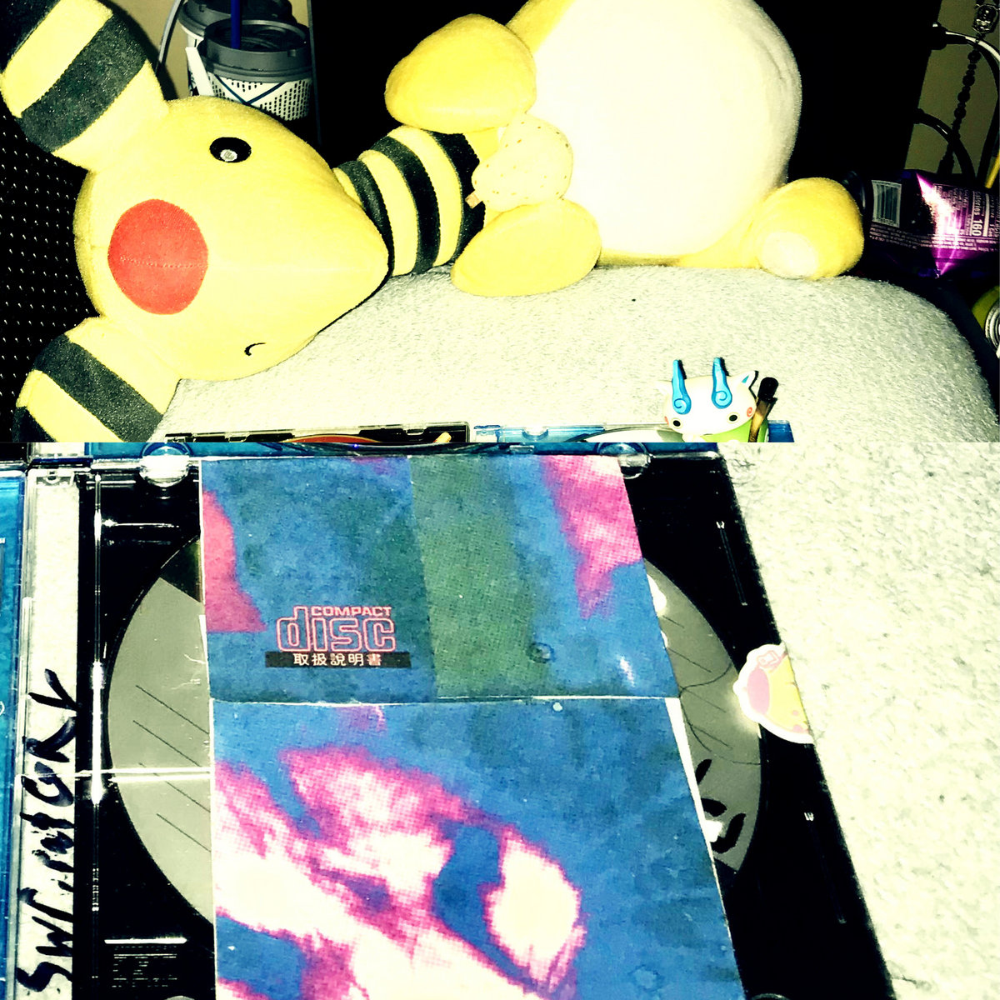

Another find from trawling through bandcamp search... 20 tracks of pure catchy breakcore... Filthy breaks... Tantalising hooks & rhythms... With a hint of mashcore & some glossy Neon White esque pads... Wonderful... 20 tracks that barely give you a chance to breath...

From the album description:

> All proceeds from this album will help allow me and my girlfriend to be able to move and afford housing. Her dad is kicking us out when her mom passes away (which could be anywhere from a week from now to a month, if even) so we need to raise up some funds soon or we'll be out on our own.

If you can afford to buy it, do so!

Buy it on [Bandcamp](https://tami-tomi.bandcamp.com/album/the-sales-from-this-album-will-help-us-afford-housing)!

### SophieKms - Sorry...

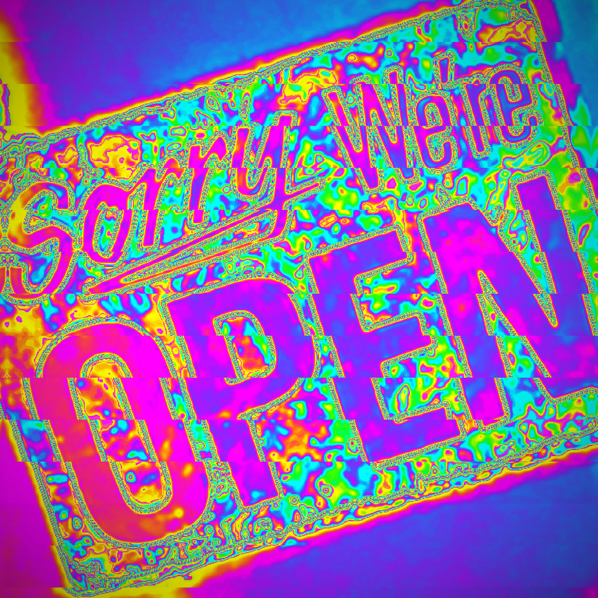

Wild, wild, super high energy mashcore, with some absolutely whacky sampling, which I'm a MASSIVE fan of... Music that is a little bit silly is the best music...

>  please enjoy listening to me harness the arts of breakbeat manipulation and sampleage. this is what i have to show for it.

Buy it on [Bandcamp](https://dogpunk.bandcamp.com/album/sorry)!

### apollo bitrate - heavily warped perception of generic

Man... Fuckin apollo bitrate... Every release I have the pleasure of listening to gets crazier and crazier, and I'm always left surprised after listening... So damn creative, each track is a rollercoaster...

Buy it on [Bandcamp](https://caybee.bandcamp.com/album/heavily-warped-perception-of-generic)!

### noisetripper - Another Mashcore Album

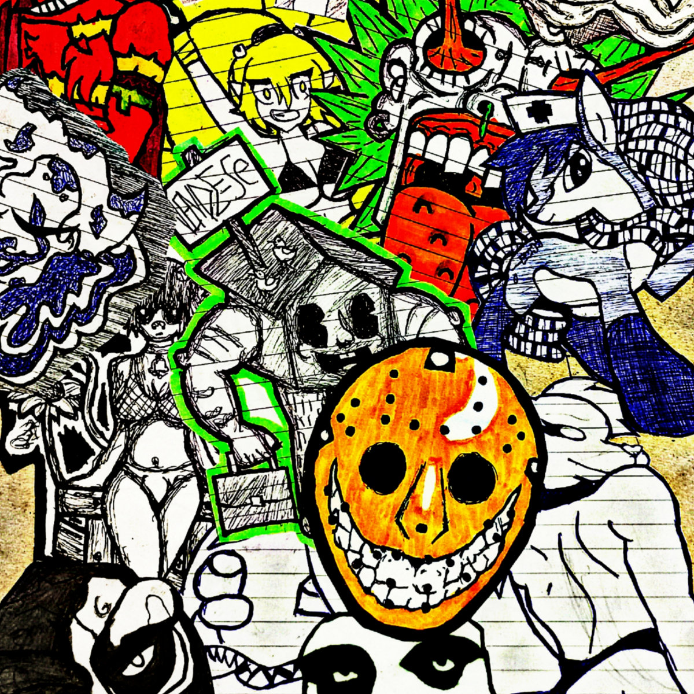

Fuckin noisetripper!!! I loved Girls Love Raggacore from back in Jan, been playing it a lot in practice mixing sessions... This next album from noisetripper does not disappoint... Quintessential mashcore, get to know... These breaks are blowing my mind...

Buy it on [Bandcamp](https://noisetripper.bandcamp.com/album/another-mashcore-album)!

### Hawitima - RAGGACON

For those interested in the side of breakcore closer to jungle, breakbeat hardcore or IDM, this is the album for you! Mesmerising beats, Hawitima holds your hand through a journey from relaxation to over-stimulation...

Buy it on [Bandcamp](https://hawitima.bandcamp.com/album/raggacon-2)!

### Fractal Weirdo - Basement Beats

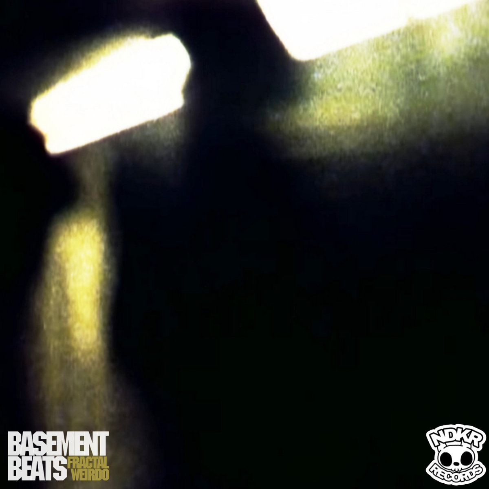

Stripped-back, hard as fuck pure breakcore that's all about the rhythm. Can't remember how I stumbled upon this album but I'm so glad I did - it is absolutely hypnotizing. I want to melt into this album.

Buy it on [Bandcamp](https://nerdkorerecords.bandcamp.com/album/basement-beats)!

### Yob The Delectable - corruptedwavelengthsmemeticwaste_ep

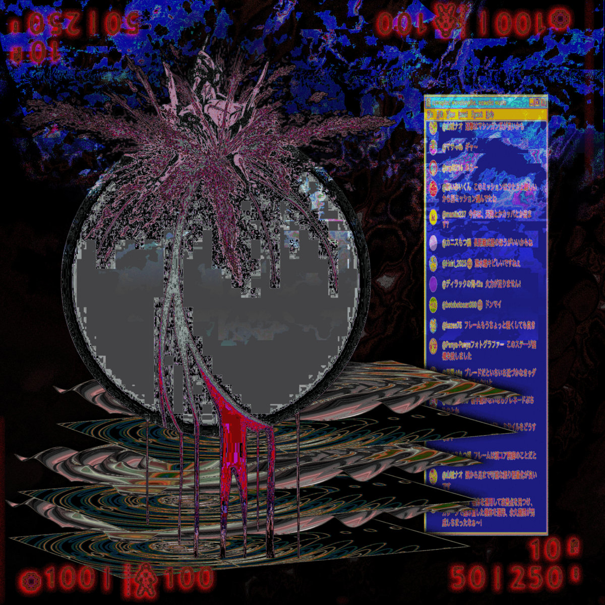

Fuckin sick album. Sounds like if you put the Neon White soundtrack through a blender. Or through a food processor. Are they the same thing? Did I already mention Neon White this article? Been playing it a bunch recently. Anyway... Love the Korn sample. Love the artwork. Love the whole thing. So good.

Buy it on [Bandcamp](https://serverofuser.bandcamp.com/album/corruptedwavelengthsmemeticwaste-ep)!

### Shoebill - lost_in_translation

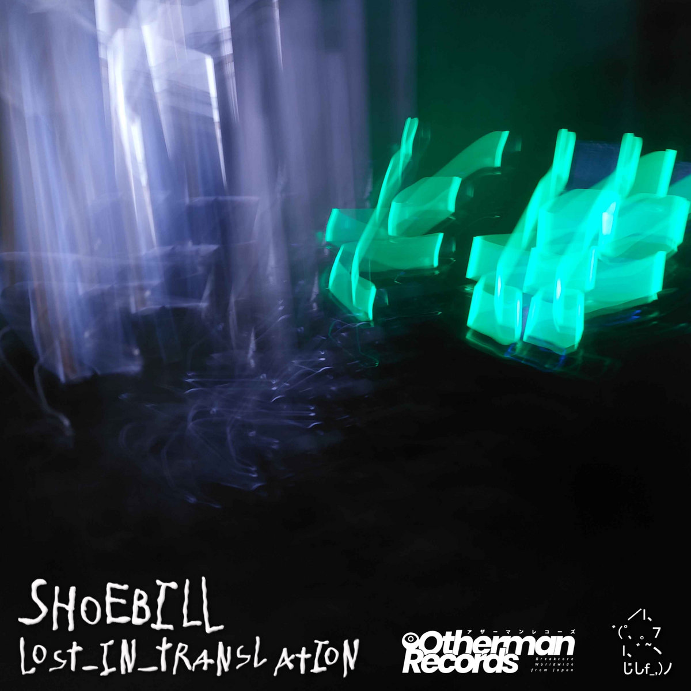

Shoebill brings their mashcore masterclass mindset to another release to treat us hungry listeners... I have eaten and I am now full... You should try... Just a bite ? Have more!!!

God damn this EP is good.

Buy it on [Bandcamp](https://othermanrecords.bandcamp.com/album/otmn103-lost-in-translation)!

### TRACKERCORPS - TRACKERCORPS VOL. 4

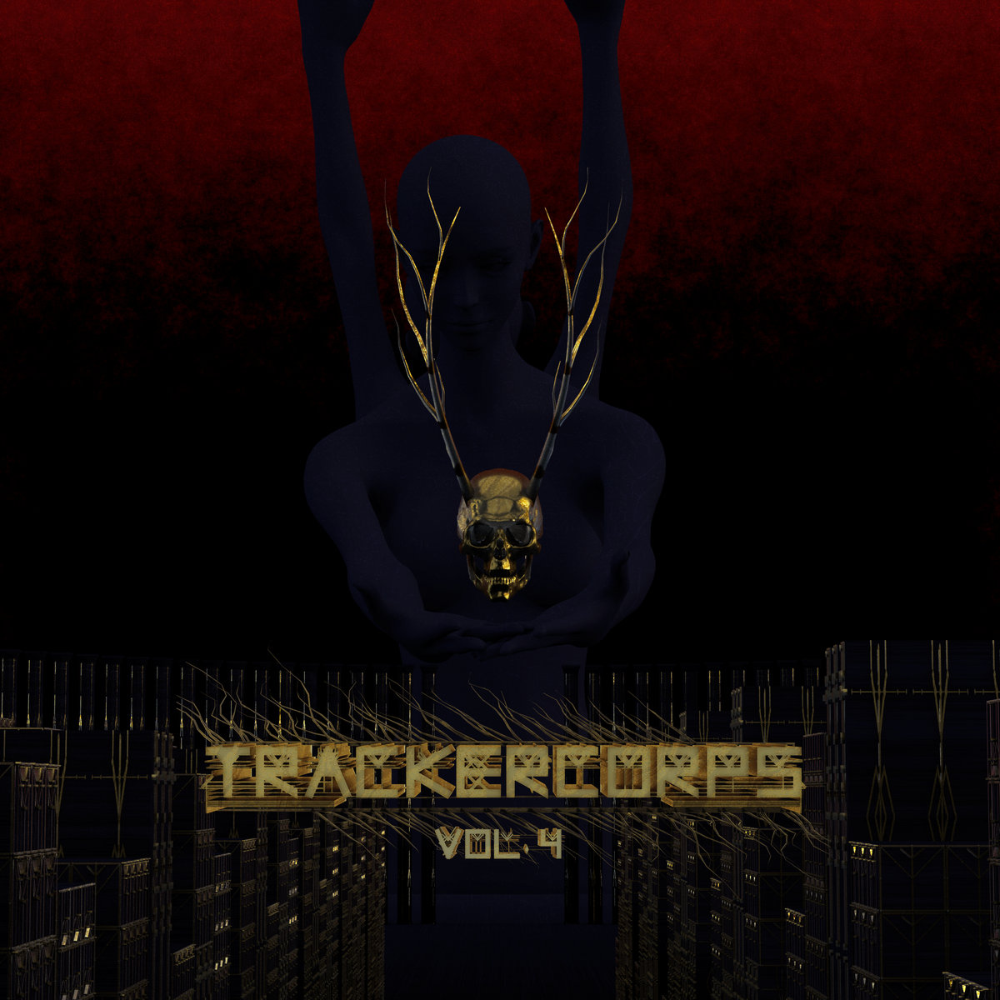

This was my entry point to TRACKERCORPS - and I'll be hanging around waiting for more!!! A compilation of 14 tracks from a wide variety of artists (few of which have already featured in the Bugle) which is just front to back bangin.

Buy it on [Bandcamp](https://trackercorps.bandcamp.com/album/trackercorps-vol-4)!

## Singles of the month

Enjoy...

### 1V0RY - ACEDIA - Agony & The Middle Class Remix

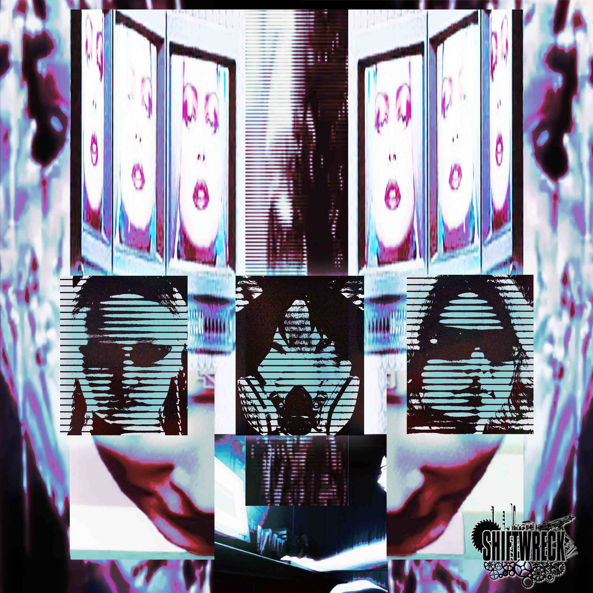

Groovy blend of digital hardcore, noise, and breakcore. Very catchy and also heavy!

Buy it on [Bandcamp](https://shiftwreck.bandcamp.com/album/acedia-agony-the-middle-class-remix)!

### FEARDOTCOM - TOTALED

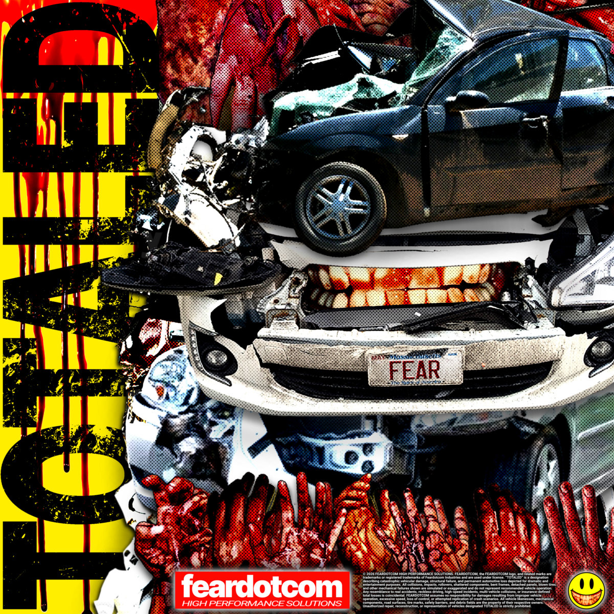

Spooky spooky SPOOKY hardcore!

Buy it on [Bandcamp](https://feardotc0m.bandcamp.com/track/totaled)!

### GVTTERMVTT - K.O.L.S_001

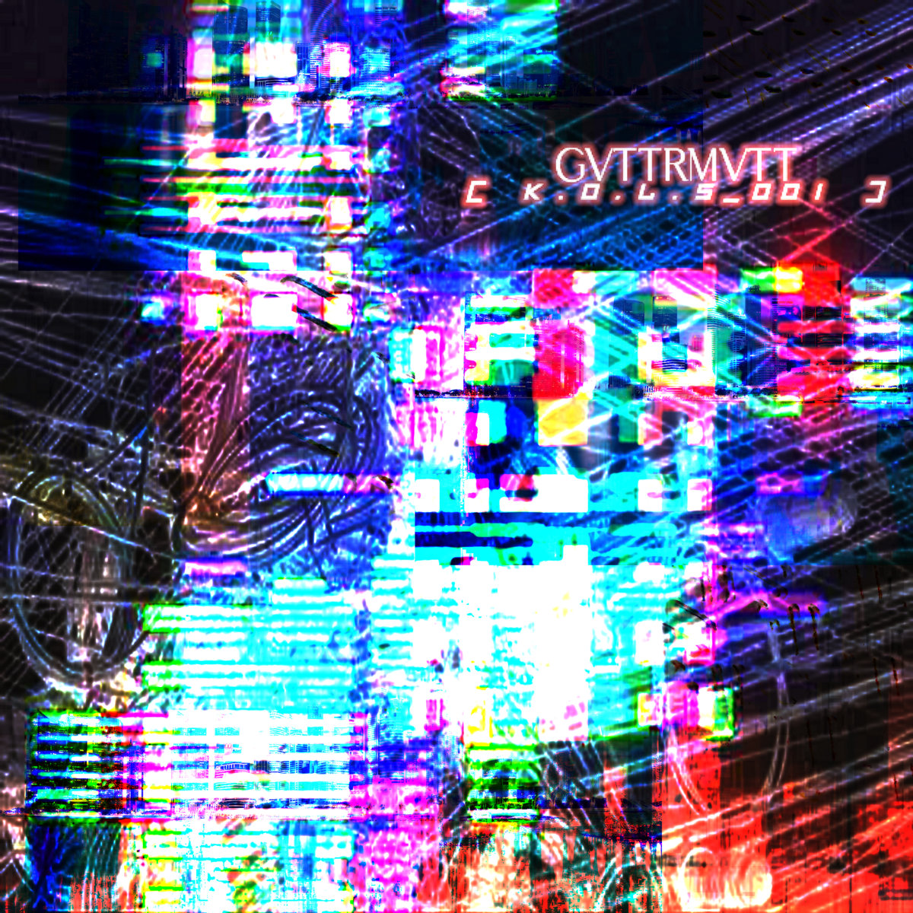

Fresh to the scene producer GVTTERMVTT brings you crazy, glitchy, ethereal but horrible-in-the-best-way ambient amenmentalism!!!

Buy it on [Bandcamp](https://gvttrmvtt.bandcamp.com/track/k-o-l-s-001)!

## Mix Of The Month

Didn't get around to finding a mix this month lol!!!! Whoopsie!!! You'll have to wait for the May edition :P

## Thanks!

Thanks for reading! As always, it's a pleasure and a privilege to write this lil article every month. Breakcore forever baby!

See you then x
