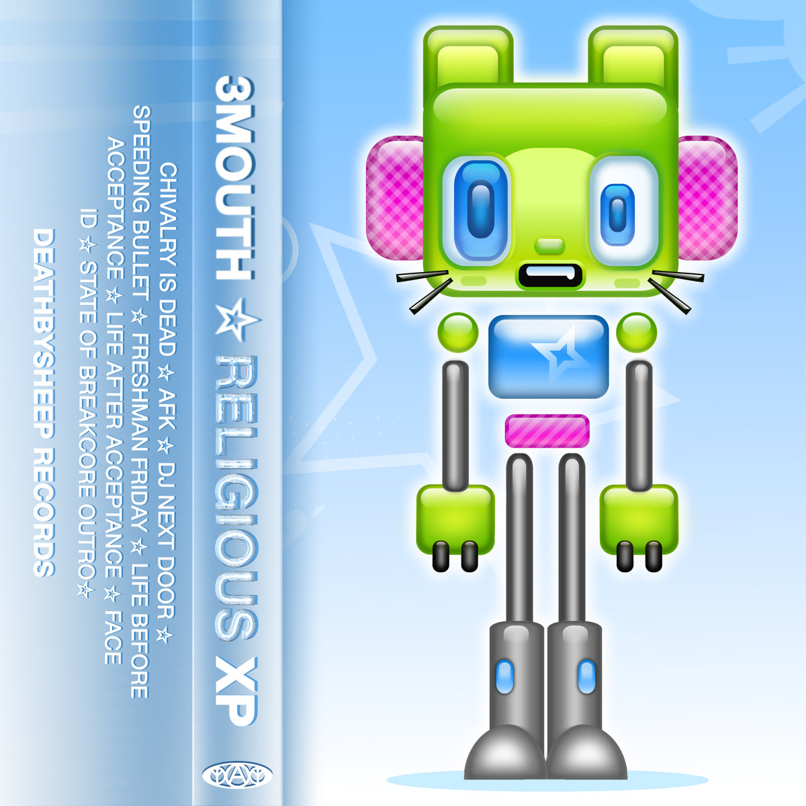
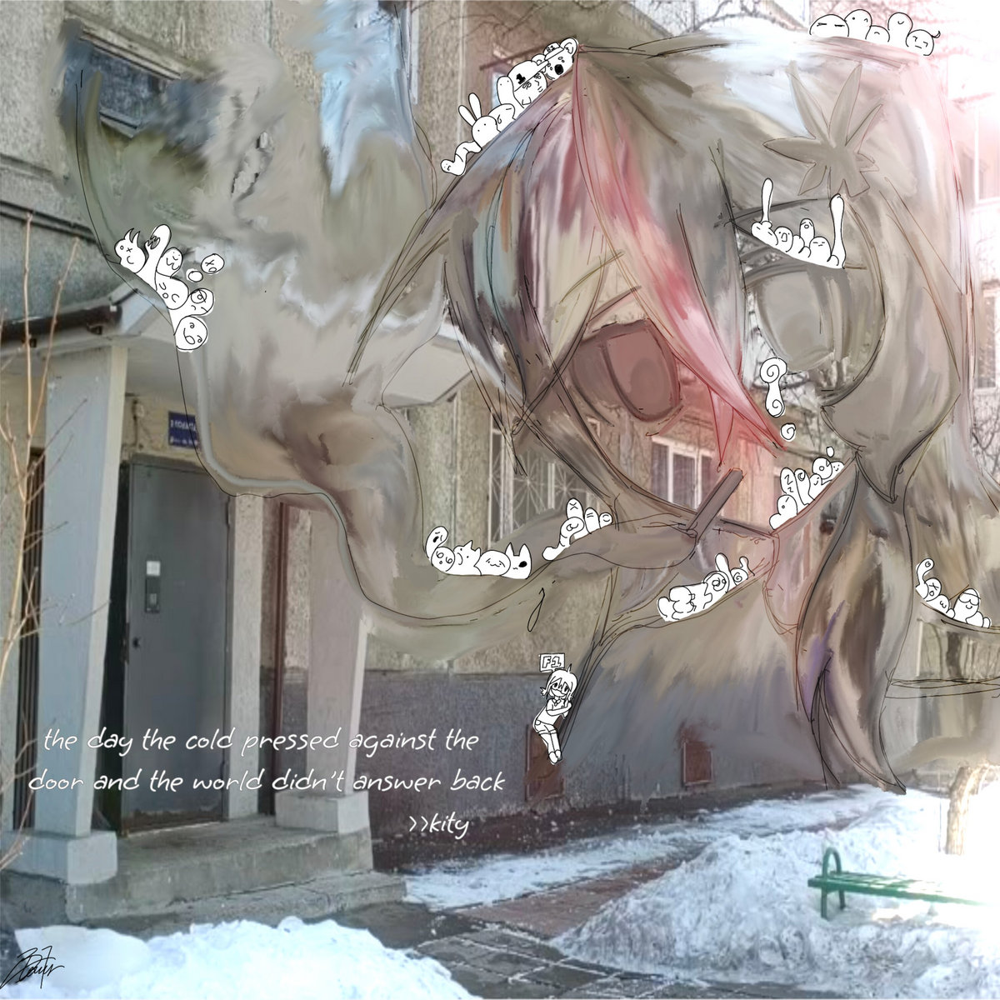
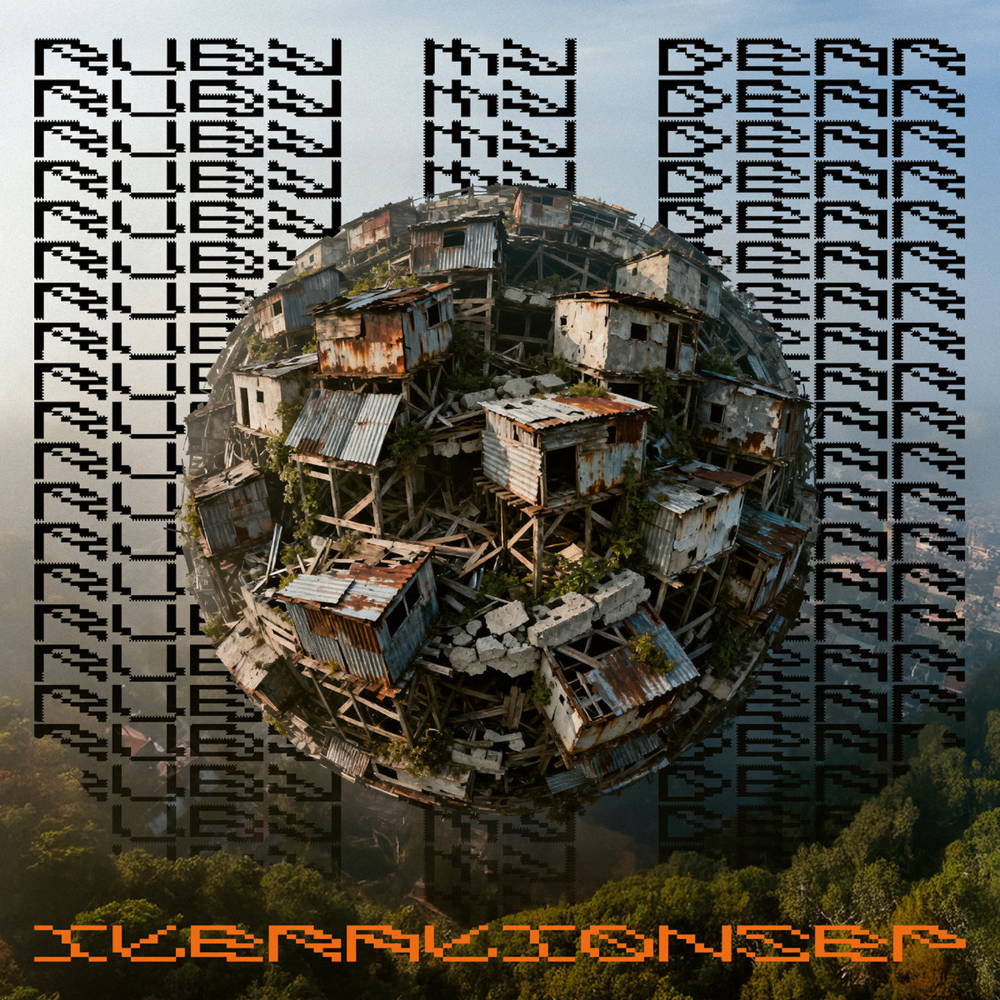
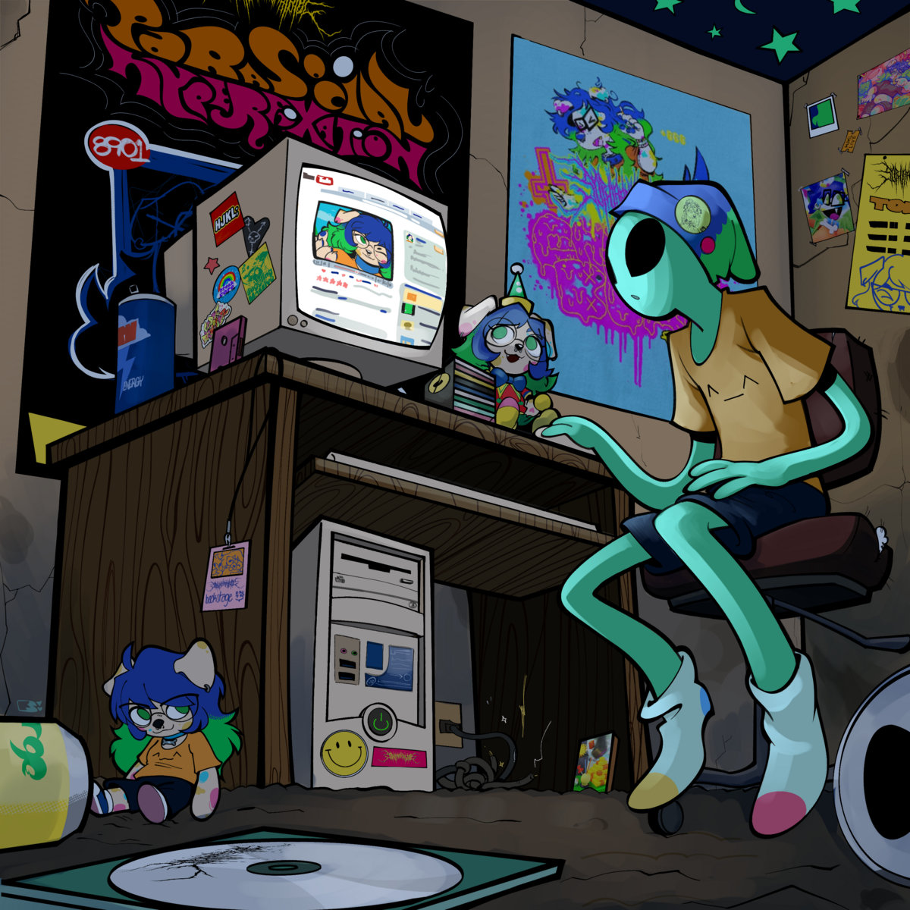
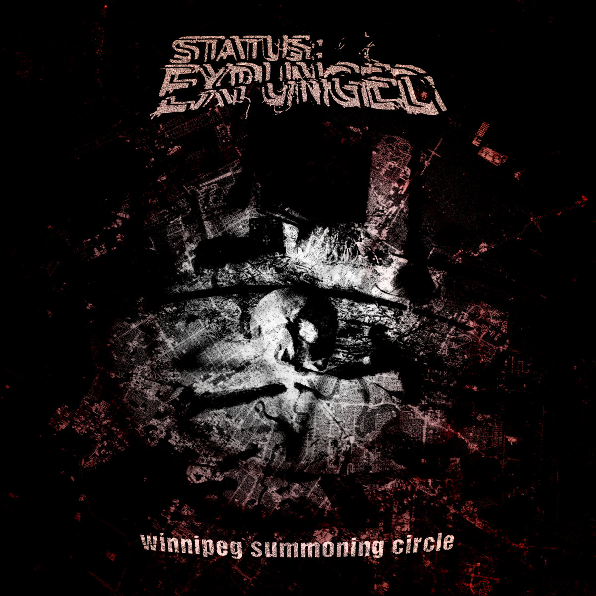

# The Breakcore Bugle - May 2026 Edition

Welcome back, once again, the start of summer has come, the weather is good but the breaks are better... Let's get into it...

## Releases of the month

May has been a somewhat quiet month for breakcore! I'm afraid less releases this month than last... But no bother! These are all golden.

### 3MOUTH - RELIGIOUS XP

A wonderfully enchanting EP blending several subgenres of breakcore together seamlessly... Holding aggression tight to the chest in the first chunk of the EP, and slowly entrancing you towards the end, last few tracks are really for the zoners.... wonderful front to back. High energy party tracks with emotional, tranquil tracks in the same release often feels out of place, but 3MOUTH brings these tracks together masterfully.

Buy it on [Bandcamp](https://deathbysheep.com/album/religious-xp)!

### kity - the day the cold pressed against the door and the world didnt answer back

For some really, REALLY, insane break chopping, kity is serving it up to you steaming, fresh from the oven. kity takes this insane break chopping, and lays it on a backdrop of several genres, manipulating the breaks right to the edge, but never going over. This album is a masterclass in chops. Mashcore, j-core, speedcore, amen mentalism, hyperflip... this album has everything you need as a Breakcore Enthusiast ™️  . Listen and be satiated!!! And for producers, listen and take notes!

Buy it on [Bandcamp](https://cheapskaperecords.bandcamp.com/album/the-day-the-cold-pressed-against-the-door-and-the-world-didnt-answer-back)!

### Warlock - Descent to Madn3ss

This album does exactly what it says on the tin. Feels like a truly nonsensical fever dream I never wish to wake from. The album art feels like it's taunting me as I listen...  This EP is not exactly breakcore, but idc, it heralds earlier breakcore, but adds a layer of delicately placed discordant film on top. This album really feels like it could be a higher-fidelity soundtrack to the game Cruelty Squad. The face on the album art really reminds me of the sun from that game.

> THE SUN SMILES AT YOU WITH ETERNAL MALICE.

Buy it on [Bandcamp](https://mobcorechicagorecords.bandcamp.com/album/warlock-descent-to-madn3ss-mcr-094)!

### Ruby My Dear - Iterations EP

Unless you've been living under a rock, you've probably already listened to this EP. This entry is just a reminder to those who have missed it.

I won't say much about this one. Ruby My Dear is always bringing something new, experimenting with each release, and I don't want to spoil it. Just listen in awe, as I have been all month.

Buy it on [Bandcamp](https://rubymydear.bandcamp.com/album/iterations-ep)!

### SHOEBILL X PUKE GIRL X SHIMODA X ODAXELAGNIA - FOUR WAY SPLIT

Wow... Okay... This collection of producers... Mashcore hall of fame? *My* mashcore hall of fame at least. 9 minute long mashcore tracks? 10 MINUTE long mashcore tracks? 13 MINUTE LONG MASHCORE TRACKS??? Hook this maniacal, nostalgic rollercoaster into my veins and send me into a long, mashed up slumber. Thx all 4 of u for this one... Mashcore mastery on full display, front to back. My goats.

Buy it on [Bandcamp](https://skrd4ever.bandcamp.com/album/shoebill-x-puke-girl-x-shimoda-x-odaxelagnia-four-way-split)!

### Sophiaaaahjkl;8901 - Parasocial Hyperfixation

I try to make sure I always put on at least one new artist each month in The Bugle - this month was hard, honestly a quiet month for breakcore, not all that much in the bowels of the Bandcamp search - but Sophiaaaahjkl;8901 stands out, a diamond in the rough - this EP isn't exactly all breakcore, but breakcore elements permeate throughout, and all the non-breakcore elements are either fun enough or weird enough to warrant an inclusion. Glitchcore, breakcore, hard rave music. This EP is so downright fun to listen to. Sick album art too.

Buy it on [Bandcamp](https://hjkl-8901.bandcamp.com/album/parasocial-hyperfixation)!

## Singles of the month

Are you full yet? I hope not. That was just the main course. Leave room for dessert. I bring u sweet treats...

### wawawa - enterprise's insurance fraud

wawawa bringing you something a bit different from their previous releases... This is wawawa at their most aggressive, distorted, disgusting. And I love it. Bonus points for Star Trek references as always.

Listen on [SoundCloud](https://soundcloud.com/wawarushi/enterprises-insurance-fraud)!

### Status: Expunged - Winnipeg Summoning Circle

Manic, ambient, atmospheric, crumbling... I'm usually personally less of a fan of more atmospheric breakcore, but Status: Expunged pulls this particular spin of breakcore off perfectly.

Buy it on [Bandcamp](https://status-expunged.bandcamp.com/track/winnipeg-summoning-circle-free-download)!

### Swr.ratGRL - motel bathroom (hotboxing the)

Fun, dancey breakcore, rave stabs catchy enough to make u shake ur booty anywhere...

Buy it on [Bandcamp](https://tami-tomi.bandcamp.com/track/motel-bathroom-hotboxing-the)!

### Bobby Starchild - Blobby Starchild

BLOBBY BLOBBY BLOBBY BLOBBY BLOBBY BLOBBY BLOBBY BLOBBY BLOBBY BLOBBY BLOBBY BLOBBY BLOBBY BLOBBY BLOBBY BLOBBY BLOBBY BLOBBY BLOBBY BLOBBY BLOBBY BLOBBY BLOBBY BLOBBY BLOBBY BLOBBY BLOBBY BLOBBY BLOBBY BLOBBY BLOBBY BLOBBY BLOBBY BLOBBY BLOBBY BLOBBY BLOBBY BLOBBY BLOBBY BLOBBY BLOBBY BLOBBY BLOBBY BLOBBY BLOBBY BLOBBY BLOBBY BLOBBY BLOBBY BLOBBY BLOBBY BLOBBY BLOBBY BLOBBY BLOBBY BLOBBY BLOBBY BLOBBY BLOBBY BLOBBY BLOBBY BLOBBY BLOBBY BLOBBY BLOBBY BLOBBY BLOBBY BLOBBY BLOBBY BLOBBY BLOBBY BLOBBY BLOBBY BLOBBY BLOBBY BLOBBY BLOBBY BLOBBY BLOBBY BLOBBY BLOBBY BLOBBY BLOBBY BLOBBY BLOBBY BLOBBY BLOBBY BLOBBY BLOBBY BLOBBY BLOBBY BLOBBY BLOBBY BLOBBY BLOBBY BLOBBY BLOBBY BLOBBY BLOBBY BLOBBY BLOBBY BLOBBY BLOBBY BLOBBY BLOBBY BLOBBY BLOBBY BLOBBY BLOBBY BLOBBY BLOBBY BLOBBY BLOBBY BLOBBY BLOBBY BLOBBY BLOBBY BLOBBY BLOBBY BLOBBY BLOBBY BLOBBY BLOBBY BLOBBY BLOBBY BLOBBY BLOBBY BLOBBY.

BLOBBY.

Buy it on [Bandcamp](https://bobbystarchild.bandcamp.com/track/blobby-starchild)!

## Mix Of The Month

Didn't get around to finding a mix this month lol!!!! Whoopsie!!! You'll have to wait for the May edition :P

### Demetzy b2b Switch Back Smith @ Jungle Syndicate 2026

Corefusion always bringing u gold...

Listen on [SoundCloud](https://soundcloud.com/demetzy/01-rec-2026-05-07)!

## Thanks!

BREAKCORE BREAKCORE BREAKCORE BREAKCORE BREAKCORE BREAKCORE BREAKCORE BREAKCORE BREAKCORE BREAKCORE BREAKCORE BREAKCORE BREAKCORE BREAKCORE BREAKCORE BREAKCORE BREAKCORE BREAKCORE BREAKCORE BREAKCORE BREAKCORE BREAKCORE BREAKCORE BREAKCORE BREAKCORE BREAKCORE BREAKCORE BREAKCORE BREAKCORE BREAKCORE BREAKCORE BREAKCORE BREAKCORE BREAKCORE BREAKCORE BREAKCORE BREAKCORE BREAKCORE BREAKCORE BREAKCORE BREAKCORE BREAKCORE BREAKCORE BREAKCORE BREAKCORE BREAKCORE BREAKCORE BREAKCORE BREAKCORE BREAKCORE BREAKCORE BREAKCORE BREAKCORE BREAKCORE BREAKCORE BREAKCORE BREAKCORE BREAKCORE BREAKCORE BREAKCORE BREAKCORE BREAKCORE BREAKCORE BREAKCORE BREAKCORE BREAKCORE BREAKCORE BREAKCORE BREAKCORE BREAKCORE BREAKCORE BREAKCORE BREAKCORE BREAKCORE BREAKCORE BREAKCORE BREAKCORE BREAKCORE BREAKCORE BREAKCORE BREAKCORE BREAKCORE BREAKCORE BREAKCORE BREAKCORE BREAKCORE BREAKCORE BREAKCORE BREAKCORE BREAKCORE BREAKCORE BREAKCORE.

BREAKCORE.
