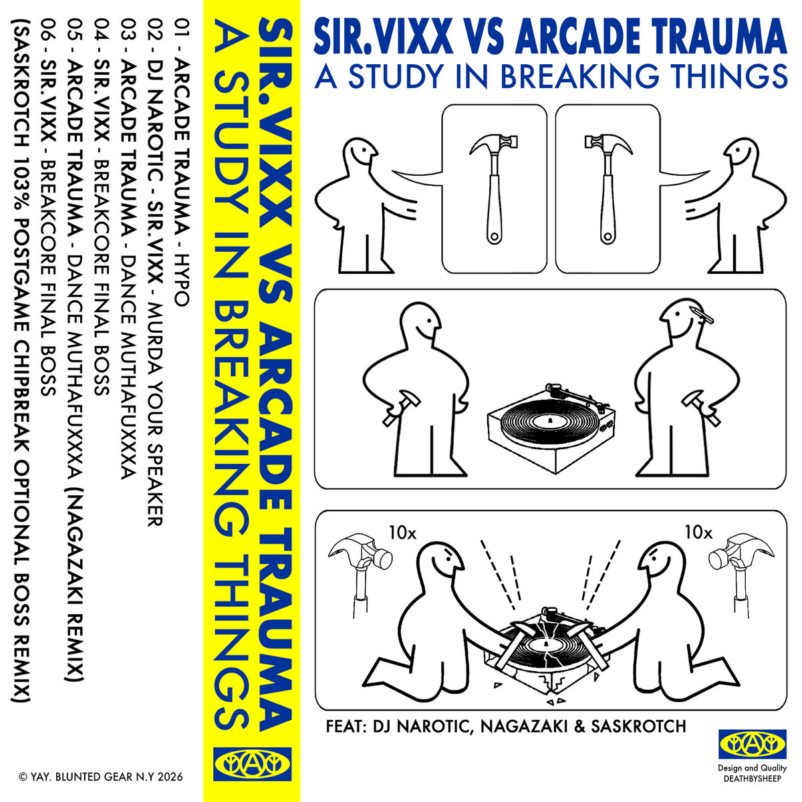
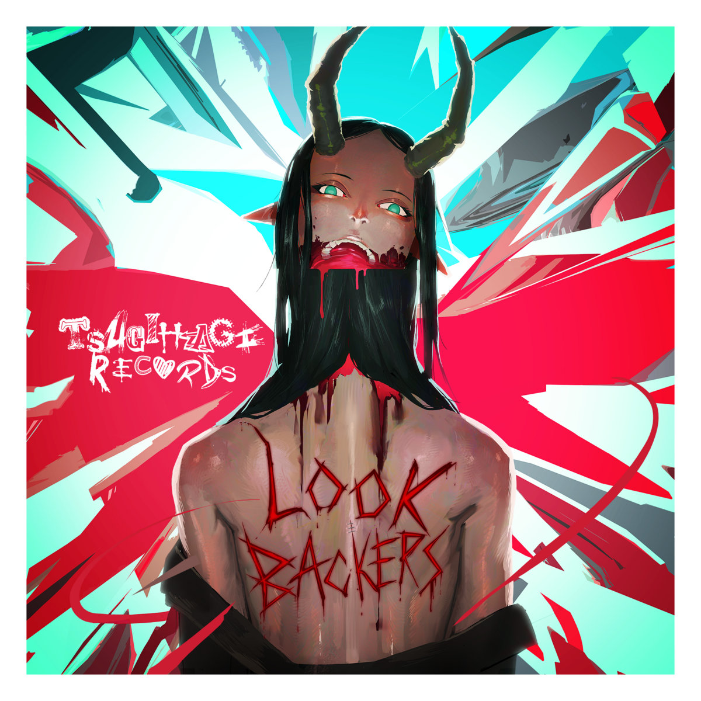
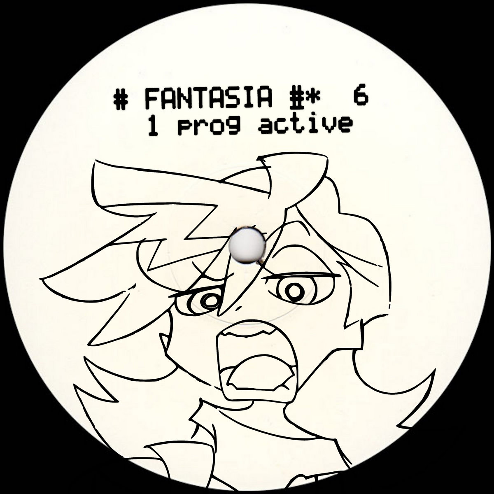

# The Breakcore Bugle - June 2026 Edition

Happy SUMMER everybody!!! If you're in the UK, I hope you've been managing to handle the heatwave... I sure haven't... The only upside to global warming is apparently that breakcore producers all over the world keep bringing more and more HEAT!!!

## Releases of the month

Similarly to one month a few months ago, I don't remember which one, I felt like I'd barely been keeping up with new releases, but actually had managed so effortlessly due to the quality of everything coming out, this month has been ezzzzzz!!!

### SIR.VIXX VS ARCADE TRAUMA - A STUDY IN BREAKING THINGS

I don't think much needs to be said about this one... It REALLY lives up to the hype. Two of the best breakcore producers out there going absolutely ham, with no reservations whatsoever. This is a masterclass of breakcore - any enthusiast or producer alike can learn a lot from this EP!!!

Buy it on [Bandcamp](https://deathbysheeprecords.bandcamp.com/album/a-study-in-breaking-things)!

### TSUGIHAGI CREW - LOOK BACKERS

The first release from TSUGIHAGI records in 6 years, and man, I wish this label would release more!!! My first discovery in their catalogue, this compilation is a wonderful mixture of breaks, hardcore, speedore, and hyperflip. Seriously insane front to back, I highly recommend.

Buy it on [Bandcamp](https://tsugihagirecords.bandcamp.com/album/look-backers)!

### N0.P171 - Kyber Manual

N0.P171 bringing you the most distorted, aggressive breakbeats you will ever hear... N0.P171 makes an absolute SCIENCE out of this part of breakcore, noisy, loud, chaotic, elegant, incredible!!!

Buy it on [Bandcamp](https://n0p171.bandcamp.com/album/kyber-manual)!

### Cash Kru - Fantasia EP

This EP is a intricate, complex, relaxing but full of energy. pad-heavy breakcore, fans of breakbeat hardcore and jungle will have a great time with this one!!

Buy it on [Bandcamp](https://serverofuser.bandcamp.com/album/fantasia-ep)!

### SKRD4EVER - QVASNY - STOSUNEK Z LUDŹMI ULICY 

The deepest depths of breaking core... This album is an incredible example of pushing the genre to its limits... Incredibly complex rhythms with carefully thought out well placed textures and synths... I was going to try and compare this album to some other artists to describe it, but I don't think that does it justice. Just have a listen.

Buy it on [Bandcamp](https://skrd4ever.bandcamp.com/album/qvasny-stosunek-z-lud-mi-ulicy)!

### foxparkk - katabasis

A weird n wonderful album, I'll let Magma Sphere describe it for you...

> Magma Sphere is BACK for the first time in months with yet another album that redefines the (honestly quite limited) scope of mashcore and isn't at all afraid to just do its own thing. In between your average magma sphere upbeat and intense noise-rave jams are bizarre and jarring cloud rap pieces, as well as other surprises. Whether you think this album is great or it sucks, it is sure as hell interesting the directions it chooses to go. Perfect for the Magma Sphere fans who have come to expect the unexpected.

Blending crazy breakcore, drill n base, mashcore, cloud rap, IDM, sparse and dreamy beats... This album has a bit of everything for everyone. Reminds me of early, old-school breakcore releases that often had elements of ambient dancey beats, or industrial hiphop-esque beats spliced in between breakbeat madness. This album is a ride! I'm all for variety :)

Buy it on [Bandcamp](https://magmasphere.bandcamp.com/album/katabasis)!

## Singles of the month

Now, this side of things, I've definitely been less on top of, but let's see if I can still give you a few recs...

### Sophiaaaahjkl;8901 - Autistic Femboy Rizz

I put the first 3 tracks of Sophiaaaahjkl;8901's in the latest edition as a release without realising they were the first few singles off their upcoming album, Alien Abduction! This, Autistic Femboy Rizz, is the 4th single, and it slaps. Glossy and chaotic, reminiscient of Machine Girl, but Machine Girl if they were a lot crazier... It's really fuckin GREAT!!!

Listen on [SoundCloud](https://hjkl-8901.bandcamp.com/album/autistic-femboy-rizz)!

### blood splattered everywhere - to be covered in it again: grief is the taste of blood i know best

An incredibly distorted and disorienting track... This track makes you feel like you have no idea where you are... Disturbingly beautiful... Enjoy...

Listen on [SoundCloud](https://soundcloud.com/myfavoritecolorisred/weakeningslowlymore)!

## Mix Of The Month

A special and super cool mix this month which I'm so glad was recorded for all of us to listen to online...

### Yuta Umegatani 3 hr set @ Breakcore Gives Me Wood Vs Murderchannel

Label head of the legendary Murder Channel bringing you 3 hours of hardcore, breakcore, and nothing but HEAT! Like I said, I'm so glad this was recorded and uploaded! A masterclass from a veteran of the scene.

Listen on [SoundCloud](https://soundcloud.com/breakcoregivesmewood/yuta-umegatani-3-hr-set-breakcore-gives-me-wood-vs-murderchannel-ghent-17525-5)!

## Thanks!

I hope this monthly roundup has truly broke your core... Enjoy!!! See you next month!!! Stay cool + healthy!

BREAKCORE.
