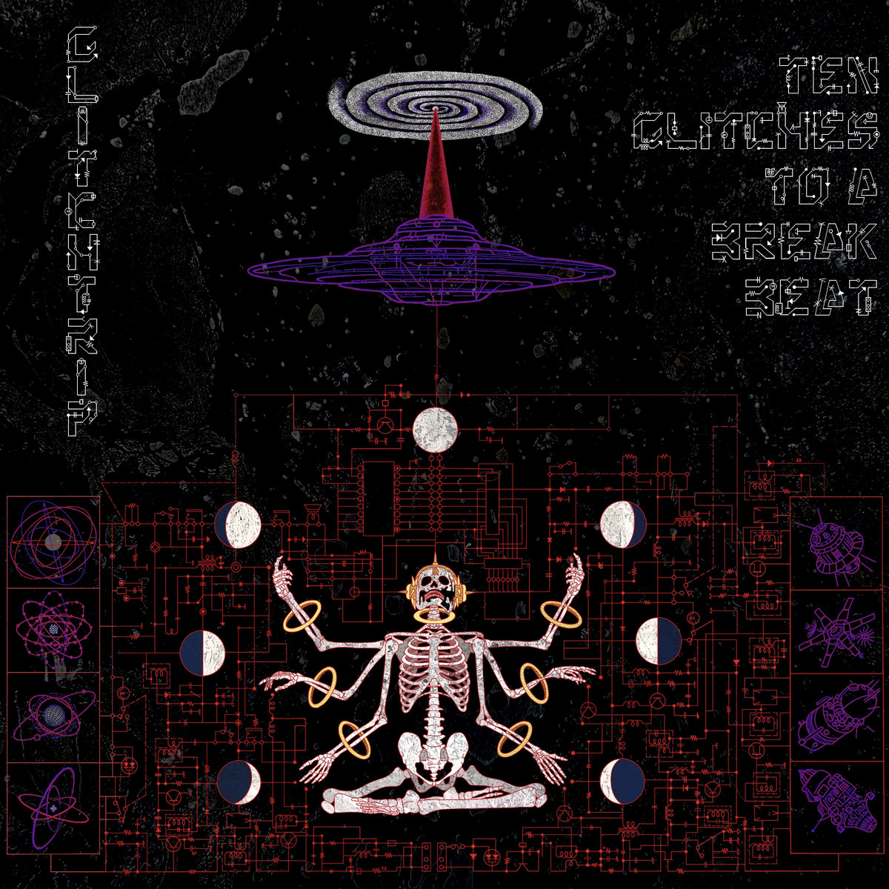
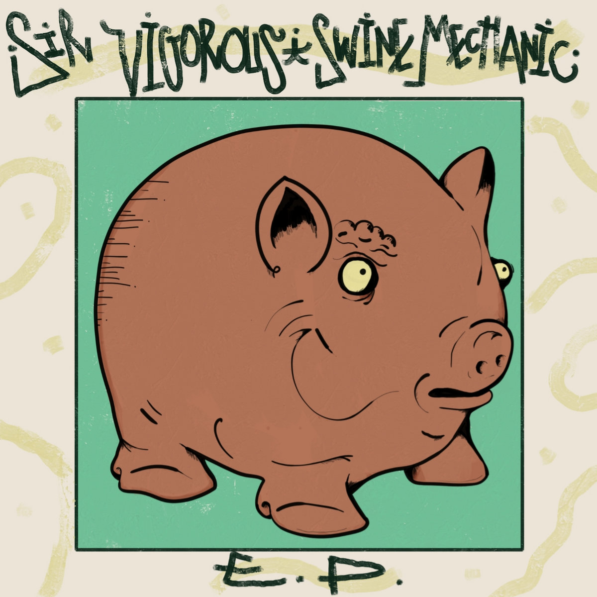
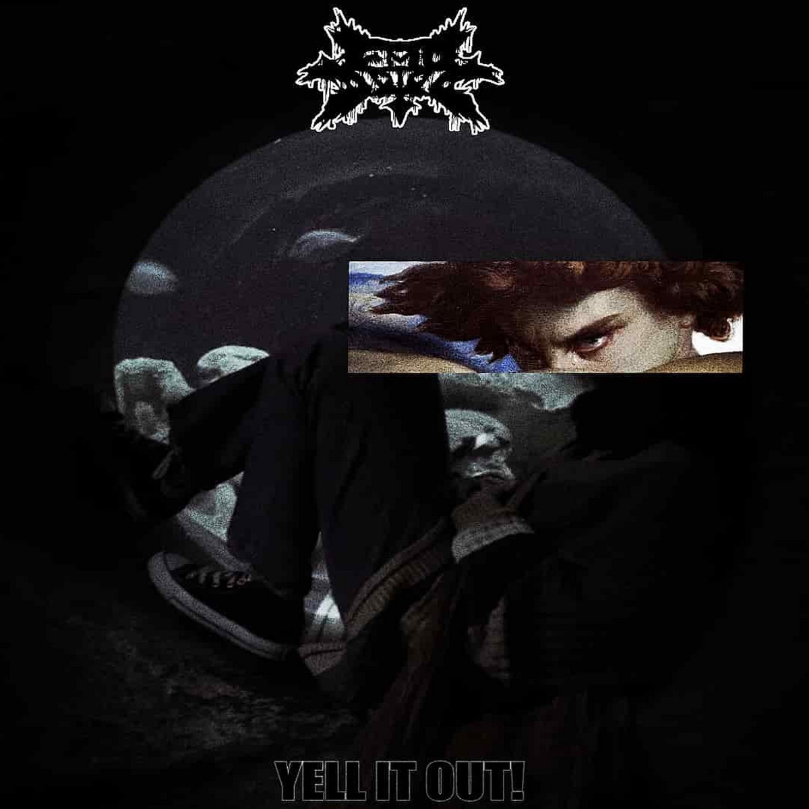
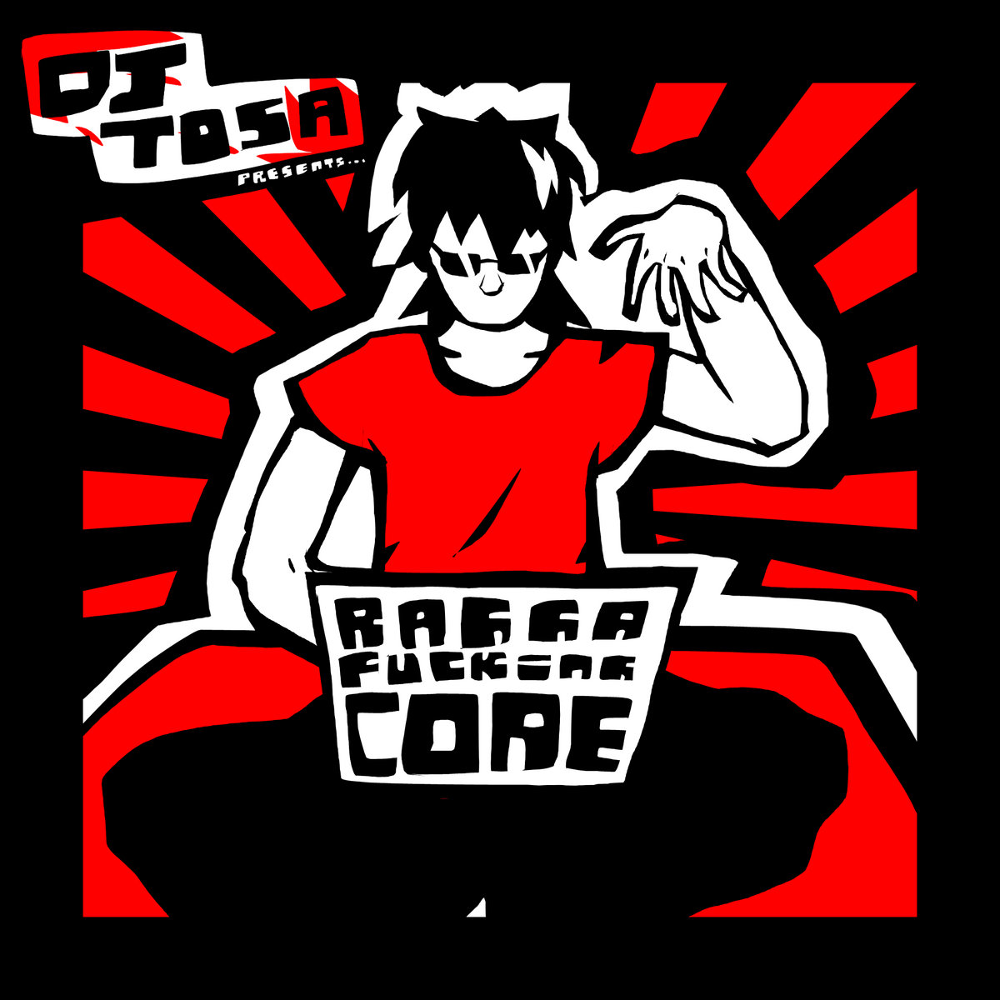
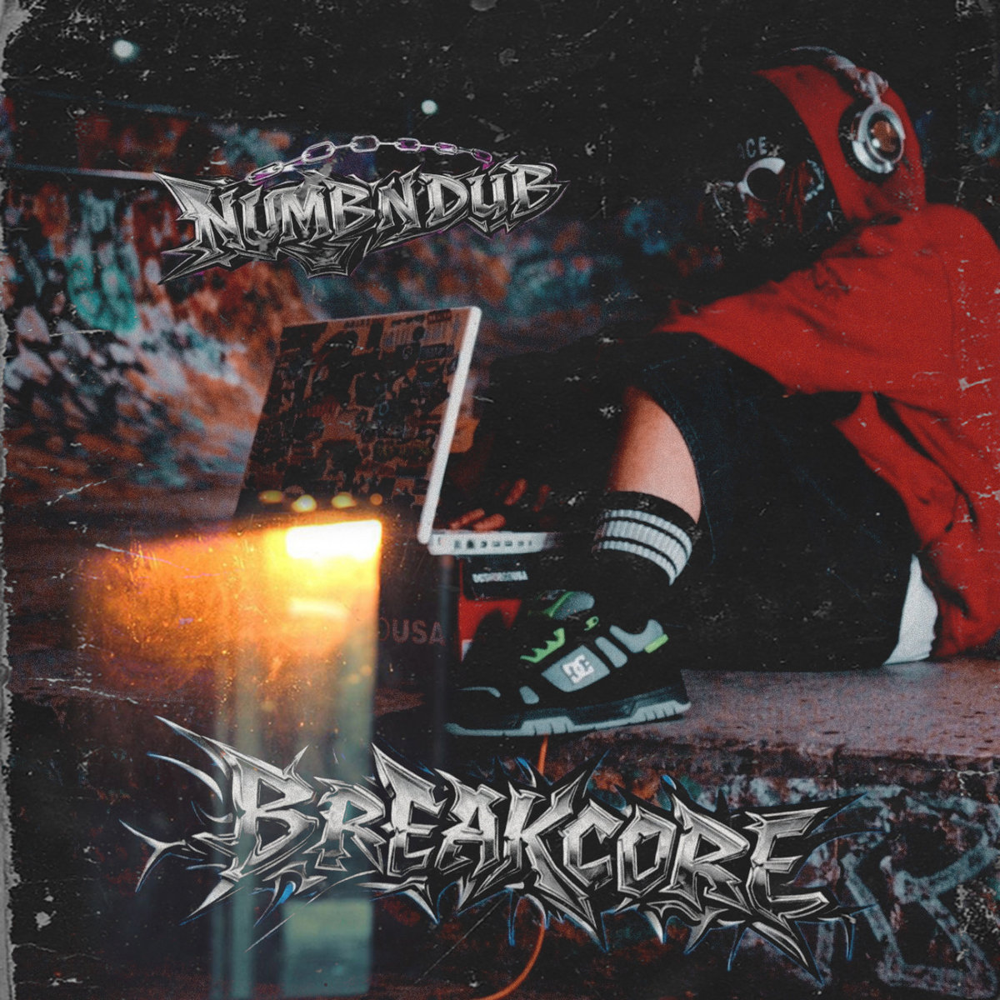
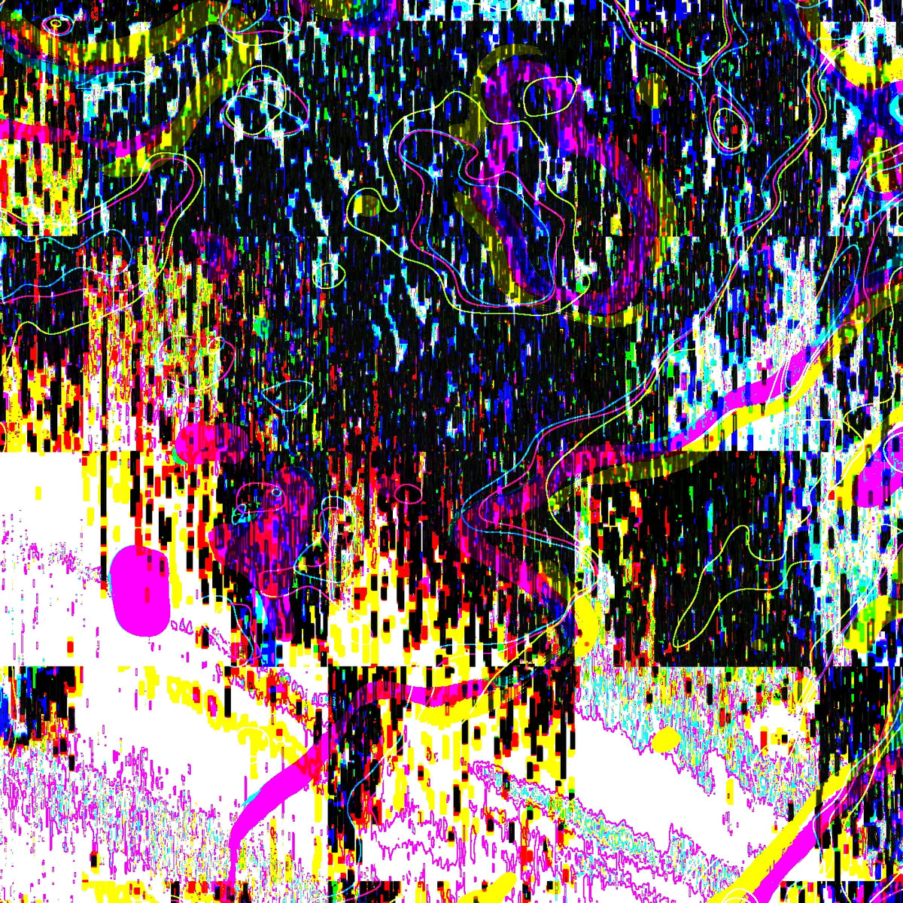
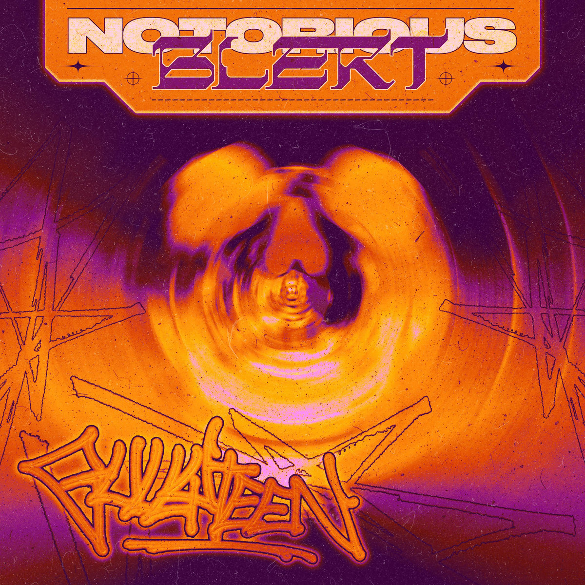

# The Breakcore Bugle - July 2026 Edition

Hey everyone!!! We're a bit late on this months release, just been super busy and not found the time, apologies!!! I shall endeavour to be more on time in the future ... Will probably happen again though lol

## Releases of the month

Some reallllllllyyyyyy hot releases this month, pun intended with the heatwave here in the UK... Some really fun and unique releases in this month I'm happy to share with you all...

### Noneless - The Night Before the World Began

So incredibly full of emotion, primordial feeling... So cosmic, texturually rich, and an aspirational album for any producers listening who want to up their game. Noneless is so fuckin good.

Buy it on [Bandcamp](https://noneless.bandcamp.com/album/the-night-before-the-world-began)!

### Glitchtrip - TEN GLITCHES TO A BREAKBEAT

> This album is dedicated to the memory of Charanjit Singh, the unwitting pioneer of acid music. Performed and recorded live in its entirety, the album fuses elements of hardcore, breakcore, acid and even black metal into a unique blend of electronic mayhem. 

I can't believe this album is live recordings. Feels so wonderfully orchestrated and composed. Catchy, dancy, chaotic in all the right places. Sometimes minimal (for breakcore at least lol) and sometimes over the top. This album is a wonderful experience front to back.

Buy it on [Bandcamp](https://gltchtrp.bandcamp.com/album/ten-glitches-to-a-breakbeat)!

### Sir Vigorous - Swine Mechanic

A super high energy crazy blend of breakcore, hardcore, industrial hip-hop & metal breakcore... An incredible debut release from Sir Vigorous! Crazy sampling, crazy kicks, crazy rolls... What more could you ask for!!!

Buy it on [Bandcamp](https://mobcorechicagorecords.bandcamp.com/album/sir-vigorous-swine-mechanic-mcr-095)!

### EMO_IDIOT - Yell It Out!

Distorted breaks hailing the magnificient era of DHR... Shizuo meets modern day breakcore - this album feels like Fuck Step '98 on meth, and I mean that with the most sincerity...

Buy it on [Bandcamp](https://emoidiot.bandcamp.com/album/yell-it-out)!

### DJ Tosa - Ragga Fucking Core

DJ Tosa dropping an album that does what it says on the tin... This is Ragga Fucking Core... With each release DJ Tosa refines what he is doing further... 18 tracks of exactly what you need if you're needing some ragga core... You can really hear his producer progression on this record and it's sickkkkkkkkkk

Buy it on [Bandcamp](https://dsquad.bandcamp.com/album/dsqdcd-004-ragga-fucking-core)!

### Numb'n'dub - REMIX&RARE

Fun creative sampling + production blending breakcore metalcore, brainrot, happy hardcore, brostep??? A crazy ride that had me cackling at times and headbanging at others... A really really fun EP!!!

Buy it on [Bandcamp](https://numbndub.bandcamp.com/album/remix-rare)!

### Cresfenn - go back to sleep

What the hell... Shoutout Demetzy for sending over this recommendation, very happy to now know of Cresfenn, this album is so wonderfully bizarre and unique, a real pinnacle of what breakcore in many cases should be... The soundscape of the album isn't necessarily consistent but is cohesive, something quite hard to do... I'm trying to think of how to describe this album but it's honestly really hard. You've just gotta listen for yourself! Dreamy at times, creepy at others... A lot of fun.

Buy it on [Bandcamp](https://cresfenn.bandcamp.com/album/go-back-to-sleep)!

### drug - dota

One for my nerds... Super fuckin crazy dota sampling and chaotic production, almost to a meme-y level but personally I love that shit... Music has every right to be whimsical as it does serious... This EP is a perfect bit of whimsical breakcore for you all, especially for those of you who love DOTA as I do.

Buy it on [Bandcamp](https://drug2005.bandcamp.com/album/dota)!

## Singles of the month

Just a few singles this month, but I'm going for quality over quantity :D

### Status\:Expunged - Alkahest

Amazing track that makes it feel like reality is falling apart around you... An embodiment of chaos...

Buy it on [Bandcamp](https://status-expunged.bandcamp.com/track/alkahest)!

### gullyteen - Notorious Blert

Fun upbeat breakcore/hardcore/jungle for the dancefloor...

Buy it on [Bandcamp](https://ditchsplitterrecords.bandcamp.com/track/gullyteen-notorious-blert)!

### drunkdriving - Call Me When You're Skee-Lo

Really fun synths, samples and rhythms in this track sampling Skee-Lo (I had no idea what this is). Really catchy and fun breakcore :)

Listen on [SoundCloud](https://soundcloud.com/drunkdriving/call-me-when-youre-skee-lo)!

## Thanks!

I hope this monthly roundup has truly broke your core... Enjoy!!! See you next month!!! Stay cool + happy + healthy!

BREAKCORE.
