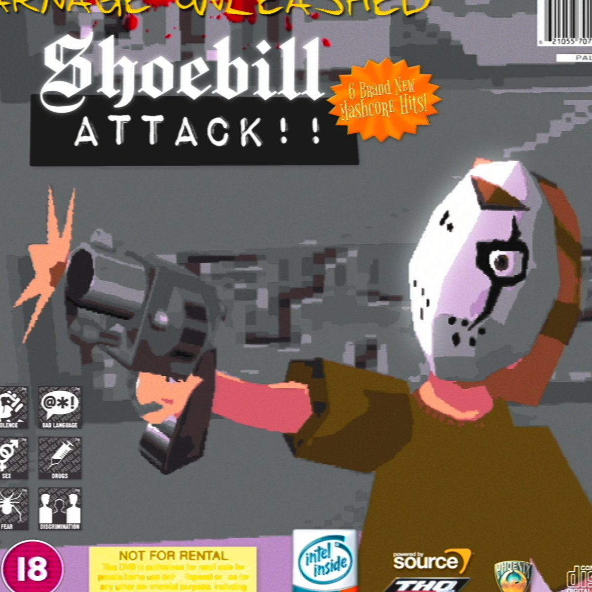
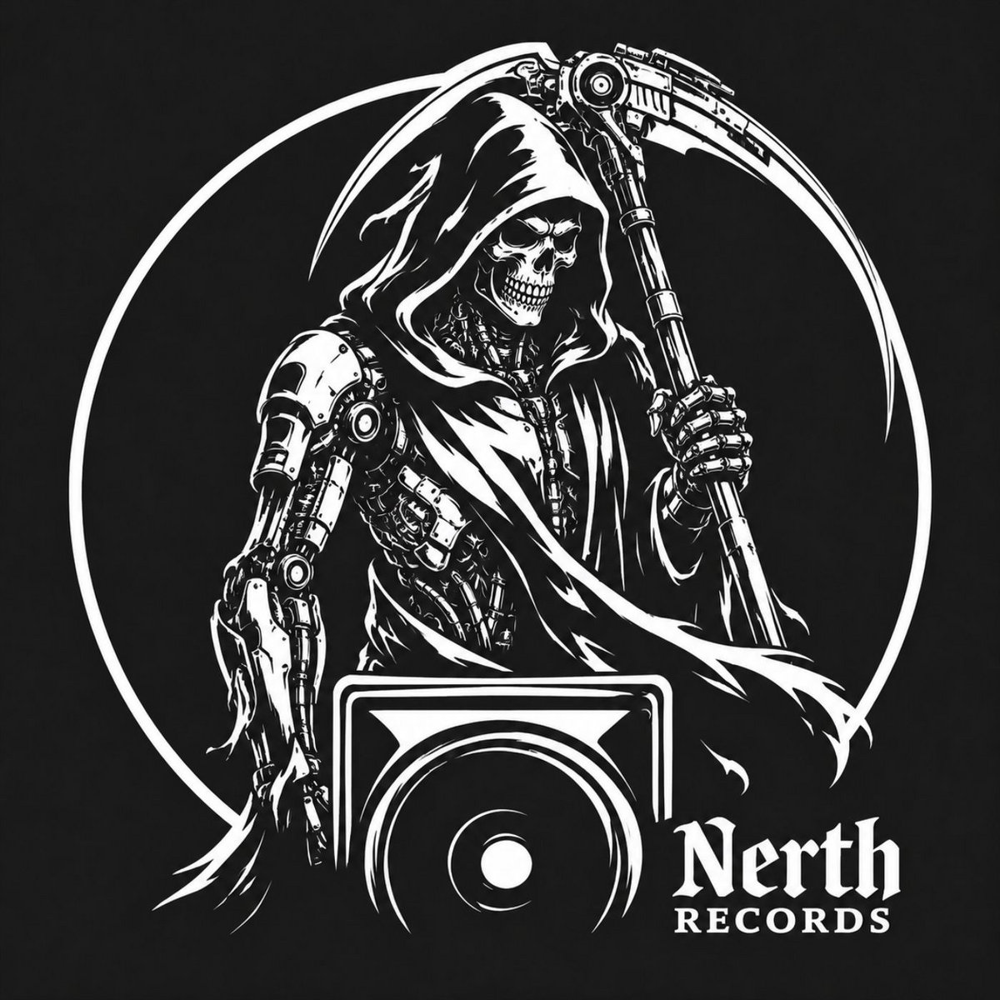
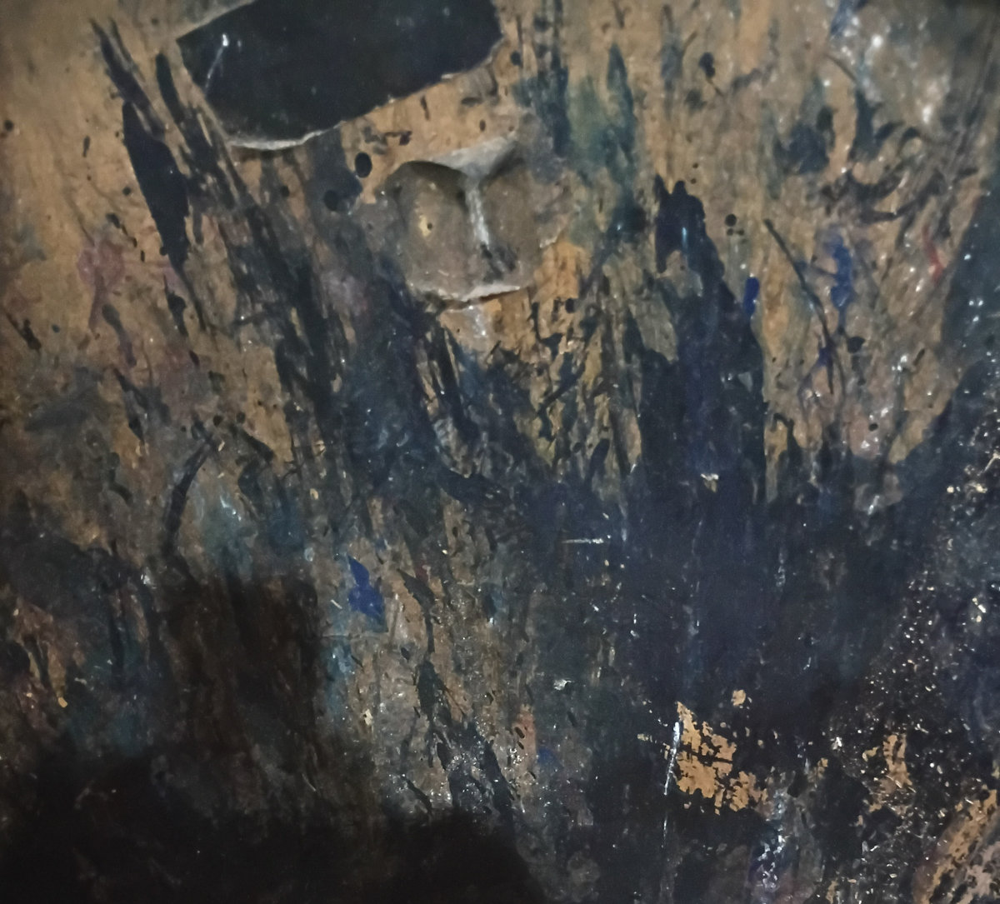
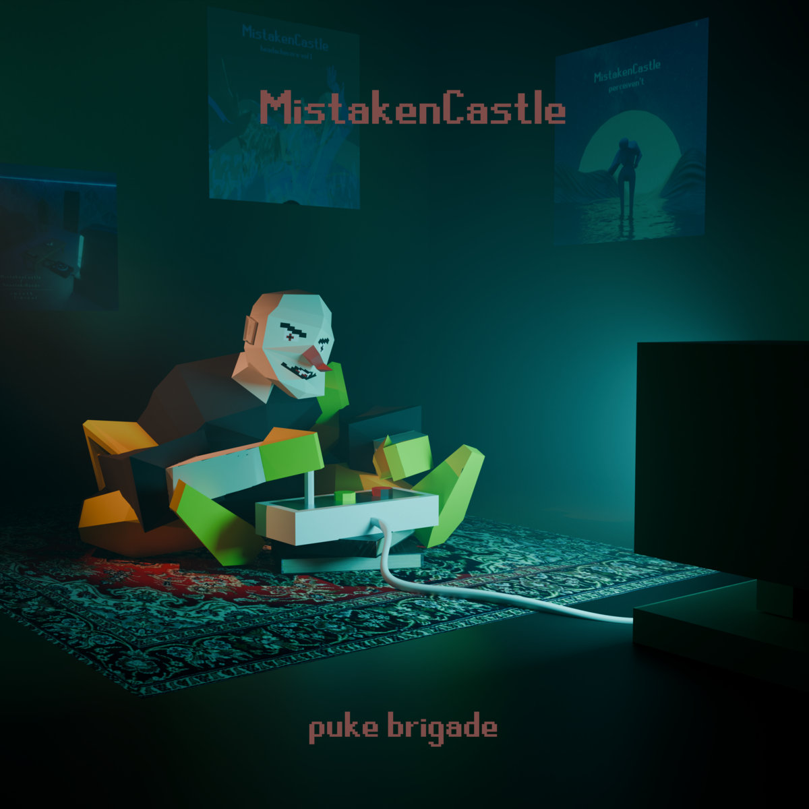
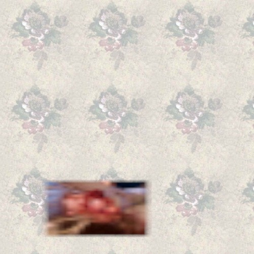
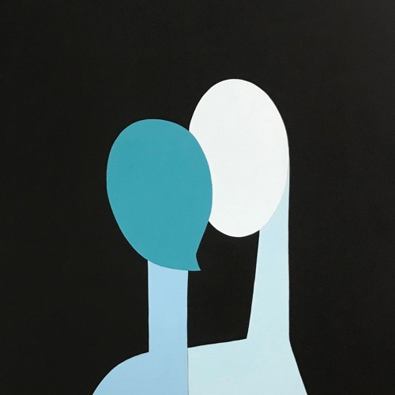

# The Breakcore Bugle - August 2026 Edition

Welcome back once again my Buglers... And honour to be back with you again after another approximate lunar cycle... I'm late again I know... But I'm the Bugle Boss... Anyway... Core 4 u...

## Releases of the month

Wowwwwweeeeeeee fuckin ELL this month has been stacked!!! Was honestly really hard to narrow down all the great releases this month to just 8. Amazing month for breakcore. Must be something in the air...

### Shoebill - ATTACK!!

What do I even need to say here... Shoebill at Shoebill's finest... Every release seems to get more and more insane... I love it...

Shoebill showing off in this one... Sooooo break heavy... Made me Shoe on my Bill until I couldn't help but Attack...

Buy it on [Bandcamp](https://shoebillmashcore.bandcamp.com/album/attack)!

### Nerth Records - Nerth 01

New and up n coming gabber crew from the SW of England!!! We're treated to some wonderful breaks on this first compilation, as well as some hard hitting gabber n hardcore ... We're also very excited to be interviewing these guys later on this year, stay tuned!!!

Buy it on [Bandcamp](https://nerthrecords.bandcamp.com/album/nerth-01)!

### Sir.Vixx - Beyond Broken

Sir.Vixx NEVER disappoints... Expect nothing less from a breakcore veteran... This EP comes full of a catchy sample-based track initially, then later on blending metal-breakcore, industrial hip-hop, filthy bursting breaks, a more ambient track, and everything else you need... Hell yeah... Every Sir.Vixx release is a gift and I am grateful...

Buy it on [Bandcamp](https://mobcorechicagorecords.bandcamp.com/album/sir-vixx-beyond-broken-mcr-096)!

### MistakenCastle - Puke Brigade

Texturally dream-like rich soundscapes with cool samples, sick artwork, catchy breaks and arpeggios... I was so impressed when I first stumbled across MistakenCastle and this follow-up release is nothing but even better...

Buy it on [Bandcamp](https://mistakencastle.bandcamp.com/album/puke-brigade)!

### Goya Av Matasanos - Messhall Ear To Ear

Really interesting + catchy sampling + cool synth textures, chaotic as fuck. I really love this EP. Keeps you guessing the whole way through. Very old-school chiptune synths at times, feel like I'm in a cave in Pokemon and the cave is collapsing... Love it... Low bit-rate madness. Discordant and melodic. Ridiculous breaks. What more could you want. For me, personally, peak breakcore.

Buy it on [Bandcamp](https://goyavmatasanos.bandcamp.com/album/messhall-ear-to-ear)!

### JoplinSpiderVR - I Think My Face Fell Off

Truly fucking alien.

So weird.

Melodies from another world.

Discordant. Depressing. Bewildering.

Really weird and creative breaks. Alien rhythyms. This one says FU to the rave. Listen and be bewildered instead. This one's an assault on the senses.

Eerie and atmospheric at times, chaotic and horrible at others.

I love it.

Buy it on [Bandcamp](https://joplinspidervr.bandcamp.com/album/i-think-my-face-fell-off)!

### EriS - 000

Heavy catchy darkstep. Super fun EP, very lovely and thick synth textures. Super atmospheric and absolutely stellar production. Earth shatteringly heavy at times, and beautifully delicate at others.

Buy it on [Bandcamp](https://eris10.bandcamp.com/album/000-2)!

### agntsullen0068 - system of a down the drain - e.p. 

Distorted, dirty breaks and bass with catchy arpeggios and some really weird sampling. Catchy and crazy. High energy and almost pop-y. This EP blends together several breakcore sub/parent-genres and soundscapes in a really fun and seemless way. Really fuckin cool basslines and sampling too. A wild ride.

Buy it on [Bandcamp](https://agntsullen0068.bandcamp.com/album/system-of-a-down-the-drain-e-p)!

## Singles of the month

Just a few singles this month, but I'm going for quality over quantity :D

### ONI-CHIKUSHOW - Smashing Junglism

Ohhhhhhhh yeahhhhhh, this one is hard as fuck, logs of chugs, incredible breakage and sampling, catchy into heavy as fuck, great track.

Listen on [SoundCloud](https://soundcloud.com/oni-chikushow/smashing-junglism)!

### Downhill2k01- Snuffleupagus

Suuuuuuuper atmospheric IDM with crisp and clean breaks, repetitive and will send u into a trance...

Listen on [SoundCloud](https://soundcloud.com/downhill_from_here/snuffleupagus-1)!

### kity - go on

HOOOOOOOOOLLLLLYYYYYY FKIN MASHCOOOOOOOOOOOORRRREEEEEEE!!!!

Listen on [SoundCloud](https://soundcloud.com/a2k3n1pwnage/go-on)!

### Mi=go - Vanish my merancholy

Melodic, calming, crazy, soothing, all at the same time, took me away from where I was at the time of listening...

Listen on [SoundCloud](https://soundcloud.com/tmn2e6ygojhm/master2)!

## Mix of the month

### Scurry - Kitchen Cleaners

An hour of old school noisy industrial breaks from Scurry, served up to u on a filthy, rusty platter plate from a kitchen that's definitely not passing a health inspection!!

Buy it on [Bandcamp](https://shiftwreck.bandcamp.com/album/kitchen-cleaners)!

## Thanks!

I hope this monthly roundup has truly broke your core... Enjoy!!! See you next month!!! Stay cool + kind + happy + healthy!

BREAKCORE. BREAKCORE. BREAKCORE. BREAKCORE. BREAKCORE. BREAKCORE. BREAKCORE. BREAKCORE. BREAKCORE. BREAKCORE. BREAKCORE. BREAKCORE. BREAKCORE. BREAKCORE. BREAKCORE. BREAKCORE. BREAKCORE. BREAKCORE. BREAKCORE. BREAKCORE. BREAKCORE. BREAKCORE. BREAKCORE. BREAKCORE. BREAKCORE. BREAKCORE. BREAKCORE. BREAKCORE. BREAKCORE. BREAKCORE. BREAKCORE. BREAKCORE. BREAKCORE. BREAKCORE. BREAKCORE. BREAKCORE. BREAKCORE. BREAKCORE. BREAKCORE. BREAKCORE. BREAKCORE. BREAKCORE. BREAKCORE. BREAKCORE. BREAKCORE. BREAKCORE. BREAKCORE. BREAKCORE. BREAKCORE. BREAKCORE. BREAKCORE. BREAKCORE. BREAKCORE. BREAKCORE. BREAKCORE. BREAKCORE. BREAKCORE. BREAKCORE. BREAKCORE. BREAKCORE. BREAKCORE. BREAKCORE. BREAKCORE. BREAKCORE. 
