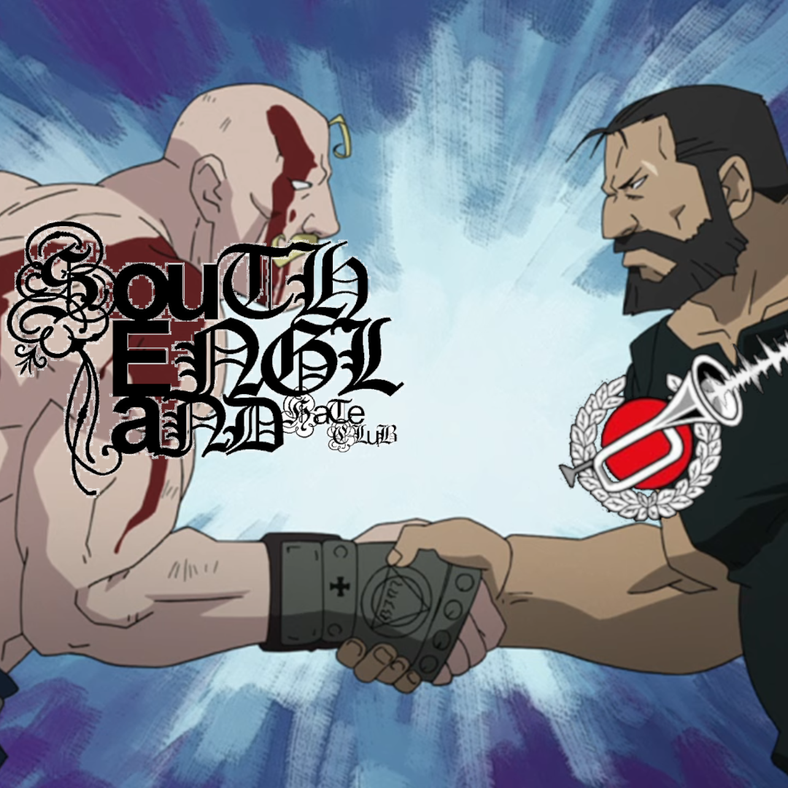

# Spotlight 02 - South England Hate Club

For those unfamiliar, spotlight is a series we do that consists of an interview or an article and an accompanying mix. This edition focuses on up and coming label, South England Hate Club.

In the first couple of years of SEHC existing, they've managed to have a very high quality roster of releases - one of the best out there right now. If you're not keeping up with what they're doing, you should start!!!

## Interview with [nitroii](https://nitroii.neocities.org/) & [Bypass](https://bypassbreakcore.neocities.org/) of [South England Hate Club](https://southenglandhateclub.bandcamp.com/)

Let's get RIGHT into it!!!  

### First of all! Serious congrats for being so young and running such a killer label. You guys are putting out some really hard shit, and consistently too - not an easy task at all! Anyway, please briefly introduce yourselves for the kind people at home.  
  
nitroii: yo yo. my name is olti krasniqi, i’m 16, and i make music under the alias nitroii (and occasionally dj fire exit, although that alias is reserved for mixes). i’m a rg1 fella with albanian heritage (i rep fully) and i’ve been doing this for more or less 7 or 8 years. i started what you guys know as ‘south england hate club’ in summer 2023 when i was 14, and it got hard running it alone, so i pulled in marcus a few months in and now we’re on top of this shit. mad sounds spewing out everywhere, but i’m gonna leave that for later.  
  
Bypass: Yo,, my name is Marcus, Im 19 years old and I go under the name Bypass (named after the name given to a drain in Bradford by many urban explorers)   
Born in the North of England, Sheffield to be specific, Ive been producing Breakcore, Ambient, Noise and other similar genres since I was about 13 years old.  
It started off as a passtime thing to cure boredom, but soon after first chatting to nitroii we hit it off instantly and began our own thing.  
Next minute, we got our own fullblown releases and label on the go, where the fuck did all the time go, eh?  
  
### Now, I will ask you both a question we like to ask every interviewee. Breakcore is a terrible term. It means nothing and everything - so, to you, what makes something breakcore? What is the criteria?  
  
nitroii: breakcore needs to be fast, that is one thing. although i believe the internet has generated a lot of nuance around the term. i call bullshit on the people who say that breakcore has to be edgy or punky or lo-fi or super loud and super aggressive; you take artists like blaerg for example, he’s been doing super intricate crazy shit for about 20 years - cutting up orchestral bits and finely finely chopping amens up. it lean towards idm sometimes, but there’s that slight tinge of urbanism or rebellion, so to say, that makes it undeniably breakcore. you go to the other end and you’ve got guys like dropthelime (who is the greatest of alltime by the way), and he’s sicko as fuck - blending elements of dubstep, grime, jungle and drum n bass all into breakcore while hopping soundscapes every other minute. it’s mental but it’s funny cus it’s all breakcore. anyone who thinks otherwise is a fucking idiot. stop saying something is what it isn’t!!  
  
Bypass: I believe Breakcore is endless in what it can be, the name has been tossed and changed so much that its totally lost its meaning as you say. Its such a big umberella to describe  
all these different releases and artists that you cant really tell what it is. I believe as long as its fast, loud, and uses breakbeats in some capacity, that it is Breakcore. I am also sick to the back teeth of  
these so called Breakcore gurus and elitists that make the term Breakcore mega strict.  
  
### You've been running SEHC for a couple of years now - not a lot of people get/make the opportunity to run a label - what's the biggest lesson you've learned so far?  
  
nitroii: i love this question… i actually started the label back when i was just 14 cus i was pottymouthed and got in some shit with other labels, so sehc was sort of a massive ‘fuck you’ to everyone who turned me away. since then it’s developed as a way for me to turn my passion into something that can actually sort of infect other people too - in a good way of course. it’s all about trying to open up other people’s minds to what music can be, as breakcore is totally alien non-music to a lot of people i know. the biggest lesson i have learned… if you’re not going full send, don’t go at all. with all due respect, you will not get far. this shit is like climbing an endless stairwell… you just gotta keep pushing up and maybe you’ll meet some sick people along the way, and maybe some dickheads - that being said, watch out for the people coming to you with low-effort music and begging you to put it out only because they see that you do jewel case cds and not cdrs in scratched up slimline cases (been there done that!)  
  
Bypass: As business wise goes, time and money management. Its key to run a label. If you dont have those under control you're screwed if you think youre gonna make it big.  
In general, Ive learned to be careful who you invite onto your label for sure, had a few dodgy blokes and alot of drama back in the early days of SEHC. That being said, were cautious now.  
  
### Following on from the last question - it's been a couple of years - what was the thing that gave you the push to go ahead and start a label in the first place?  
  
nitroii: of course i started off doing it solo, and i think it had to do not just with labels pushing me away but also because i remember being back home in kosovo, with all my albanian family and friends. i just thought to myself ‘england is so fucking rubbish’, and i was working on a lot of music at that time for the ocularist album, so i essentially just channeled this frustration against my birthplace into a label title. i don’t actually hate south england that much but i’m really happy i chose the name i did - it sounds threatening but tongue in cheek; just like my music. another thing is that i really just wanted to do my own thing… i’ve always been super energetic and bubbly when it comes to the creative aspect of things, and i’ve been creating things my whole life, so i decided that the next step was to open up a label whose visuals, styles, and conventions were all overseen by me  
  
Bypass: Obviously as nitroii said it wasnt me that started it up, however as soon as I had learned nitroii was interested in making a label I was more than intrigued to get my hands into it.  
I think the thought of being your own boss was what mainly drove me to that. Having to work under someone elses rule isn't that fun and can be stressful, depending how serious the label is of course.  
So being able to be your own boss is a great privilage that really enticed me.  
  
### Now, a pretty basic but pertinent question - how did you get into breakcore, and who are your biggest influences? First, as individual producers, and then for SEHC, if the answer differs!  
  
nitroii: i grew up on this electrohouse stuff that was all the rage in the uk back in the early 2010s and i became so infatuated in its soundscapes that i just felt like i needed to venture out further somehow. when i was maybe 7 or 8 i got into grime and dubstep - i was a big fan of skepta, jme, dizzee rascal, wiley, crazy titch, d double e, jammer, shorty, frisco, et cetera… and then when i was about 9 or 10 i got into death grips and aphex twin all at once and it was like nothing i had ever heard before; so much was happening at once but it all made perfect sense in my head, which then led onto me discovering other artists more prominent in the breakcore scene (vsnares, kid606, xanopticon, shitmat, dropthelime, toecutter…) but i wouldn’t say my influences are exclusive to breakcore whatsoever. if i had to pick 10 it would probably be aphex twin, dropthelime, death grips, skepta, vex’d, the cranberries, guns n roses, bethlehem, sophie (RIP) and cex.   
  
Bypass: Believe it or not, Chris Cunningham, the director that made Rubber Johnny. I saw Rubber Johnny first when I was about 7-8 years old, then found that Chris did live shows for a few years. One of the clips I saw  
he played the track "Make Ronnie Rocket" by Venetian Snares, and that was my introduction. From then on I was hooked.  
My biggest influences at the moment are honestly my friends in SEHC and similar labels. I dont look out to bigger artists for inspiration like I used to years ago. To name a few, my main inspirations are: nitroii, wawawa, Midori, Sam Fauchon, apollo bitrate, Ely Muff and AM3NAC3.  
  
### SEHC has become a very successful and respected label in the breakcore scene - do you have any plans for the label aside from releasing killer music? The answer being no isn't necessarily a bad thing - knowing when you're biting off more than you can chew is hard!!!  
  
nitroii: there is a beefy distance between me and marcus, but we plan to host shows soon. endless chaos and destruction - i get very excited thinking about it. it’s also funny cus this interview is being conducted on the cusp of our first merch drop. as an art student, i have a borderline unlimited supply to art products so i just nicked some acrylic stuff and a screen and i just started going ham on old tees and jumpers. i will be putting them up for sale soon! we also wanna do real vinyl records. lathe cuts are great but why not expand your horizons??  
  
Bypass: I think something me and nitroii have discussed alot is doing live shows and DIY events, we would LOVE to so an SEHC disco or something crazy like that, would be sick. We are also wanting to do merch which  
we have already started to do, nitroii has been cooking up some fucking killer shirts and polos with the toughest designs on them. And of course, we want to start doing REAL vinyl instead of lathe like we have been doing.  
  
### Any releases you have coming up that you want to shout about?  
  
nitroii: ‘recession beating anthems, volume two’, is out on my 17th birthday, april 14th. i’ve been honing my style these past months a fuckton and it’s led me into a loophole of sampling gummo and macaulay culkin movies. i’m not complaining… the tunes are coming along fucking awesome, and some of my buddies are on there with some sick remixes too. this album is gonna merk stereo systems nationwide; i’m hopping from 225+ bpm mashcore to cut up and cranked up jungle techno anthems, and some crunky grime and dubstep beats infused with the classic amen… boom boom pow  
  
### Tell us a bit about your mix; talk us through some of the tracks, artists, and tell us what they mean to you?  

nitroii: i know it’s the breakcore bugle but i feel like if i limited the mix to breakcore it would feel sort of obsolete. so i’ve cheffed up a quick blend of all sorts; grime, dubstep, jungle, drum n bass, gabber, hardcore, breakcore… it’s all in there. it might be a bit sloppy cus i threw it together a bit last minute (marcus’ mixing skills are limited so he helped me form a tracklist and left the actual dj bit all to me). the tracks in the mix all play a part in who we are today; these are artists and soundscapes who influenced our style over the years and we’re happy to have this mix done for you all! please enjoy  

### Any shoutouts or final thoughts you want to share with the Buglers at home?  
  
nitroii: hold tight all the fans. album soon - 2026 is the year of the sehc. free palestine, free congo and free all my stateside folk who have been affected by the corrupt system of the united states of america. keep merking the fucking sound till it gets you somewhere, and always be you to your fullest capacity unapologetically. fuck who’s watching!!  
  
Bypass: Big up all our supporters, fuck the haters, Free Palestine and Fuck Trump.  

## SEHC's Mix for The Breakcore Bugle
  
Here's nitroii's mix that represents the vision, inspirations, and current roster of SEHC! nitroii seamlessly takes us through a range of fun genres with this one. Enjoy!
  
Here's the [SoundCloud link](https://soundcloud.com/the-breakcore-bugle/spotlight-02-bypass-and-nitroii-of-south-england-hate-club/) if you'd rather listen directly on that platform.

<iframe width="100%" height="300" scrolling="no" frameborder="no" allow="autoplay" src="https://w.soundcloud.com/player/?url=https%3A//api.soundcloud.com/tracks/soundcloud%3Atracks%3A2249219948%3Fsecret_token%3Ds-6W4GKnLw1ig&color=%23ff5500&auto_play=false&hide_related=false&show_comments=true&show_user=true&show_reposts=false&show_teaser=true&visual=true"></iframe>
<a href="https://soundcloud.com/the-breakcore-bugle" title="The Breakcore Bugle" target="_blank" style="color: #cccccc; text-decoration: none;">The Breakcore Bugle</a> · <a href="https://soundcloud.com/the-breakcore-bugle/spotlight-02-bypass-and-nitroii-of-south-england-hate-club/s-6W4GKnLw1ig" title="Spotlight 02 - bypass and nitroii of South England Hate Club" target="_blank" style="color: #cccccc; text-decoration: none;">Spotlight 02 - bypass and nitroii of South England Hate Club</a>

