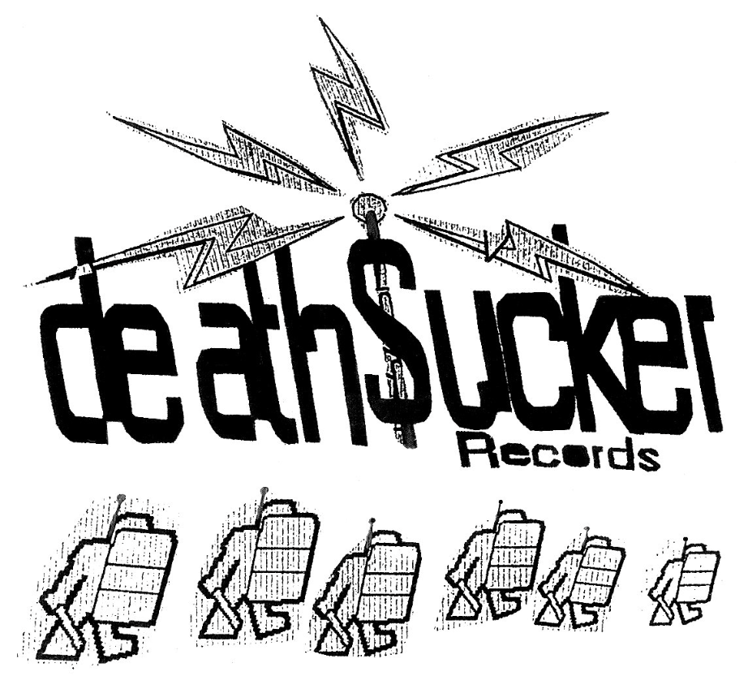

Okay people... This is a _very_ exciting edition of Spotlight. This time around we're covering [death\$ucker records](https://deathsucker.bandcamp.com/) - a British mashcore/breakcore label from back in the day, with some serious heavyweights on the roster.

This edition of Spotlight includes an interview with Parasite, the head honcho at the now-defunct death$ucker, along with an accompanying mix. However, this one comes with a little twist...

## Prelude and Public Service Announcement

Unlike usual, for this little section, I'll break the royal we... :P

This edition of Spotlight is _kindly_ brought to you by [Arcade Trauma](https://arcadetrauma.bandcamp.com/). I put out an Insta story a while ago asking if anyone wanted to write an article (at least I think that's how it went down), and Mr Trauma reached out to me, asking to write this article.

I myself (ssstr1pe) am not super familiar with death$ucker records discography (am I a poser?) - I've been putting off reading the whole article properly and listening to the mix until dropping it - I want to enjoy it all along with other readers, and I've been so excited to drop this one :)

Anyway - thank you so much to Arcade Trauma. It really means a lot. Up until now, I am the solo writer of articles. I love doing this, of course, but in the long term, I want The Breakcore Bugle to be a collectively owned, open thing with many contributors. We have a [bus factor](https://en.wikipedia.org/wiki/Bus_factor) of 1 right now, and I don't want that to be the case...

I want The Breakcore Bugle to be a wider thing with many people owning little parts, contributing where, how and when they please. I, as an individual, am not that interesting, I'm not good at writing articles - you've probably noticed a lot of the time in the monthly roundups I say very little about each featured release. This is intentional - I don't really know how to be more elaborate, and I also don't think that the monthly roundups require it. A concise list of sick as fuck music is what I'm tryna deliver to u... Went on a tangent there... Lost my train of thought... Perfect example of what I'm talking about...

BUT ANYWAY! We welcome contributions from everyone. If you want to write about _anything_ breakcore (labels, artists, albums, etc) - please get in touch. The more the merrier. We're really open to all kinds of media and contributions, if you have an idea, just get in touch. Here's some ideas of things I'd like the Bugle to do that I don't personally have all that much time to do:
- monthly roundup of upcoming events (something we did at the start, that I'm shit at)
- interviews with artists/djs/whatever
- featured articles covering albums/eras/scenes
- video recordings of live sets (shall we expand to youtube?)
- and literally anything else

So, to summarise, the more the merrier. I just want to document this mad genre as much as possible :)

And also, obviously go show Arcade Trauma some serious love. Big him the FFFFFFFFF up for this contribution. Buy his music, follow him on all platforms, go see him play out <3

Okay, now we will get into the interview...

_until further notice, all of this is from Arcade Trauma, unedited... But ssstr1pe, you didn't even check the formatting? Do some basic editing? No. I do not care about any of that. Enjoy!_

## death$ucker records: The U.K’s Answer to Breakcore - Brought to you by [Arcade Trauma](https://arcadetrauma.bandcamp.com/)

death\$ucker records, founded in 2001, is a label that some of you may have heard of, or it may be the first time you’re hearing about such a label… regardless if you’ve heard of it or not, death\$ucker was a legendary breakcore label out of the U.K, based originally in Bristol. Ran by a legendary titan of breakcore, Parasite, death\$ucker pumped out an obscene amount of high quality breakcore and absolute rave stompers throughout the years. Some of these releases include the brilliant works of prolific producers such as: “Foxdye, Krumble, Dj Floorclearer and Bong-Ra” as well as releasing tracks for producers such as: "Venetian Snares, Shitmat, Aaron Spectre.”

You’ll find as you scour through the death\$ucker label, there is an abundance of well celebrated producers within breakcore that have featured on the label. However perhaps the most interesting part of the label is it’s dedication to providing unique sound. The influences found across the label are vast, including: “Ragga, IDM, hardcore, jungle, ravecore”.

To showcase this wide range of sound, I’ve taken up the task to record a mix for this article, cramming in as much as I could to showcase some of my favourite death\$ucker tracks. Fair warning, this mix isn’t exactly super tip top, it was impromptu, unplanned and sporadic fun. Please find links to the mix at the bottom of this article.

After listening and DJing so many tracks from the death\$ucker label, and of course from Parasite himself, I was intrigued to hear more about the labels creation, driving force, and was equally curious about Parasite himself, as one of the biggest OG’s of the breakcore sound and also representing my own country, the U.K…

So without further ado, here is a few questions I had the pleasure of asking the man himself…

### Parasite Interview

#### What inspired the beginning of the Parasite project? Were there any key inspirations at the time?

The Parasite project started when I moved to Bristol in 1999\. Musically I was inspired by the riot sounds of the Digital Hardcore Recordings label in Berlin. Politically I was very much into anarchic ideals and breaking the rules. I was really into protesting; Reclaim the streets in Bristol, anti-war demos in London and legalise cannabis marches. I read Anachist zines and magazines like Adbusters, which opposed capitalism and the mainstream media. DIY culture was rife and peer-to-peer file sharing was a big thing. Parasite was born as an act of retaliation against popular music and consumer culture.

#### What was breakcore like when you got into DJing and Producing as parasite?

My early experience of Breakcore was listening to artists like Alec Empire, Bomb20, Christoph De Babylon, Patric C and Panacea. Later on it labels like Peace Off, Ambush and Addict Records. I was really into Bong-Ra, Sickboy, FFF, Knifehandchop and Venetian Snares. Before that my musical influences were Aphex Twin, Squarepusher and early Ninja Tune releases. I loved the cut-up sound and breakcore was a complete departure form the constraints of traditional dance music.

#### How did death\$ucker begin? What was the inspiration and thought behind the label?

I was listening to other breakcore producers an labels and realised there was nothing like that in Bristol. I was making tunes and not doing anything with them. One day a friend said why don't you set up a record label and record distro? I started burning CDRs and trading with other distros around Europe and further afield. I heard Bong-Ra's Peel Session on BBC Radio 1 and asked him for some tracks to release, and the first Deathsucker vinyl release was born. The name Deathsucker comes from a William S. Burroughs quote from Ah Pook Is Here, which you can hear at the end of the Ballroom Blitz compilation: [https://deathsucker.bandcamp.com/album/various-ballroom-blitz](https://deathsucker.bandcamp.com/album/various-ballroom-blitz)

#### Who created the death\$ucker logo? And how did it come to be?

My brother John came up with the Deathsucker logo. I really liked the idea of music that was radical and revolutionary, music with a message, music that could start a riot\!

#### What would you consider to be the most memorable moment for you donning the Parasite moniker?

It's difficult to pinpoint one thing because there were so many\! Touring Japan in 2005 with Bong-Ra was a gruelling but memorable experience. We were there for 1 week and played shows in Tokyo, Kanazawa and Osaka. Running the Toxic Dancehall parties in Bristol was a mind blowing experience. We had legendary line-ups of Breakcore artists from around the world and crowds of 1000+ people filling the Black Swan. Another memorable achievement was being nominated for an Ivor Novello Award in 2010 for music I wrote for Savage Moon \- a tower defence game on Playstation3. I also had the pleasure of working with the original Star Wars sound effects for a game called Battle for Hoth.

#### Your music seems to have quite a strong ragga influence and also hip-hop… how important were these influences to your style? How did they come to be integrated?

The ragga influence for me came from listening to artists like Bong-Ra and Aaron Spectre, plus I've always had love for the amen break. Living in Bristol amongst the Jamaican community who put on St. Pauls Carnival every year, was a big influence for me. Also the free-party scene and sound systems culture was strong at the time. For a time I had a late night slot on Bristol's pirate radio station Passion FM (I still have some of the radio shows recorded to cassette). The hip-hop influence was from listening to bands like Public Enemy, Wu-Tang and Beastie Boys. Also hip-hop beats and vocals work really well with the fast breakcore BPMs.

#### Do you still listen to breakcore? What are your thoughts on how breakcore has evolved and manifested through time?

Not so much these days. I haven't kept up to date with the scene since leaving Bristol so couldn't really give me thoughts on it now. It makes me happy that there still an audience for it and people like Arcade Trauma are still pushing the riot sound.

#### What are you up to nowadays in regards to performing and producing? Any cool raves coming up?

I now co-run a club night called Tell Your Friends and co-host a radio show on Alpha Wave Radio. In February 2026 it will be our 4th birthday so we're throwing a party in my local town of Cardigan in West Wales. I've been slowly recovering music from old hard drives and uploading them to the Deathsucker Bandcamp page, and still have stacks of vinyl for sale on Discogs. I mostly DJ these days, but would love to get back into music production at some point in the near future..

Special thanks to Parasite for letting me ask these questions and to breakcore bugle / str1pe for letting me publish this article / interview for all those as curious as me.

## Arcade Trauma's death\$ucker records mix for The Breakcore Bugle

_and now back to your regularly scheduled programming with ssstr1pe..._

WOAH! That was fucking sick. You know what's even sicker? Arcade Trauma's accompanying mix, which is right here, for you and your ears. Fuck yeah.

Thanks again to Arcade Trauma and Parasite <3.

Here's the [SoundCloud link](https://soundcloud.com/the-breakcore-bugle/spotlight-03-arcade-trauma-x) if you'd rather listen directly on that platform.

<iframe width="100%" height="300" scrolling="no" frameborder="no" allow="autoplay" src="https://w.soundcloud.com/player/?url=https%3A//api.soundcloud.com/tracks/soundcloud%3Atracks%3A2265434903%3Fsecret_token%3Ds-O9czxfp34zG&color=%23ff5500&auto_play=false&hide_related=false&show_comments=true&show_user=true&show_reposts=false&show_teaser=true&visual=true"></iframe>
<a href="https://soundcloud.com/the-breakcore-bugle" title="The Breakcore Bugle" target="_blank" style="color: #cccccc; text-decoration: none;">The Breakcore Bugle</a> · <a href="https://soundcloud.com/the-breakcore-bugle/spotlight-03-arcade-trauma-x/s-O9czxfp34zG" title="Spotlight 03 - Arcade Trauma x death$ucker records" target="_blank" style="color: #cccccc; text-decoration: none;">Spotlight 03 - Arcade Trauma x death$ucker records</a>

