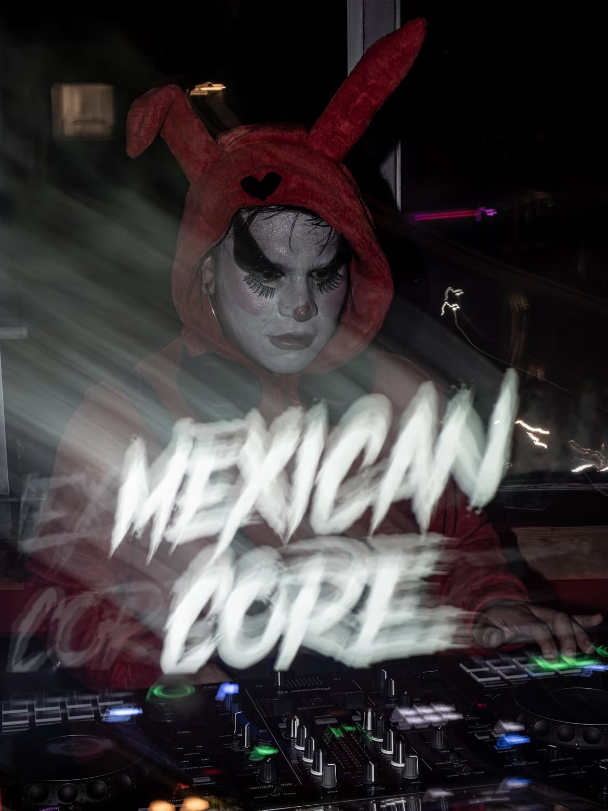
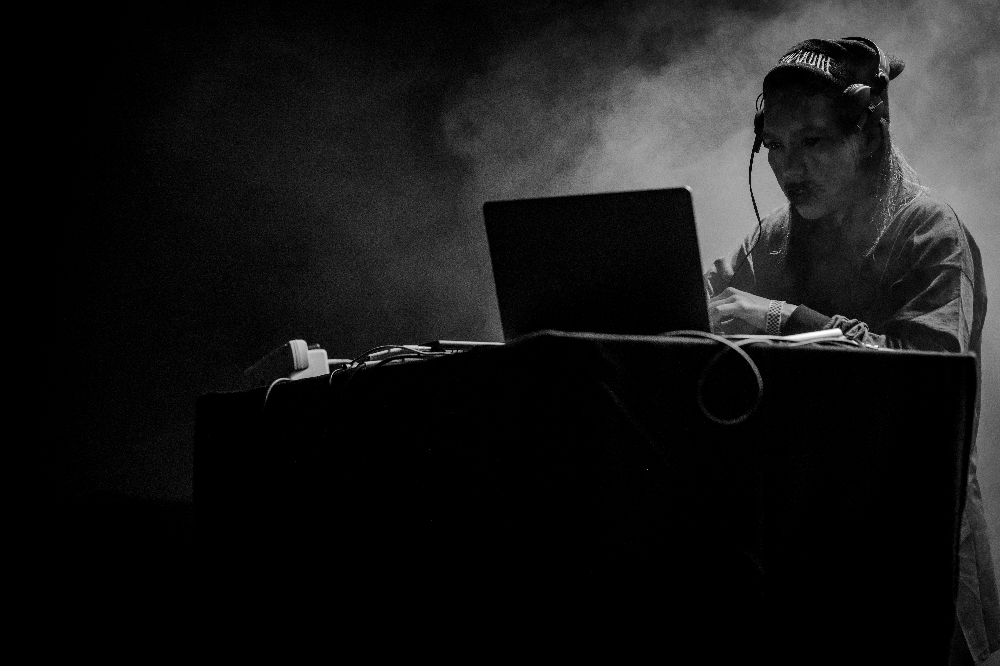
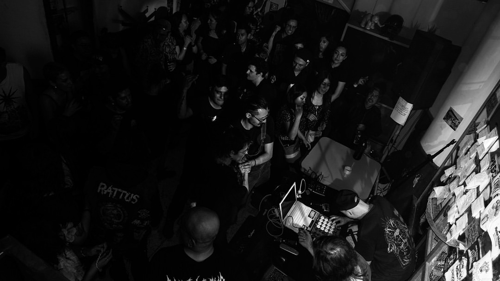
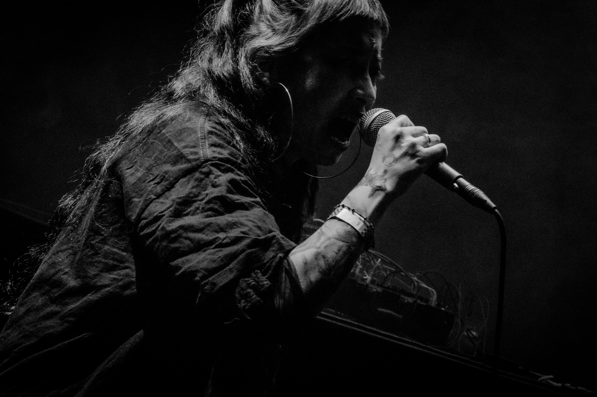
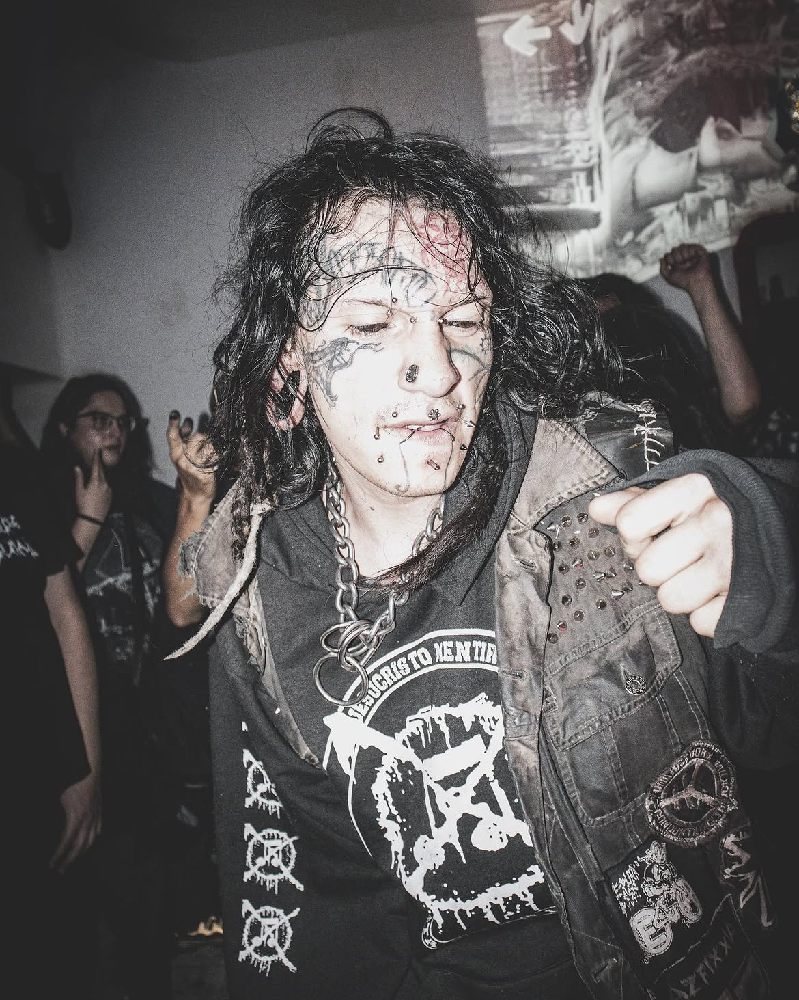
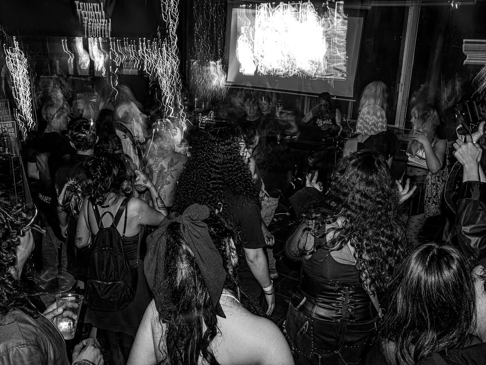
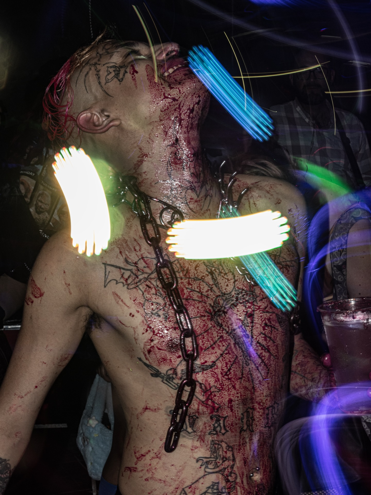
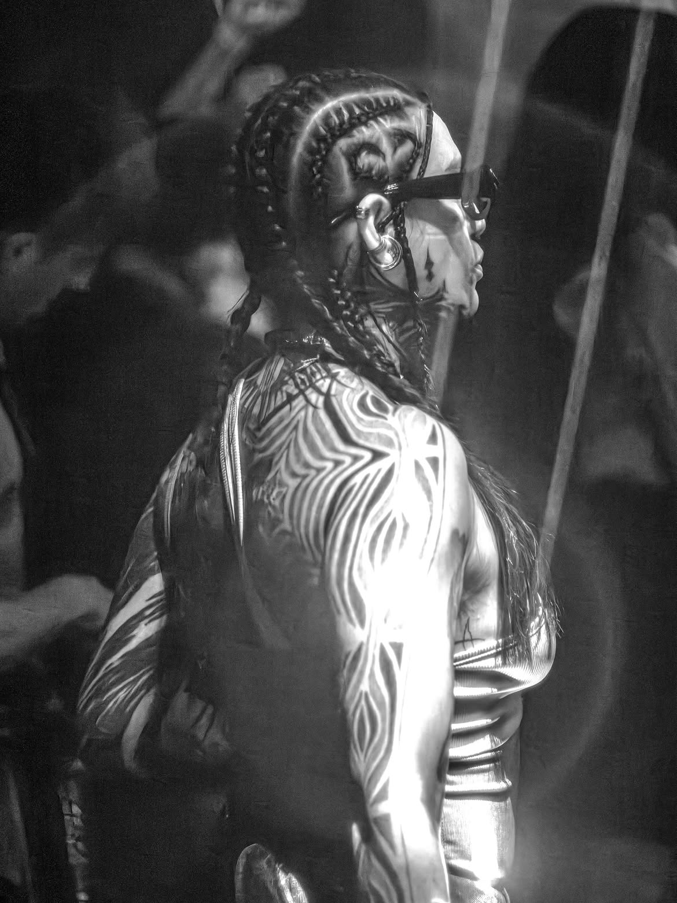
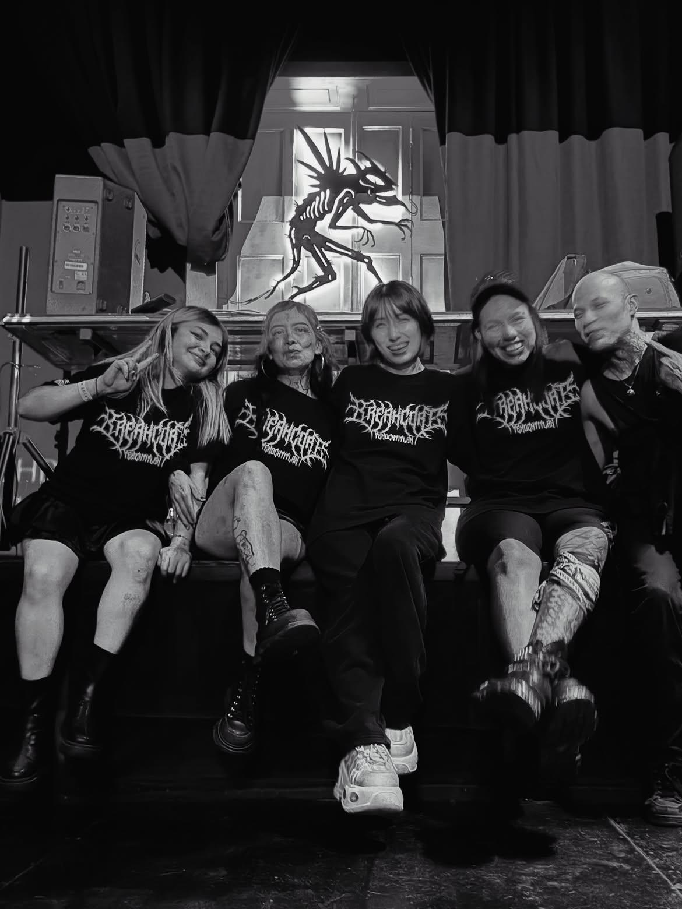

Ohhhhhhhhhhhhhhh yesssss!!! This interview has been in the works for a little while now and I'm so happy to share it with you all!!! I'm so grateful to be covering such a cool up and coming label/collective... This spotlight is covering none other than [MEXICANCORE](https://mexicancore.bandcamp.com/)!

I've been keeping tabs on this collective for a little while now and the events look amazing... Varixs Artistas vol.1 was probably the best debut compilation from a label I've heard, with some names you are most likely familiar with... Since then I was hooked and doom-scrolling with envy all the photos from their events... Also the first single artist release, crossdesphyxxxia, I loved too and I play it out in my sets pretty much every set.

So I've had the please of interviewing none other than [SAFOH](https://safohmx.bandcamp.com/)! The head of Mexicancore, a veteran in the breakcore scene, someone clearly extremely well qualified to run the hottest breakcore label in Mexico... Let's dig into their brain and see what they have to say...

*This interview will be shown first in English, and then in Spanish!*

# Mexicancore - Interview with SAFOH!

## Mexicancore! Before we dive into the actual interview questions, please introduce yourself.

Hey everyone!

We're a collective of audiovisual artists that organizes electronic music events focused on Breakcore, Hardcore, Speedcore, Braindance, Hardtek, Latincore, Gabber, Crossbreed...

We're based in Mexico City, and the events we organize are built around giving visibility to non-binary, trans, and women artists, because the people who make up this crew belong to those communities ourselves.

We love creating spaces for people to come together and party around concepts that often sit at the intersection of science, technology, and pleasure (lately our flyers have become pretty recognizable because of these ideas).

I know it sounds a little crazy, but all of this is deeply connected to who we are as a crew. Let me introduce us: I'm Safoh, the founder of the collective, and I handle everything related to the sonic side of things: DJs, producers, live acts, the netlabel, artistic curation for our events, and so on. Mel Flaum is a visual artist who coordinates the VJ side of our parties while also creating the artwork and 3D models for every flyer. Lágrimas is a tattoo artist and scientific illustrator whose artistic background shapes the conceptual direction behind each of our events.

## How did you get into \*core? Both initially, listening wise, and then how did you find yourself getting involved in the scene?

Hahaha, I don't think there's much mystery to it. Ever since I was a teenager I've been into punk and ska—in general, anything people here would call "countercultural." One day a friend invited me to a D&B party, and while I was rolling on MDMA I heard a DJ drop a breakcore track. Something just clicked in my brain. Those distorted Amen breaks felt like a lightning bolt illuminating my subconscious and taking over my whole body. From that moment on I knew I needed more of... whatever that was.

After that night, nothing was ever the same. I started digging deeper into underground electronic music scenes, and although there were a few D&B, hardcore, and breakcore parties around, I quickly found a very macho environment with a lot of hostility toward anyone who wasn't a cis, straight guy (Mexico is still an incredibly macho, LGBT-phobic, and misogynistic country).

It was heartbreaking to realize there wasn't a platform or event series dedicated entirely to extreme electronic music where I could actually feel safe expressing who I am—and where 90% of the lineup wasn't made up of men.

That's what led me to start Mexicancore... and I've never regretted it >:)

## You've been putting on events for a few years, what made you recently decide to start releasing music too?

Mexico is wild. It's an incredibly rich country in terms of culture, biodiversity, and MUSIC. People here listen to everything, and we're constantly influenced by cultures from all over the world.

Our unique position on the map has allowed Mexico to develop producers and DJs with truly distinctive sounds. It would be a shame not to document what's happening here. At the same time, we also have lots of friends abroad who support the Mexican scene, so it felt natural to create a platform where music from both international and Mexican artists could come together.

## What's your favourite event you've put on so far and why?

Ahhh... that's a really difficult question. Every event we've organized holds a special place in my heart, and every artist we've invited has meant something to us. But if I had to choose one, it'd be the event we organized together with Day of the Droids (a breakcore crew from Barcelona and Osaka).

Autopsy Protocol was our headliner, and we held the party in a clandestine venue right in the heart of Mexico City's Historic Centre—in Chinatown, at a space lent to us by a friend of Lágrimas, someone they'd tattooed.

The sound system was incredible, and the music never stopped blasting above 200 BPM. I think admission was only 20 pesos (less than one euro). Every kind of person showed up: dedicated breakcore fans, punks, and even people wearing traditional cowboy hats.

That party had everything: mosh pits, fights, the police showing up... ufff, it had a truly underground spirit. Everyone was dancing their hearts out while the visuals completely swallowed the room. For a brief moment it felt like breakcore had fused all of our souls together in one massive audiovisual frenzy. HAHAHA. Easily one of the best parties we've ever thrown.

Oh—and before all the breakcore madness, we had cumbia DJs playing. XD XD

## You played Bang Face a few years back now - siiiiiiiiiiiick! Do you have any future plans or aspirations to bring Mexicancore back over to the UK/Europe in any way?

Ahhhh, Bang Face ;) ...and Balter too! You folks in the UK are seriously lucky to have festivals like those. Hahaha.

We definitely want to come back. Lately a lot of our friends have been asking us exactly the same thing... Maybe we'll be announcing some dates sooner than people think—you never know.

Our tours around Europe and the UK have always gone really well. Sometimes people are genuinely surprised when they find out we're Mexican and making quality breakcore. It's an interesting reaction, because they end up embracing what we do and supporting us, and it feels amazing to be able to share our music with them.

What's more, every tour we've done has been alongside artists we genuinely admire and love, so I'd say it's more than a realistic possibility.

## Tell us all about the \*core scene like in Mexico, and the community you've built around Mexicancore?

Pffff... what can I even say? @\_@ It's honestly crazy how much this has grown. We threw our very first party back in 2018, and now, eight years later, we've shared lineups with artists from Norway, Japan, UK, Spain, the United States, Colombia, France, Canada, Russia, Argentina, Slovakia, ... We can honestly say we've built a strong community of people who share the same hunger for extreme electronic music, but who also refuse to sacrifice the quality of an event just because it's underground.

On top of that, giving visibility to LGBTQ+ artists has turned the dancefloor into a place where people can genuinely come together. You'll see attendees wearing the wildest makeup and outfits imaginable (a bit like what you see at Bang Face and Balter, but in our own way). People here are absolutely crazy... it's impossible to describe. You really have to see the photos—and even then, that's not even 1% of what actually happens at our events.

## What do breakcore/hardcore/etc events in Mexico have that everywhere else is missing? BOAST! Hehe

Hahaha, I'll just say it straight: they've got their own flavour: ¡Chile y sazón!

Mexican events have something you'll rarely find in European or Asian scenes: a level of diversity that borders on the baroque.

And I don't just mean musically—I mean visually, in the most fashion-forward sense imaginable. You can hear breakcore with Latin samples and heavy metal guitar riffs. You can see people experiencing homelessness dancing alongside someone covered in body mods and face tattoos. You might watch the cutest girl at the party mixing extratone, speedcore, and flashcore like it's the most natural thing in the world. I don't know... it's hard to put into words. You really have to come to Mexico and experience it for yourself.

I think a lot of that comes from how difficult it is to organize events in a country like ours. Economically speaking, it's simply not the same for a white, straight person in, say, Berlin to organize a party as it is for someone who is brown, transgender, and has Indigenous roots. Maybe I'm getting into politics here, but I think it's always important to understand where we're standing and the place we're creating from.

Even though Mexico has made significant progress under recent centre-left governments, we still face serious problems with violence, and there's still a long way to go when it comes to gender equality. That's why I bring all of this up.

Nothing we do comes from a place of privilege. It comes from countless hours of unpaid work, from saving our monthly salaries for months just to afford a decent soundsystem. It comes from the need to dance to something other than reggaeton or TikTok hard techno (not because there's anything wrong with those genres, but because we need DIVERSITY. And sometimes choosing diversity means ending up with an empty wallet—but also with the satisfaction of creating something you truly believe in and sharing it with people who genuinely love it too).

## Give us your top THREE Mexican \*core artists to watch? o.O

Besides Safoh, we'd definitely recommend Bruxxi and Gnomo. But more than individual artists, we'd encourage people to keep an eye on these three Mexican breakcore collectives: **Mexicancore**, **Breakcore Never Dies**, and **Sinapse**. Lately we've been working closely together, and alongside **Organized Damage** (a crew from the United States), we'll be hosting **Xanopticon** on August 22nd.

That event means a lot to us because it's another reminder that music has no borders. Among friends, we're one big breakcore family, regardless of terrible immigration policies or whatever political agenda any government happens to have.

## You have the next compilation coming out in August - congratulations! Shout about it! Tell us all about it!!! Where can we find it and how can we support it?

Awwwwww <3 Thank you so much!

We're incredibly excited about this second compilation because it features some huge names in breakcore—Baseck, Nagazaki, Ars dada, STR1PE, just to name a few...

For now we're releasing music exclusively through Bandcamp (ahhh... we genuinely love Bandcamp). Our compilations will always be free to download, but donations are always welcome because they're the easiest way to support our netlabel.

And if you decide to support us on a **Bandcamp Friday**, even better! On those days, every donation goes directly to the label, which makes a massive difference for projects like ours.

## Do you want to release EPs or LPs in the future or stick to compilations?

We already have several EPs and LPs in the works from Latin American artists as well as artists from other parts of the world. We're also beginning to experiment with physical formats, and we'd absolutely love to release some records on vinyl someday.

The future looks bright, and we feel incredibly honoured by all the support people have been showing us.

## Final question - yap to your heart's content. Say whatever you want to the people...

Before we wrap this up, I'd like to share my perspective on the community we've built around breakcore. More than a community—as I mentioned earlier—it's really a group of friends whose friendship was born out of a shared love for music.

The bond we've built together has allowed Mexicancore to grow by creating bridges between people, regardless of nationality, gender identity, or economic background. To me, that's what truly matters: cultural exchange, love, and all the experiences we've shared along the way.

We want to thank all of our friends around the world, as well as everyone here in Mexico, who continues to support us and help keep this dream alive: establishing Mexico as the Latin American capital of breakcore. <3

# Mexicancore - Entrevista con SAFOH!

## ¡Mexicancore! Antes de entrar de lleno en las preguntas de la entrevista, por favor preséntate.

Hola, carnales

Somos un crew de artistas audiovisuales que organiza eventos de música electrónica en torno al Breakcore, Hardcore, Speedcore, Braindance, Hardtek, Latincore, Gabber, Crossbreed...

Nuestra base operativa se encuentra en Ciudad de México y las fiestas que organizamos parten de la premisa de darle visibilidad a artistas no binaries, trans y mujeres, porque quienes integramos este crew pertenecemos a estas comunidades.

Nos gusta generar espacios para la fiesta en torno a conceptos que muchas veces tienen que ver con esas cosas que se intersectan entre ciencia, tecnología y goce (últimamente nuestros carteles se han vuelto bastante reconocibles por estos conceptos).

Sé que suena loco, pero todo esto tiene mucho que ver con quienes integramos el crew (voy a presentarnos): yo soy Safoh y fundé el crew. Me encargo de toda la parte que tiene que ver con lo sonoro: DJs, productores, live acts, netlabel, curaduría artística de los eventos, etc. Mel Flaum es artista visual, organiza la parte del VJing en las fiestas y realiza la gráfica y los modelados 3D de los carteles para cada evento. Lágrimas es tatuadore e ilustrador científico; a través de su formación artística define la línea conceptual de cada uno de nuestros eventos.

## ¿Cómo te iniciaste en el mundo del \*core? Tanto al principio, como oyente, como después: ¿cómo terminaste involucrándote en la escena?

Jejeje, creo que esto no tiene mucha ciencia: desde la adolescencia he tenido gusto por la música punk y el ska; en general, por todo aquello llamado aquí "contracultural". Un día una amiga me invitó a una fiesta de D&B y, en un viaje de MDMA, escuché a un DJ poner breakcore y simplemente algo hizo click en mi cerebro. Esos amen breaks distorsionados generaron como un relámpago que iluminó mi subconsciente y se apoderó de mi cuerpo. Desde ahí supe que necesitaba más de "eso".

Después de ese evento nada fue lo mismo. Empecé a escarbar en los circuitos alternativos de música electrónica y, aunque existían algunas fiestas de D&B, hardcore y breakcore, me encontré con un ambiente muy machista y con prácticas violentas hacia las personas que no éramos vatos cis hetero (México es un país súper machista, LGBTfóbico y misógino).

Fue muy triste darme cuenta de que no existía una plataforma o una serie de eventos dedicada al 100 % a la música extrema en donde, además, pudiera sentirme segurx expresando mi forma de ser y en donde el 90 % del line up no estuviera conformado por hombres.

Esto me llevó a fundar Mexicancore y no me arrepiento.

## Llevas unos años organizando eventos; ¿qué te llevó a decidir recientemente empezar a publicar música también?

México es loco, es un lugar súper rico en cultura, biodiversidad y MÚSICA. Aquí se escucha de todo y también es un país influenciado por culturas de todo el mundo.

Este punto privilegiado que ocupamos en el mapa hace que México tenga productores y DJs que hacen cosas únicas. Sería una pena no tener un registro de lo que se está haciendo aquí. A la par, también tenemos muches amigues que apoyan nuestra escena mexicana desde el extranjero, y es interesante hacer que la música tanto de artistas internacionales como nacionales confluya en una sola plataforma.

## ¿Cuál es tu evento favorito de los que has organizado hasta ahora y por qué?

Ahhh, esta es una pregunta muy difícil... Todos los eventos que organizamos tienen algo que se queda en mi corazón; cada artista que invitamos es especial. Pero, si tuviera que elegir, sería el evento que hicimos con Day of the Droids (crew de breakcore de Barcelona y Osaka).

Autopsy Protocol fue nuestro headliner y realizamos el evento en un lugar clandestino en el corazón del Centro Histórico de la Ciudad de México (en el Barrio Chino, con un amigo de Lágrimas, a quien tatuó y que nos prestó su "lugar" para hacer el evento).

El sonido fue exquisito y la música estuvo a no parar, a velocidades por encima de los 200 BPM. Creo que cobramos la fiesta en 20 pesos (algo así como un euro o menos). Llegó gente de todo tipo: desde fans del breakcore hasta punks y personas vestidas con sombreros rancheros.

Hubo de todo en esa fiesta: moshpit, altercados, llegó la policía... Uffff, algo con auténtico espíritu underground. Todos los asistentes estábamos bailando bien recio; los visuales inundaban el lugar. Era como si por un momento el breakcore hubiera fundido nuestras almas en un frenesí audiovisual. JAJAJA. Una de las mejores fiestas. Además, antes del breakcore hubo DJs de cumbia XD XD.

## Tocaste en Bang Face hace ya unos años... ¡una pasada! ¿Tienes planes o aspiraciones de traer Mexicancore de vuelta al Reino Unido o a Europa de alguna manera?

Ahhhh, Bang Face ;) También Balter... Son unos suertudos ustedes en UK por tener esos festivales. Jejejeje.

Tenemos planes de regresar, claro que sí. Últimamente muchos amigos nos están preguntando lo mismo... Quizá en breve anunciaremos fechas, uno nunca sabe. Pero los tours que hemos hecho por Europa y UK han sido muy exitosos. A veces las personas allá se sorprenden cuando se dan cuenta de que somos mexicanos y que tenemos buen breakcore. Es interesante, porque esto les gusta, nos apoyan y se siente muy bien poder compartir.

Además, siempre que hemos hecho un tour ha sido de la mano de artistas que admiramos y queremos un montón, así que esto es una posibilidad más que real.

## Cuéntanoslo todo sobre la escena \*core en México y la comunidad que has creado en torno a Mexicancore.

Pffff, ¿qué puedo decir? @\_@ Es una locura cómo ha crecido todo esto. Empezamos la primera fiesta en 2018 y ahora, ocho años después, hemos compartido con artistas de Noruega, Japón, Reino Unido, España, Estados Unidos, Colombia, Francia, Canadá, Rusia, Argentina, Eslovaquia, ... Podemos decir que tenemos una sólida comunidad de personas que comparten el hambre de música extrema, pero que al mismo tiempo no buscan sacrificar la calidad de los eventos solo por ser underground.
Además, el hecho de darle visibilidad a artistas LGBT ha hecho de la pista de baile un verdadero lugar para confluir auténticamente. Puedes encontrar asistentes con maquillajes y estilos súper locos (un poco como lo que ves en BF y Balter, pero a NUESTRA manera). La gente aquí está loca... es indescriptible. Tienen que ver las fotos, y eso no es ni el 1 % de lo que sucede en nuestros eventos.

## ¿Qué tienen los eventos de breakcore/hardcore/etc. en México que les falta a los demás sitios? ¡Presume un poco! Jeje.

Jajajaja, lo diré sin rodeos: tienen chile y sabor. Los eventos aquí tienen algo que difícilmente verán en las escenas europeas o asiáticas: una diversidad que raya en lo barroco.

Esa diversidad no es solo musical; también es estética, en el sentido más fashionista posible. Puedes escuchar breakcore con samples latinos y riffs de guitarras de heavy metal. Puedes ver a personas en situación de calle disfrutando de la música, lo mismo que a una persona con body mods o face tattoos. Puedes escuchar a la morrita más cute del evento mezclando extratone con speedcore y flashcore... No sé... es difícil de explicar. Tendrían que venir a México para experimentarlo en carne propia.

Creo que mucho de esto tiene que ver con la complejidad de hacer estos eventos en un país como el nuestro. No es lo mismo, económicamente hablando, para una persona blanca, heterosexual y, por ejemplo, de Berlín, organizar un evento que para una persona morena, transgénero y con raíces indígenas. Quizá aquí me estoy metiendo en temas políticos, pero siempre es importante saber en dónde estamos parados y desde dónde estamos haciendo las cosas.

México, aunque ha mejorado mucho con los últimos gobiernos de centroizquierda, sigue teniendo problemas graves de violencia y aún hay una larga brecha en temas de equidad de género; por eso menciono todo esto.

Hacer las cosas aquí no viene desde un privilegio; viene de invertirle muchísimas horas de trabajo no pagado, de ahorrar nuestros sueldos mensuales durante meses para poder pagar un soundsystem decente. Viene de la necesidad de bailar otra cosa que no sea reggaetón o hardtechno tiktokero (no porque estos géneros estén mal, sino porque se necesita DIVERSIDAD. Y muchas veces apostarle a la diversidad es quedarte con la cartera vacía, pero con la satisfacción de haber hecho lo que te gusta y la felicidad de haberlo compartido con más personas que también lo disfrutan).

## ¿Cuáles son tus tres artistas mexicanos de \*core a los que no hay que perder de vista? O.O

Además de Safoh, les recomendamos a Bruxxi y Gnomo. Y más que artistas, deben tener los ojos puestos en estos tres colectivos de breakcore mexa: Mexicancore, Breakcore Never Dies y Sinapse, pues últimamente hemos trabajado juntos. Aunado a Organized Damage (crew de Estados Unidos), vamos a tener un evento el próximo 22 de agosto con Xanopticon.

Esto es importante porque demuestra, una vez más, que la música no tiene fronteras y que entre amigos somos una gran familia de breakcore, sin importar las horribles políticas migratorias ni las agendas de cualquier gobierno.

## En AGOSTO sale tu próxima recopilación: ¡felicidades! ¡Cuéntanoslo a los cuatro vientos! ¡Danos todos los detalles! ¿Dónde podemos encontrarla y cómo podemos apoyarla?

Awwwwwwww <3 Muchas gracias. Estamos muy contentos con esta segunda compilación porque grandes nombres del breakcore nos acompañan (Baseck, Nagazaki, STR1PE, por mencionar algunos)... Además el lanzamiento coincide con el evento que tenemos con Xanopticon por lo que será algo muy chido. 

Por ahora solo estamos lanzando música vía Bandcamp (ahhh, realmente amamos Bandcamp). Nuestras compilaciones siempre serán gratuitas, pero claro que las donaciones son bienvenidas, pues es la manera más fácil de apoyar nuestra netlabel. Y si es donando un viernes, mejor, pues es Bandcamp Friday y todo lo que donen llega directamente a la label.

## ¿Quieres publicar EPs o LPs en el futuro o prefieres seguir con las recopilaciones?

Tenemos en puerta varios EPs y LPs de artistas latinos y de otras partes del globo. Eventualmente también estamos experimentando con formatos físicos; sería genial lanzar algunos vinilos. El futuro es brillante y prometedor, y nos sentimos muy honrados por todo el apoyo que las personas nos están demostrando.

## Última pregunta: desahógate y habla todo lo que quieras. Di lo que te apetezca a la gente...

Antes de terminar esto quisiera compartir mi perspectiva de la comunidad que hemos formado en torno al breakcore, la cual, más que una comunidad (como ya lo dije anteriormente), es un grupo de amigues cuya amistad surgió por el amor a la música.
Este estrecho lazo que hemos formado nos ha permitido enriquecer Mexicancore, formando puentes para compartir sin importar nuestra nacionalidad, identidad de género o condición económica. Y eso es lo más importante: este intercambio cultural, el amor y todas las experiencias compartidas.
Queremos darles las gracias a todxs nuestrxs amigxs alrededor del mundo y de aquí, de nuestro país, que nos apoyan para hacer de México la capital latinoamericana del breakcore. <3

# The end!

We hope you enjoyed this interview with SAFOH! A real pleasure to collaborate with them and to document the wonderful collective that is Mexicancore!

BREAKCORE FOREVER BABY BREAKCORE 3026

**BREAKCORE BREAKCORE BREAKCORE BREAKCORE BREAKCORE BREAKCORE BREAKCORE BREAKCORE BREAKCORE BREAKCORE BREAKCORE BREAKCORE BREAKCORE BREAKCORE BREAKCORE BREAKCORE BREAKCORE BREAKCORE BREAKCORE BREAKCORE BREAKCORE BREAKCORE BREAKCORE BREAKCORE BREAKCORE BREAKCORE BREAKCORE BREAKCORE BREAKCORE BREAKCORE BREAKCORE BREAKCORE BREAKCORE BREAKCORE BREAKCORE BREAKCORE BREAKCORE BREAKCORE BREAKCORE BREAKCORE BREAKCORE BREAKCORE BREAKCORE BREAKCORE BREAKCORE BREAKCORE BREAKCORE BREAKCORE BREAKCORE BREAKCORE BREAKCORE BREAKCORE BREAKCORE BREAKCORE BREAKCORE BREAKCORE BREAKCORE BREAKCORE BREAKCORE BREAKCORE BREAKCORE BREAKCORE BREAKCORE BREAKCORE BREAKCORE BREAKCORE BREAKCORE BREAKCORE BREAKCORE BREAKCORE BREAKCORE BREAKCORE BREAKCORE BREAKCORE BREAKCORE BREAKCORE BREAKCORE BREAKCORE BREAKCORE BREAKCORE BREAKCORE**
