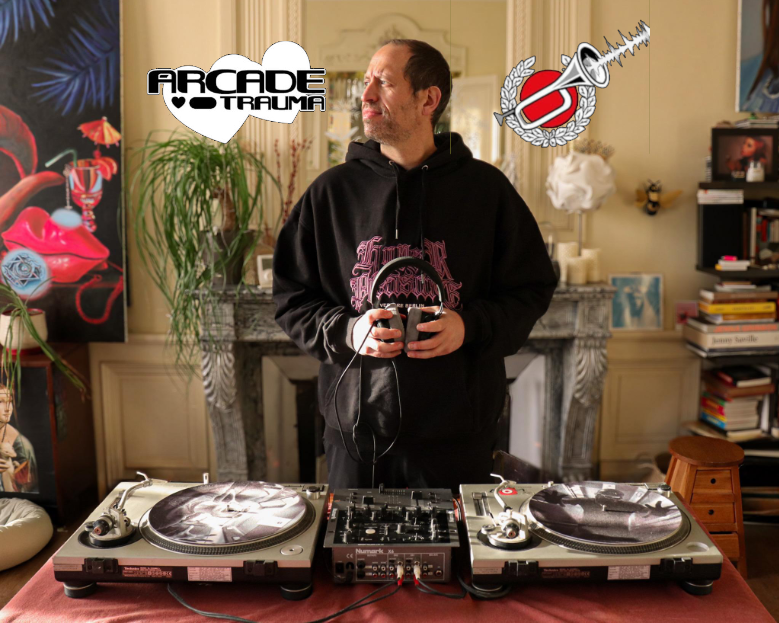
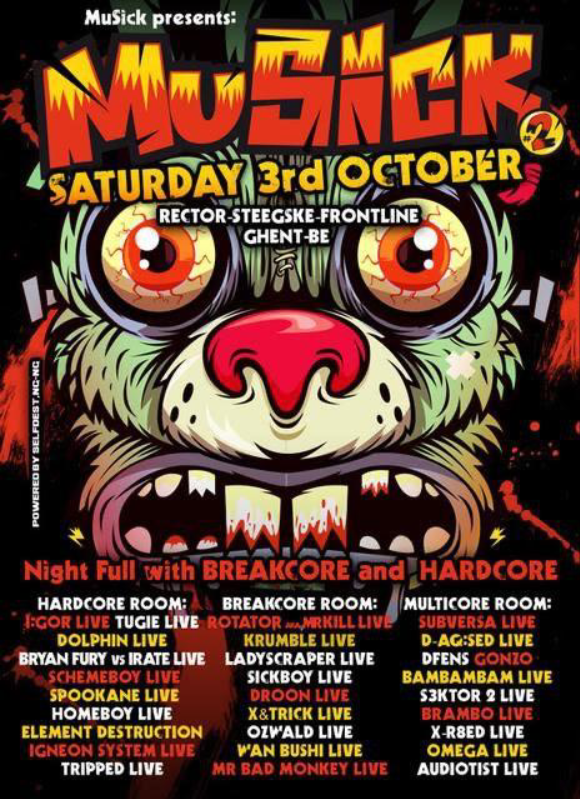
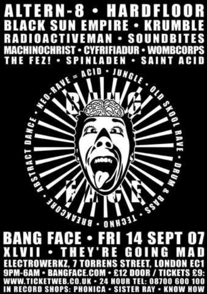
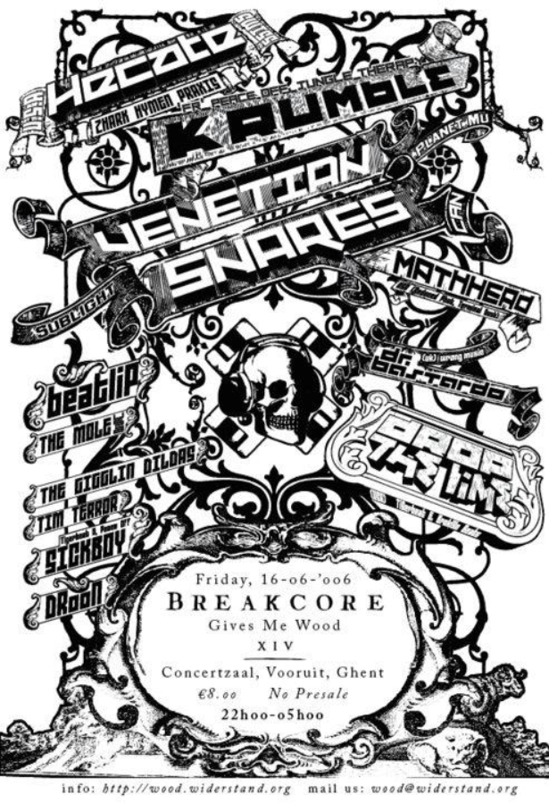
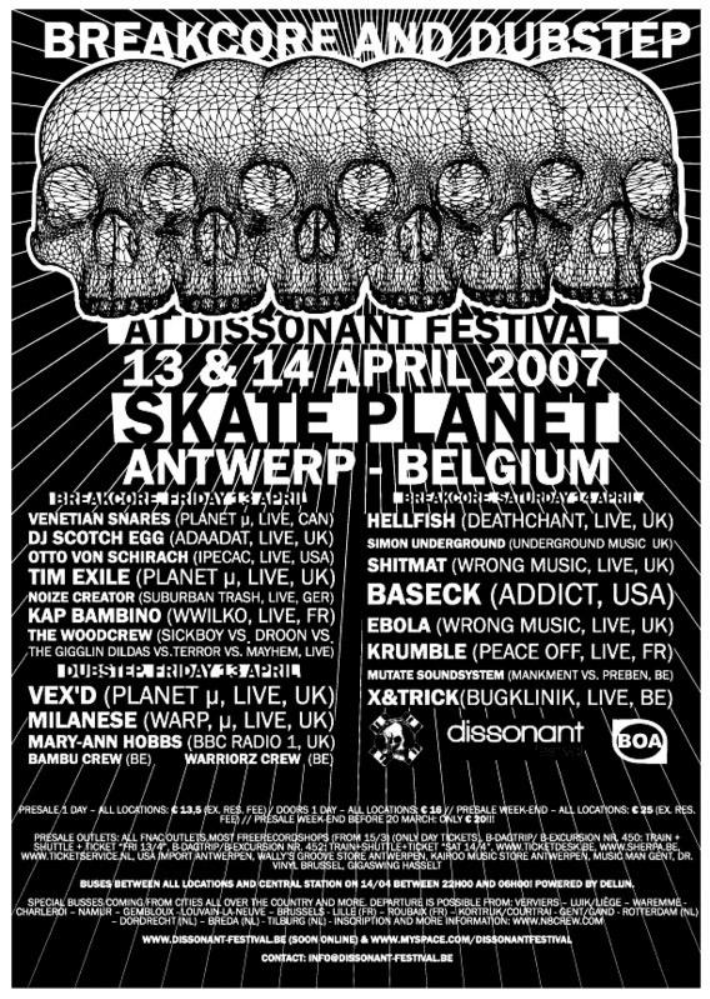
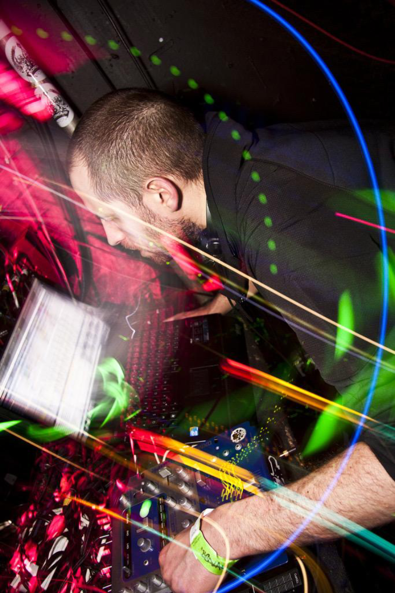
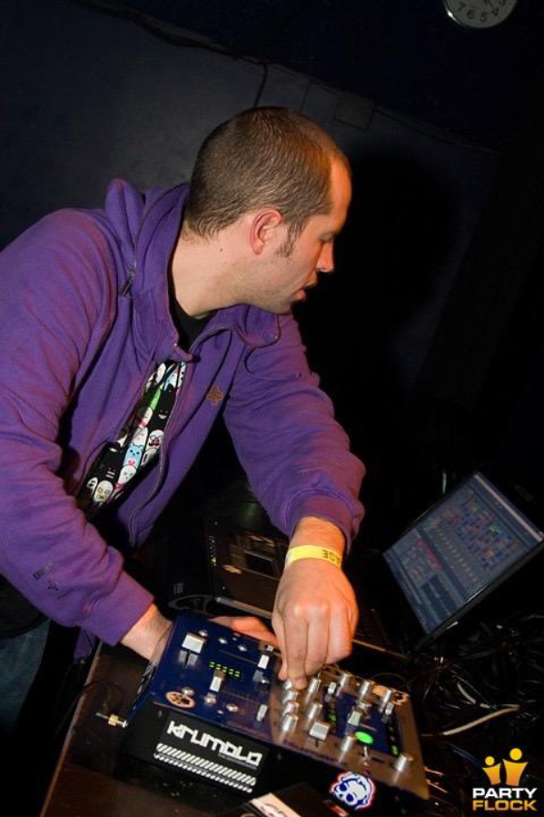
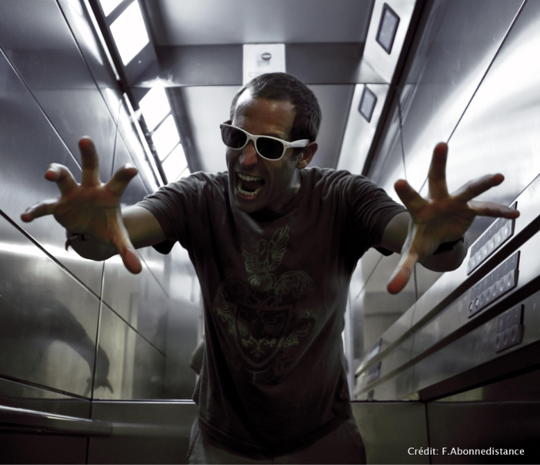

Exciting interview today with a breakcore OG... I won't bother with an intro paragraph, Arcade Trauma has that covered...

Go show Arcade Trauma some love. He's a legend for contributing once again, and we appreciate it so much. Without further ado...

From this point on, it's all Mr Trauma!

# Interview with Krumble - Brought to you by Arcade Trauma

Throughout the history of dance music, France has always been a key representative to an echelon of sounds. From hardcore with labels such as epileptik, all the way to the free party scene with legends such as Ben9mm, Suburbass, and the great Mat Weasel Busters. Breakcore of course, is no exception to this. France has had many, many great breakcore producers and Krumble is up there with the best, period.

Krumble’s style of breakcore is dense, amen layered chopping madness with lethal beats and bass to back it. Having released on labels such as the legendary peace off, on the Damage sublabel, as well as having numerous legendary ep’s on jungle therapy with his superb jungle work as well as death$sucker.

What makes krumble so special though isn’t just his incredible chopping techniques, it’s the level of energy he brings to each unique track. Examples of some of this come from his tracks Bleng Sleng 99’ and Hoarse Fire from his “return of the amen spammer” ep. The tracks are just full to the brim with amens that are so tightly compact yet extremely vibrant and ear pleasing in terms of technique and flavour. Krumble also utilises tons of heavy dense ragga vocals and disgusting bass sound waves which would tear down any breakcore rave.

Other classics tracks can be found on his two death$ucker releases. Krumble’s “fucking hostile” remix to me is a standout breakcore tune that just encompasses all I love in breakcore. Ear shattering amens, heavy fuck off gabber kicks and sampling classic hardcore. Whereas with his tune “Bassline Vision” it takes a whole other identity. This track is features some of the all time best break chopping I’ve ever heard. It’s ultra technical, clean, and above all else - insane. The track uses IDM soundscapes, as well as a distinct IDM like melody which will be ingrained into your brain. Seriously, this track is one that should be noted to anyone who wants to develop their breakcore production.

Krumble isn’t just a producer who makes all time classics, he’s also played some of the best breakcore parties out there. Travelling Europe and playing for over 20 years, he has played along the likes of Venetian Snares, Rotator, I:gor and many many more. Not only has he played vinyl extensively, he also champions a hardware setup that really emphasis the D.I.Y aspects that Breakcore has been founded upon.

With all the hyping up out of the way… I got a chance to ask krumble some questions and looked more into the legend behind the music.

## What attracted you to the breakcore sound?

I think what drew me in the most was the experimental and innovative nature of this music. I moved to Rennes in 2001 and was listening to a lot of electronic music—and, of course, a lot of jungle ragga and drum and bass. Back then, I used to buy my vinyls at Switch, the record shop owned by Frank, aka Rotator. Gradually, he introduced me to a harder, more experimental style of breakbeat, and since I was eager to explore new sounds, I naturally dove headfirst into that beautiful scene.

## What are some of your biggest inspirations to your sound?

First of all, since I don’t consider myself a 100% breakcore musician, my influences are very diverse. I also play the keyboard, so I listened to a lot of soul, funk, and jazz when I was a student. Lots of ambient, hip-hop, breakbeat, pop, metal, and classical music—which, in my opinion, is the perfect combination for diving into the breakcore subgenre. If I had to name just one reference in hindsight (and so as not to offend other artist friends whom I admire ahaha), how could I not choose “Amen Brother” by The Winstons (since it’s the foundation of almost all my productions)?

## In your production, the way you produce and process your amens is very unique, could you share any insight into this?

I'm not sure my approach to the amen break is really that unique! Let's just say I spend a lot of time sampling and resampling variations of that beat, and I process them with lots of different effects, but overall I do a lot of cutting by hand (the old-school way, you know^^). Let's just say that for me, resampling is the key.

## You’ve done some amazing sample packs, is there any further plans for new ones? If so what would you be interested in including to these?

For now, I don't have anything planned in that area; I think I've pretty much covered everything for the time being. I have other projects in mind, but you never know—there might be more releases down the road (because I love samples more than anything).

## You’ve played lots of parties over the years. Is there any particular show that stands out to you that you have played? 

Ah, good question! I don’t know if I can pick just one—playing in Russia was pretty crazy; the Kamikaze Warfare III in 2005 with Venetian Snares, Merzbow, Rotator, and Electric Kettle was wild! Our first show in Belgium for the Trash N Ready tour with Frank and Luis Cardopusher remains unforgettable, and finally, Breakcore Gives Me Wood XIV on June 16, 2006, was probably one of the craziest nights I’ve ever experienced! -- I think I could describe that time as a sort of golden age of MySpace, hahaha

## In the current breakcore space, is there any particular sound you’d like to hear more? 

Mostly farm animal sound.

## Other than breakcore, you also produce a lot of art as a painter. Does your music have any tie to your art or vice versa? And does your art have any effect on your music?

Absolutely, I think the approach is the same. The function of a musical or visual work isn’t merely to make you dance or to be figurative. It can evoke other sensations, prompt a different kind of reflection, and open up paths that previously seemed nonexistent or inaccessible to us. In any case, I try to incorporate a second layer of meaning into my work; I like to reuse popular conventions to play with them, subvert them, critique them, document them, or celebrate reality. And the principle of repetition in my music and painting is essential: it’s a way of doing the same thing while, at the same time, producing something different each time. I really love that idea, in any case.

## As a final question, how would you define breakcore? what does breakcore mean to you?

Breakcore is all about freedom and open-mindedness, man! Everything seems possible within this space (even though more clearly defined categories have emerged since the beginning), but this music is surely the most inclusive of the electronic era—you’re free to incorporate whatever you want into it. It’s kind of like a Spanish-style potluck, you know, you find whatever everyone brings to the table ;) It’s a genre that welcomes everyone, that chooses to conform to nothing or to conform to everything—nothing is art and everything is art at the same time. Breakcore can be both highly intellectual and very punk and wild. You never know what it has in store for us—to me, it’s a bit like an allegory for life. That’s why it’s so essential in this day and age. Stay wild, folks!

## A final word from Arcade Trauma

Special thanks to Krumble for letting me ask these questions and to The Breakcore Bugle / STR1PE for letting me publish this article / interview for all those as curious as me.

# The end!

We hope you enjoyed this interview with Krumble! Big up Arcade Trauma once again for contributing, the Bugle appreciates it so much :)

If you also want to write about breakcore, in any way, get in touch! Everyone is welcome to contribute!

BREAKCORE FOREVER BABY BREAKCORE 3026

**BREAKCORE BREAKCORE BREAKCORE BREAKCORE BREAKCORE BREAKCORE BREAKCORE BREAKCORE BREAKCORE BREAKCORE BREAKCORE BREAKCORE BREAKCORE BREAKCORE BREAKCORE BREAKCORE BREAKCORE BREAKCORE BREAKCORE BREAKCORE BREAKCORE BREAKCORE BREAKCORE BREAKCORE BREAKCORE BREAKCORE BREAKCORE BREAKCORE BREAKCORE BREAKCORE BREAKCORE BREAKCORE BREAKCORE BREAKCORE BREAKCORE BREAKCORE BREAKCORE BREAKCORE BREAKCORE BREAKCORE BREAKCORE BREAKCORE BREAKCORE BREAKCORE BREAKCORE BREAKCORE BREAKCORE BREAKCORE BREAKCORE BREAKCORE BREAKCORE BREAKCORE BREAKCORE BREAKCORE BREAKCORE BREAKCORE BREAKCORE BREAKCORE BREAKCORE BREAKCORE BREAKCORE BREAKCORE BREAKCORE BREAKCORE BREAKCORE BREAKCORE BREAKCORE BREAKCORE BREAKCORE BREAKCORE BREAKCORE BREAKCORE BREAKCORE BREAKCORE BREAKCORE BREAKCORE BREAKCORE BREAKCORE BREAKCORE BREAKCORE BREAKCORE**
